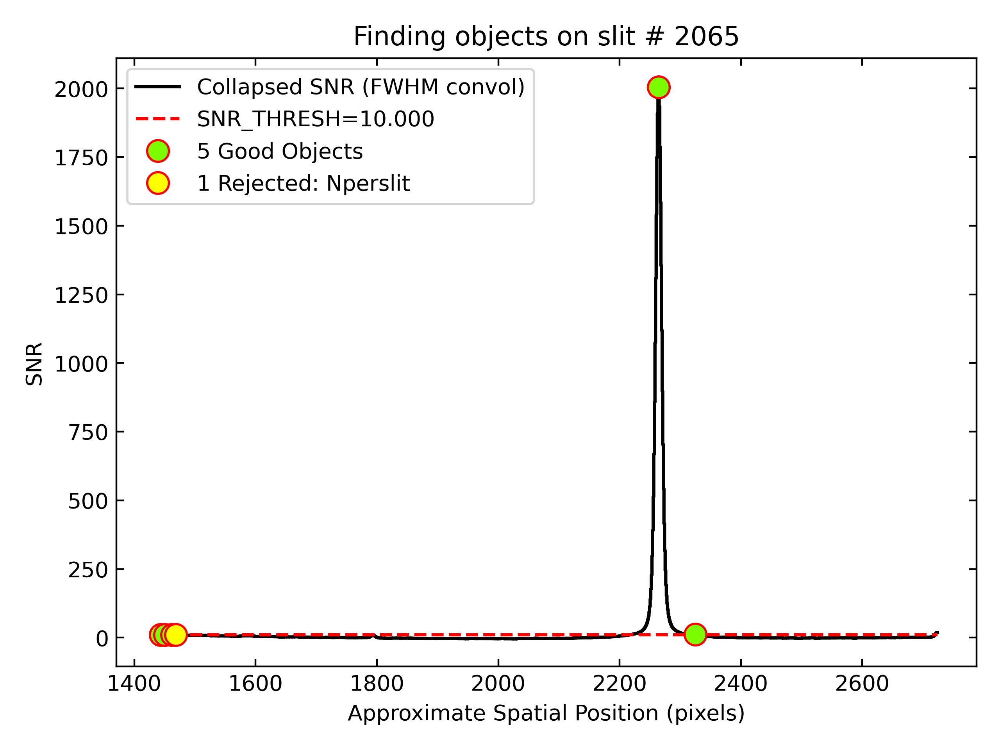
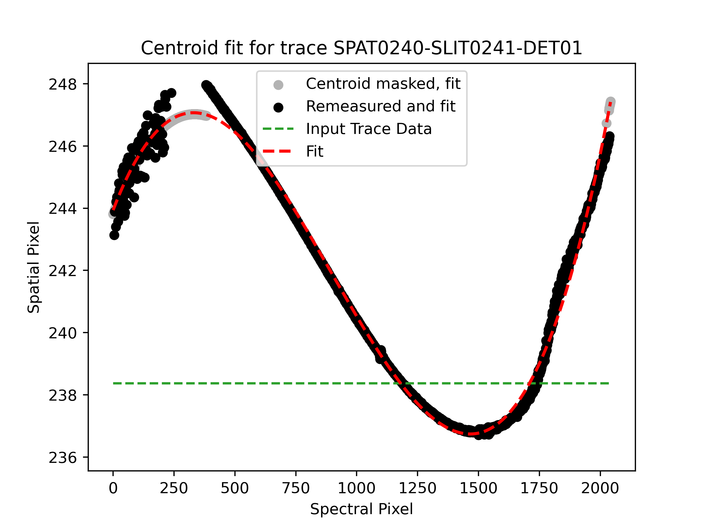
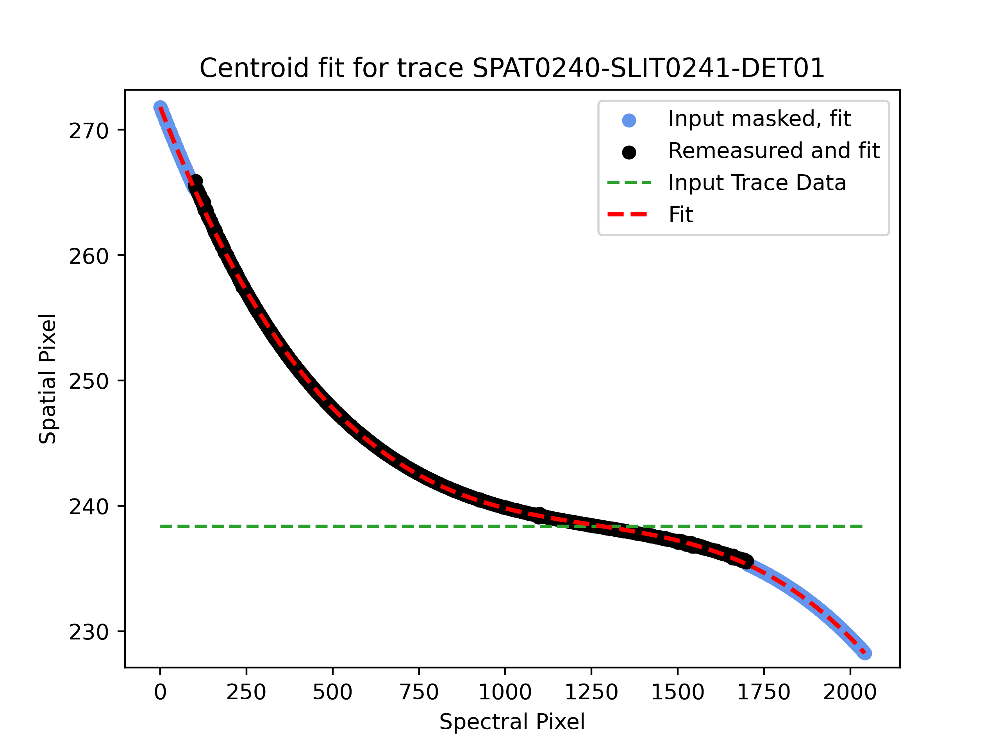

.. _object_finding:

==============
Object Finding
==============

This document describes how the code identifies objects within the slits/orders.

Overview
========

Object identification is a challenging process to code in general. The
challenges are that one must consider a large dynamic range between bright
telluric and spectrophotometric standards and faint continuum or emission-line
sources. When this is coupled with very short slits, the presence of both
positive and negative traces (when image differencing), and the detection of
objects on specific orders (for echelle spectra), many corner cases can arise.
Our general philosophy has been to try to create an algorithm that is fully
automated and detects the most probable sources (:math:`{\rm SNR} > 10\sigma`).
The user has the option to lower this threshold and/or request that specific
objects be manually extracted.

Algorithm
=========

The algorithm described below attempts to identify the peak location of objects
on the slit/order as well as measure an initial FWHM of the object. This FWHM
then informs the width of the mask around this object trace in global
sky-subtraction, as well as the width of the region that ``PypeIt`` uses for
local sky-subtraction.

In a standard run, the approach to object finding adopted is:

    #. Perform a first global sky-subtraction without any masking of objects.
    #. Run the object finding code for the first time.
    #. Create a mask indicating object free sky pixels using the locations of
       the objects identified.
    #. Perform a second global sky-subtraction with the objects masked.
    #. Run the object finding code a second time.

These steps are performed by :func:`pypeit.find_objects.FindObjects.run`.

The automated object finding algorithm is
:func:`~pypeit.core.findobj_skymask.objs_in_slit`. It performs the following
steps:

    #. Rectify the sky-subtracted frame.

    #. Create a mask by sigma clipping (median stat) down the spectral dimension
       to further reject CRs.  This could mask bright emission lines.

    #. Sum over the spectral direction but using the sigma clipping resulting in
       a vector representing counts as a function of spatial slit/order. Compute
       the formal S/N ratio of this collapsed image using the noise model.

    #. Smooth this 1d vector which represents S/N vs spatial slit/order position.

    #. Search for peaks in this S/N ratio vector above the threshold
       ``snr_thresh``. This is the quantity that is shown as the histogram in
       the object finding QA plots (see example below). The default value is
       ``snr_thresh = 10``.

    #. Objects that are within ``find_trim_edge`` of the slit edges will be removed.

    #. Of the good objects (i.e. not close to the edge), the number of objects
       returned will be further restricted to a maximum number with the highest
       S/N ratio. Note that this maximum is set by ``maxnumber_sci`` parameter
       for science exposures, versus the ``maxnumber_std`` for standard
       exposures. For multislit the defaults are ``maxnumber_sci = 10`` and
       ``maxnumber_std = 5``. For echelle spectrographs with short slits they
       are ``maxnumber_sci = 2`` and ``maxnumber_std = 1``.

   Example object finding QA plot for Keck/LRIS, using the ``long_400_8500_d560``
   dataset from the :ref:`dev-suite`.  A total of 6 objects were found whose
   collapsed SNR exceeded the threshold (:math:`10\sigma`), but for only the
   brightest 5 were marked as "good", since this is a ``standard`` frame and
   ``maxnumber_std = 5``.

A QA plot is generated for each slit for evaluation of the object-finding step.
See :ref:`qa-obj-find` for more examples and descriptions of the plots.

Parameters
==========

This reduction step is guided by the :ref:`findobjpar`.

These are parameters one may modify to improve performance.
While we have tried to tune these for each spectrograph, 
particular use cases may require further modification.

snr_thresh
----------

The most common parameter modifications we recommend are to adjust
``snr_thresh`` to enable the identification of fainter sources (at the risk of
false positives).  Reasonable results have been obtained with ``snr_thresh`` as
low as 5.0.

To make this modification, add the following to your
:doc:`pypeit_file`:

.. code-block:: ini

    [reduce]
        [[findobj]]
            snr_thresh = 5.0

maxnumber_sci
-------------

The QA plot above clearly indicates the objects that are being excluded
due to proximity to the edges, and/or the maxnumber parameter. These can also be
adjusted, for example for an echelle spectrum with three objects on the slit
where one wants to work closer to slit edges:

.. code-block:: ini

    [reduce]
        [[findobj]]
            maxnumber_sci = 3
            find_trim_edge = 3,3

find_min_max
------------

If your spectrum covers only a minority of the detector 
(less than 50%), you may need to set this using the ``find_min_max``
parameter.  This includes odd tilts of the grating, 
data cut off to the blue and objects with 
spectral breaks, like with high-z quasars or
galaxies. 

You can restrict the spectral region that the automated object
finding collapses out to search for objects via

.. code-block:: ini

    [reduce]
        [[findobj]]
            find_min_max = 1600, 2048

This will only collapse out spectral pixels 1600-2048 when computing the 1d SNR
vs spatial position vector. The best way to choose these pixels is to run PypeIt
without it set. Then run :ref:`pypeit_show_2dspec` to view the sky-subtracted
image and decide which pixels to use for object finding. Then re-run ``PypeIt``.

.. _object_tracing:

Object Tracing
==============

Faint Objects
-------------

For automatically identified objects (i.e., not manual extractions),
PypeIt improves the object trace by fitting the spatial position of the peak
as a function of wavelength. In some situations, the object trace is poorly
determined by the peak location, and the code will fail to trace the object
correctly. For example, if the slit edges are not well-defined, the object's
position relative to the slit edges is also poorly defined, and the object trace
is difficult to determine. The default is to perform several iterations (typically 9)
but for some cases this is insufficient. In these cases, the user can attempt to
increase the number of iterations to improve the object tracing, in combination with
a relatively low order polynomial, as follows

.. code-block:: ini

    [reduce]
        [[findobj]]
            find_numiterfit = 100
            trace_npoly = 4

Note that the default value is typically ``trace_npoly = 5``. If you notice a
relatively poor object trace, sometimes in combination with the object counts
being masked, increasing the number of iterations may help to resolve your
problem. If, on the other hand, your object is relatively faint, you may
benefit from using the trace of a standard star (this is the default behavior),
and you can provide a 1D spectrum of a previously reduced standard star with the
``std_spec1d`` parameter.

Observations at High Airmass
----------------------------

If you have observations taken at high airmass without the benefit of an
atmospheric dispersion corrector, you may have spectra that curve on the
detector with respect to the slit edges.

For instance, the spectrum below was taken with a 150 l/mm grating on the
LDT/DeVeny spectrograph.  Shown are the ``spec2d`` file and :ref:`qa-obj-trace`
plot for an object observed at an elevation of 11\ :math:`^\circ` above the
horizon (airmass 5).

The trace was not able to follow the curve of the spectrum to larger spatial
pixel at low spectral pixel (low wavelength), and instead tried to grab onto
peaks in the noise closer to the "Input Trace Data" (parallel to the slit
edge).  In these cases, you may need to allow PypeIt to follow traces further
from the line defined by the slit edges.  The parameter ``trace_maxshift``
(default value = 1 pixel) may be increased incrementally to allow the curved
spectrum to be traced.  By using the following combination of parameters, the
object tracing algorithm is now able to trace the object cleanly across the
entire spectral image, as shown in the plot below.

.. code-block:: ini

    [reduce]
        [[findobj]]
            trace_maxshift = 2.0
            trace_npoly = 4
            find_numiterfit = 100
            find_min_max = 900,1700
            trace_min_max = 100,1700

The ``find_min_max`` parameter directs PypeIt to only spectrally smash the
image over the specified range of spectral pixel numbers (useful if the
spectral trace fades at the ends of the detector), and the ``trace_min_max``
parameter indicates that all pixels outside of the specified range should be
masked when fitting the object trace (useful for similar reasons as above).
In the lower plot, the masked ranges are visible as the light blue regions at
the upper and lower spectral ends.

Not only does the trace now follow the blue end (low spectral pixel number),
but it is monotonic in spatial pixel space, as mandated by the physics of
atmospheric refraction.  See the :ref:`qa-obj-trace` documentation for more
details on the interpretation of this plot.
