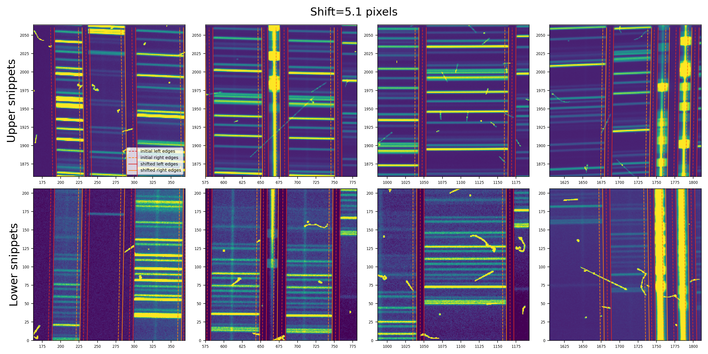
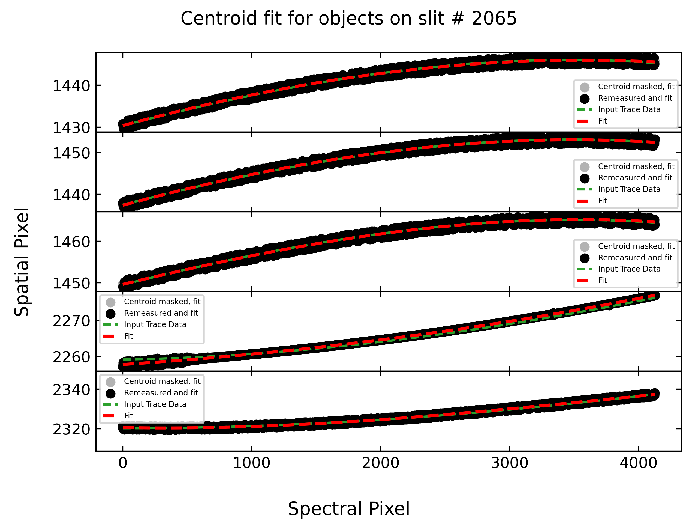
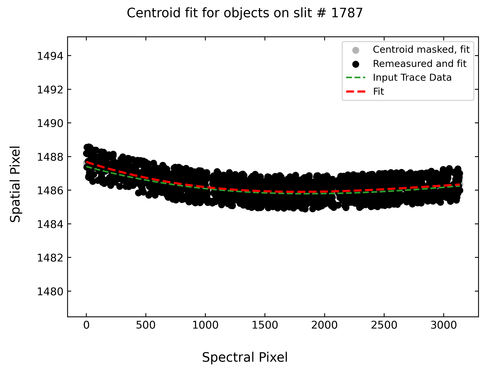

.. TODO: We should expand this page, showing examples of the QA plots and
.. describing them in more detail.

.. _qa:

=========
PypeIt QA
=========

As part of the standard reduction, PypeIt generates a series
of fixed-format Quality Assurance (QA) figures. This document describes
the typical outputs, in the typical order that they appear.

*This page is still a work in progress.*

The basic arrangement is that individual PNG files are created
and then a set of HTML files are generated to organize
viewing of the PNGs.

HTML
====

When the code completes (or crashes out), an HTML file is generated in the
``QA/`` folder, one per setup that has been reduced (typically one).  An example
filename is ``MF_A.html``.  These HTML files are out of date, so you're better
off opening the PNG files in the ``PNGs`` directory directly.

Calibration QA
==============

The first QA PNG files generated are related
to calibration processing.  There is a unique
one generated for each setup and detector and
(possibly) calibration set.

Generally, the title describes the type of QA plotted.

.. _qa-order-predict:

Echelle Order Prediction
------------------------

When reducing echelle observations and inserting missing orders, a QA plot is
produced to assess the success of the predicted locations.  The example below is
for Keck/HIRES.

.. figure:: figures/Edges_A_0_MSC01_orders_qa.png
   :width: 60%

   Example QA plot showing the measured order spatial widths (blue) and gaps
   (green) in pixels.  The widths should be nearly constant as a function of
   position, whereas the gaps should change monotonically with spatial pixel.

In the figure above, measured values that are included in the polynomial fit are
shown as filled points.  The colored lines show the best fit polynomial model
used for the predicted order locations.  The fit allows for an iterative
rejection of points; measured widths and gaps that are rejected during the fit
are shown as orange and purple crosses, respectively.  The measurements that are
rejected during the fit are not necessarily *removed* as invalid traces, but the
code allows you to identify outlier traces that *will be* removed.  None of the
traces in the example image above are identified as outliers; if they exist,
they will be plotted as orange and purple triangles for widths and gaps,
respectively.  Missing orders that will be added are included as open squares;
gaps are green, widths are blue.  To deal with overlap, "bracketing" orders are
added for the overlap calculation but are removed in the final set of traces;
the title of the plot indicates if bracketing orders are included and the
vertical dashed lines shows the edges of the detector/mosaic.

.. _qa-wave-fit:

Wavelength Fit QA
-----------------

PypeIt produces plots like the one below showing the result of the wavelength
calibration.

.. figure:: figures/deimos_arc1d.png
   :width: 60%

   An example QA plot for Keck/DEIMOS wavelength calibration.  The extracted arc
   spectrum is shown to the left with arc lines used for the wavelength solution
   marked in green.  The upper-right plot shows the best-fit calibration between
   pixel number and wavelength, and the bottom-right plot shows the residuals as
   a function of pixel number.

See :doc:`calibrations/wvcalib` for more discussion of this QA.

.. _qa-wave-tilt:

Wavelength Tilts QA
-------------------

PypeIt produces plots like the one below showing the result of tracing the tilts
in the wavelength as a function of spatial position within the slits.

.. figure:: figures/mosfire_arc2d.png
   :width: 60%

   An example QA plot for a single slit in a Keck/MOSFIRE tilt QA plot.  Each
   horizontal line of black dots is an OH line.  Red points were rejected in the
   2D fitting.  Provided most were not rejected, the fit should be good.

See :doc:`calibrations/tilts` for more discussion of this QA.

Exposure QA
===========

For each processed, science exposure there are a series of
PNGs generated, per detector and (sometimes) per slit.

.. _qa-spat-flex:

Spatial Flexure QA
------------------

If a spatial flexure correction was performed, the result of the correction
is shown in a plot like the one below.  The plot shows a few snippets of the
science/standard spectral image with overlaid the slit edges as traced in the
``trace`` image (dashed lines) and after applying the spatial flexure correction
(solid lines). The value of the shift is also reported on the top of the plot.

.. _qa-spec-flex:

Spectral Flexure QA
-------------------

If a spectral flexure correction was performed (default), the fit to the
correlation lags per object
is shown and the adopted shift is listed.  Here is
an example:

.. figure:: figures/qa/flex_corr_armlsd.jpg
   :align: center

There is then a plot showing several sky lines
for the analysis of a single object (brightest)
from the data compared against an archived sky spectrum.
These should coincide well in wavelength.
Here is an example:

.. figure:: figures/qa/flex_sky_armlsd.jpg
   :align: center

.. _qa-obj-find:

Object Finding QA
-----------------

The object-finding step can be evaluated using the ``*_obj_prof.png`` QA files
produced during the main PypeIt run.  Following the algorithm outlined in
:ref:`object_finding`, the plot provides a visual confirmation of the steps
taken to identify the objects in each ``spec2d`` frame.  The heart of the QA
plot is the FWHM-convolved plot of the spectrally-squashed spectral image.
Identified objects are marked with green or yellow circles to indicate objects
that exceed the minimum detection signal-to-noise ratio (SNR; red dashed line).
Objects in excess of the maximum allowed per slit are in yellow, sorted by SNR.

Examples of object-finding QA files for different types of frames are shown
below.

Keck/LRIS Standard Star Frame
+++++++++++++++++++++++++++++

.. figure:: figures/lris_objfind_qa_example.png
   :alt: Object tracing for Keck/LRIS
   :width: 60%
   :class: with-shadow

   Example object finding QA plot for Keck/LRIS, using the ``long_400_8500_d560``
   dataset from the :ref:`dev-suite`.  A total of 6 objects were found whose
   collapsed SNR exceeded the threshold (:math:`10\sigma`), but for only the
   brightest 5 were marked as "good", since this is a ``standard`` frame and
   ``maxnumber_std = 5``.

Subaru/FOCAS Faint Object Frame
+++++++++++++++++++++++++++++++

.. figure:: figures/focas_objfind.png
   :alt: Object tracing for Subaru/FOCAS
   :width: 60%
   :class: with-shadow

   This shows the spatial profile of the object's S/N collapsed along the spectral direction.
   The dashed red line is the S/N threshold set by the :ref:`findobjpar`, and the green circle
   marks the spatial position of the detected object. This plot is useful to assess if the object
   was correctly detected and if the S/N threshold (``snr_thresh``) set is appropriate for the
   observation.  You will note that there were 3 objects rejected because we restricted 
   the code to find only 2 objects in the science frame.
   See :ref:`object_finding` for further details. 

Gemini/GMOS Science Frame
+++++++++++++++++++++++++

   .. grid:: 2

      .. grid-item::
         :columns: 4

         .. image:: figures/gmos_objfind_qa_example1.png
            :alt: Object finding on slit #NNNN
            :class: with-shadow

      .. grid-item::
         :columns: 4

         .. image:: figures/gmos_objfind_qa_example2.png
            :alt: Object finding on slit #NNNN
            :class: with-shadow

      .. grid-item::
         :columns: 4

         .. image:: figures/gmos_objfind_qa_example3.png
            :alt: Object finding on slit #NNNN
            :class: with-shadow

      .. grid-item::
         :columns: 12

         Examples of object finding on three separate slits from a single
         Gemini/GMOS frame from the ``GS_HAM_B480_550`` dataset in the
         :ref:`dev-suite`.  Note that only one of the slits had an object meet
         the detection threshold specified by instrument parameters.

.. _qa-obj-trace:

Object Tracing QA
-----------------

The object-tracing step can be evaluated using the ``*_obj_trace.png`` QA files
produced during the main PypeIt run.  These plots indicate the extracted
spatial peak of the object trace (ordinate) as a function of spectral pixel
(abscissa).  The value of these plots lies in identifying when the tracing
algorithm has gone off the rails and is following something other than the
desired spectral object.

Examples of object-tracing QA files for different types of frames are shown
below.

Keck/LRIS Standard Star Frame
+++++++++++++++++++++++++++++

   Example object tracing QA plot for Keck/LRIS, using the ``long_400_8500_d560``
   dataset from the :ref:`dev-suite`.  A total of 6 objects were found whose
   collapsed SNR exceeded the threshold (:math:`10\sigma`), but for only the
   brightest 5 were marked as "good", since this is a ``standard`` frame and
   ``maxnumber_std = 5``.

Gemini/GMOS Science Frame
+++++++++++++++++++++++++

   Example object tracing QA plot for Gemini/GMOS, using the ``GS_HAM_B480_550``
   dataset from the :ref:`dev-suite`.  Of the three slits shown above in the
   Object Fining QA plot, only one had an object found using the criteria
   specified in the PypeIt Reduction File.

Using the Object Tracing QA Plot for Troubleshooting
++++++++++++++++++++++++++++++++++++++++++++++++++++

The value in these plots lies in troubleshooting when object tracing goes wrong.
In the example below, an object was observed using a 150 l/mm grating on the
LDT/DeVeny spectrograph at an elevation of 11\ :math:`^\circ` above the horizon
(airmass 5).  As a result of significant atmospheric dispersion, the point-like
object was smeared out into a rainbow and the spectrum appears curved with
respect to the slit edges.  Using standard PypeIt tracing parameters for this
spectrograph, the resulting object trace is shown below.

.. figure:: figures/objtrace_qa_highX_bad.png
   :alt: Bad tracing of object at high airmass
   :width: 60%
   :class: with-shadow

   Attempt at object tracing using standard PypeIt parameters.

Note that the fitted object trace is not monotonic, and jumps at low spectral
pixel number (short wavelength) away from the solid trend of the trace toward
noise in the image closer to the input trace value.  Comparison of this trace
with the ``spec2d`` image indicates that the tracing did not follow the actual
peak in the spectral image.  While occasional grey dots indicating "Centroid
masked, fit" (as in the Keck/LRIS plots above) are acceptable, contiguous
sections (as seen here) are problematic.  See :ref:`object_tracing` for details
about parameter changes that can be applied to fix these traces.
