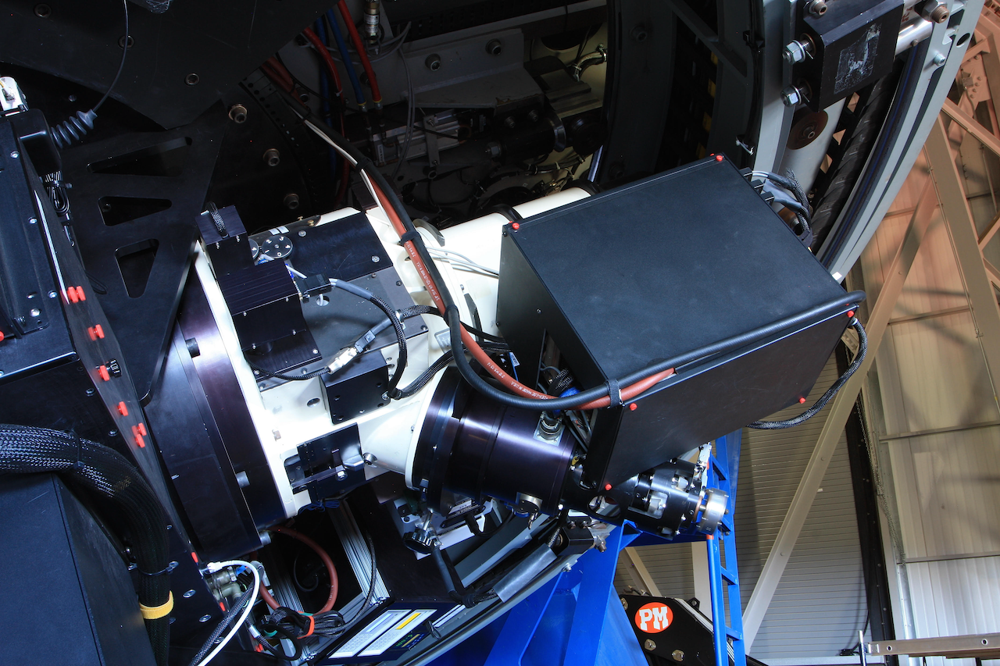
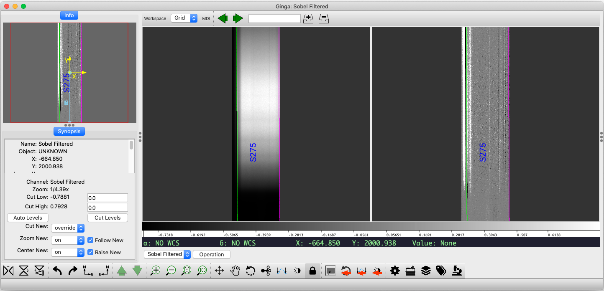
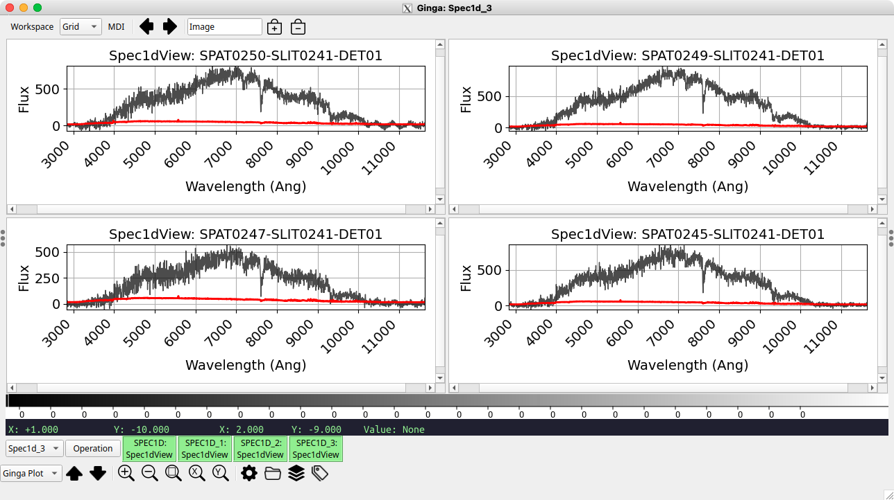
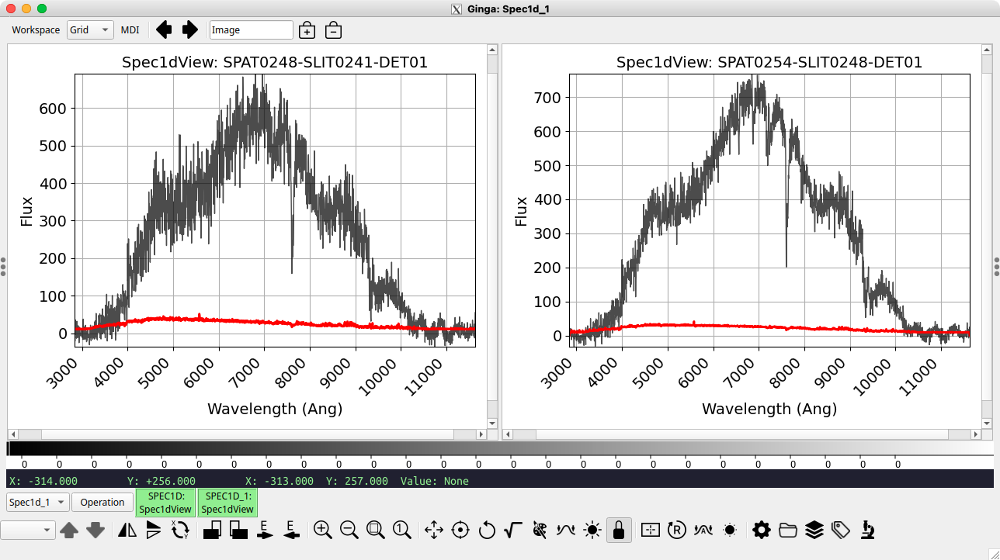
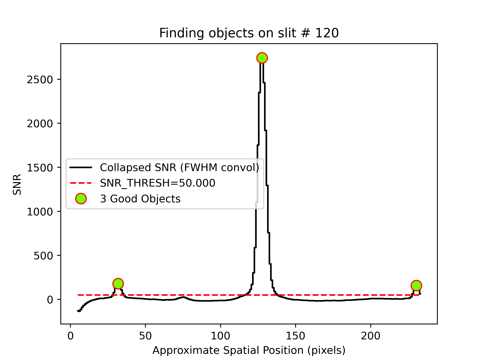

.. highlight:: rest
.. _ldt_deveny_doc:

**********
LDT DeVeny
**********

.. _deveny_overview:

Overview
========

This page provides a detailed outline of using PypeIt with data from the
`LDT/DeVeny spectrograph
<https://lowell.edu/research/telescopes-and-facilities/ldt/deveny-optical-spectrograph/>`__,
including pipeline setup, parameter modifications, and troubleshooting.

Contents
--------

- :ref:`deveny_overview`
- :ref:`deveny_setup`
- :ref:`deveny_outputs`
- :ref:`deveny_parmods`
- :ref:`deveny_troubleshooting`
- :ref:`deveny_workflow`
- :ref:`deveny_filestructure`

The Instrument
--------------

The Lowell Discovery Telescope (LDT) is a 4.3m telescope owned by `Lowell
Observatory <http://lowell.edu>`_ (Flagstaff, AZ) and located at a dark-sky
site in northern Arizona near Happy Jack.  The facility was built as the
Discovery Channel Telescope, and had first light in 2012.  The telescope can
host up to 5 instruments simultaneously at its Cassegrain focus with fast
(several minutes) switches between instruments during the night.  

The DeVeny spectrograph was built at Kitt Peak National Observatory (KPNO)
and was known as the White Spectrograph. It had a long career at the #1 36-inch
and 84-inch telescopes there before being retired. Lowell Observatory acquired
the spectrograph from KPNO on indefinite loan in 1998 and renamed the
instrument in honor of the longtime KPNO Instrument Support Scientist Jim
DeVeny (see `a photo of DeVeny with the spectrograph
<https://noirlab.edu/public/images/noao-02617/>`__ on the 84-inch telescope).
A new CCD camera was built for it, and the spectrograph was further modified
for installation on the 72-inch Perkins telescope in 2005. Following 8 years of
service there, it was removed in 2013 for upgrades for installation on the
Lowell Discovery Telescope (LDT) instrument cube (see image below). DeVeny has
been in service at LDT since February 2015. The spectrograph was designed for
and operates internally with f/7.5 optics; new re-imaging optics were designed
and fabricated to match the spectrograph with LDT's f/6.1 beam.

         
   The DeVeny spectrograph mounted on one of the large side ports of the LDT
   instrument cube.  The instrument is the white cylinder, with various
   electronics boxes mounted to the side and the (black-anodized) CCD camera
   dewar and cooler seen at a 45\ :math:`^\circ` angle the main instrument.

EMI Pickup Noise
----------------

See the `LDT Observer Tools package documentation
<https://lowellobservatory.github.io/LDTObserverTools/scrub_deveny_pickup.html>`_
for information about the EMI pickup noise seen in the DeVeny detector since
approximately 2019.

Using PypeIt with the LDT/DeVeny Spectrograph
---------------------------------------------

The LDT/DeVeny configuration parameters described herein are included
with PypeIt ``v1.15.0`` and later\ [1]_, and the released package may be
installed via your favorite method.  See the :ref:`installation
instructions <installing>` for steps.

Once you have installed the package, test to be sure the main driver
script runs.  Go to a directory outside of the PypeIt directory (*e.g.*,
your home directory) and run the main executable:

::

        cd
        run_pypeit -h

This should fail if any of the required dependencies are not satisfied.
See the :ref:`installation instructions <installing>` for troubleshooting.

.. _deveny_setup:

Setting Up and Running a PypeIt Reduction
=========================================

This section outlines the highlights of how to use PypeIt with LDT/DeVeny data.
It is a condensed and paraphrased version of the :ref:`cookbook`, which is 
routinely updated and should be referenced for complete and detailed
instructions.

.. note::

    Before you get too far, it is important to understand that PypeIt
    reorients all 2D image data (from any spectrograph) so that the spectral
    axis is vertical with increasing wavelength corresponding to increasing
    pixel number. In the case of DeVeny data, this amounts to a 90\
    :math:`^\circ` CW rotation of the images with respect to the original
    files. Don't Panic!

.. tip::

   At the :ref:`bottom of this page <deveny_workflow>` there is a "cheat sheet"
   of common DeVeny PypeIt workflows.

Planning Your Observations for Reduction with PypeIt
----------------------------------------------------

Because PypeIt is an "end-to-end" data reduction pipeline with minimal
opportunity to interact with the reduction in progress, pre-telescope
planning is required to obtain the proper calibration frames. While most
observing programs will already collect all of the frames necessary for
smooth operation of the pipeline, several items bear pointing out:

-  Bias frames are used to remove fixed-pattern noise in the data and
   generate the default bad pixel mask for reductions.

-  Dome flats are used for the dual purposes of removing pixel-to-pixel
   variations in sensitivity and tracing the edges of the slit.  (Slit edges 
   can vary from grating to grating, and will be more apparent following
   the future installation of the decker). Dome flats (or, optionally,
   sky flats) also may be used for correcting for the variable illumination
   function along the slit (generally < 1% variation), **but this feature
   must be explicitly turned on during reduction**.

-  Wavelength calibration is the piece most likely to cause headaches
   for any spectroscopy program. The user needs to decide which
   combination of lamps will provide suitable calibration for their program.
   PypeIt performs an unclipped mean combine of specified arc frames into a
   single ``Arc`` calibration file. As of ``v1.13.0``, the default DeVeny
   parameters allow for combination of frames taken with individual lamps
   (*e.g.*, separate Hg- and Ar-only frames), as well as multilamp frames
   **but you must modify parameters following** :ref:`deveny_wavecalib`.

   The selected slit width also plays into how well PypeIt matches the
   calibration spectrum with the corresponding line lists. While it is
   sometimes possible to attempt calibration on arc frames taken with a
   wide slit opening (>2"), for best results use arc spectra taken with an
   optimal slit width (*i.e.*, projected slit width on the detector of 2.5 -
   3.0 pixels) to ensure matching by the automated algorithms.

   Additionally, because of the spectral-direction flexure of the DeVeny
   camera, **do not attempt** to combine comparison arc frames from **different
   telescope positions**. The shift in line positions between positions will
   create a hot-mess calibration frame and the wavelength calibration will
   fail. PypeIt's flexure-correction algorithm (see :ref:`deveny_flexure`)
   uses night-sky lines to adjust the wavelength calibration for individual
   science frames, so the use of *in situ* arcs may not be necessary. It
   is, however, possible to correlate individual science frames with
   individual arc images, and this is discussed under :ref:`deveny_groups`
   -- if you go this route, we suggest you also compare it with the
   single-pointing arcs and PypeIt's flexure correction and let LDT staff know
   how well they do.

   .. As of ``v1.14.1``, complete wavelength templates using the Hg, Cd, and Ar
   .. lamps are available for the 150g/mm (DV1), 300g/mm (DV2, DV3),
   .. 500g/mm (DV5), 600g/mm (DV6, DV7), and 1200g/mm (DV9) gratings.
   .. PypeIt will automatically match calibration spectra from these
   .. gratings against the appropriate template using its ``full_template``
   .. method. For the other two gratings (DV4 and DV8), PypeIt attempts to
   .. identify the lines in the spectrum *ex nihilo* using its ``holy-grail``
   .. method.

-  All 9 in-service gratings have been tested with PypeIt and appropriate
   grating-specific parameters have been included in the ``v1.15.0`` release.
   If you have issues with the pipeline crashing or incorrect reduction of your
   data, please contact LDT staff for troubleshooting.

-  *To ensure your calibrations will work with PypeIt*, test the pipeline on a
   preexisting data set whose calibration frames were taken in the same way you
   expect to take them. If this testing is done ahead of time, it will save
   much frustration later. It is also possible to run the pipeline on-the-fly
   on your observing night to ensure you have collected a workable calibration
   set.

.. _`deveny_organize`:

Organize the Data to be Reduced
-------------------------------

Download a single night's data from the site computers to your reduction
machine, as described in the DeVeny User Manual. The easiest method is using
secure copy (``scp``), but feel free to use whatever method you prefer\ [2]_.

Be sure your data directory includes calibration frames taken using the same
grating, tilt, and rear filter (order blocking) settings as your science data.
Focus frames may be present or deleted -- PypeIt will ignore them. You should have:

-  Bias frames (to remove fixed-pattern noise from the data)

-  Dome Flat frames (to remove pixel-to-pixel sensitivity variations and trace
   the slit edges)

-  Comparison Arc frames (for wavelength calibration)

-  Science frames (the whole point)

Optionally, depending on the science requirements of your program, you
may also include:

-  Spectrophotometric Standard Star frames (for flux calibration)

-  Sky Flat frames (to correct for variations in illumination along the
   slit, seldom required but may be applicable to certain science programs)

This raw data directory is the root of the directory tree PypeIt uses
for organizing the processing files and processed data (see
:ref:`deveny_filestructure`). Make sure it is on a local drive (rather than
network storage) for speed and efficiency, since PypeIt reads and writes files
frequently during the reduction process.

Setup
-----

.. tip::

   All PypeIt command-line scripts (*e.g.*, ``pypeit_setup``) will display
   script usage by calling the script with the ``-h`` option.

Running PypeIt on a set of data is controlled by a :ref:`pypeit_file` that
details what the software should do to each file along the way to producing
reduced and calibrated data. PypeIt determines unique instrument
configurations, and sorts data in preparation for the data reduction.

The package provides two setup methods (:ref:`automated <pypeit_setup>` and
GUI) -- both available through the ``pypeit_setup`` script -- that read through
the FITS headers in the raw directory to generate the Reduction File (and
directory tree) based on what it finds.  The Setup GUI (call using
``pypeit_setup -G``) provides the ability to interactively produce a PypeIt
Reduction File, which is very helpful for first-time users.

For DeVeny data, instrument configurations are defined by unique combinations
of the grating (FITS keyword ``GRATING``), grating tilt angle (``GRANGLE``),
rear order-blocking filter (``FILTREAR``), and CCD binning (``CCDSUM``). PypeIt
maps the various DeVeny FITS keywords onto a set of internal metadata keys for
processing. The relevant PypeIt metadata keys for DeVeny configurations (which
you will see in your reduction files) are:

::

       Metadata Key   FITS Header
       ------------   -----------
           dispname       GRATING
            cenwave       GRANGLE
            filter1      FILTREAR
            binning        CCDSUM

The PypeIt metadata key ``cenwave`` is the computed central wavelength of the
spectrum in Angstroms, derived from the grating and tilt angle,  rounded to the
nearest 5\ :math:`\mathring{A}`.

#. **Run** ``pypeit_setup``

   The first run will produce the setup files that should be inspected to
   ensure the code has properly divvied up the FITS files into the proper
   configuration(s). For most DeVeny programs (a single grating tilt and rear
   filter used with the installed grating), should find a single instrument
   configuration. Run the script:

   ::

      $ pypeit_setup -s ldt_deveny

   where the required command-line option ``-s`` sets the spectrograph
   configuration parameters.

#. **Inspect the Outputs**

   The ``ldt_deveny.obslog`` file should somewhat resemble your own
   time-ordered observing log for this set of data, with the relevant FITS
   keywords mapped to their PypeIt metadata keys. This is a good time to ensure
   that all the files you expect to see are in fact present.

   Any collimator focus frames (which you should have identified with
   FITS header keyword ``IMAGETYP = FOCUS``) will have a ``frametype`` listed
   as ``None`` in this file and are commented out. If there are
   non-focus frames with ``frametype None`` listed, this indicates the FITS
   keyword was not correctly set. You should note the affected frames so that
   you can later edit the relevant PypeIt Reduction File(s)
   (:ref:`deveny_edit`) with the correct frame type.

   The ``ldt_deveny.sorted`` file is divided into sections enumerating the
   unique instrument configurations and the list of frames associated
   therewith. Each unique configuration is given a capital letter identifier
   (A, B, C, D...).  Below are example headers from a file for LDT/DeVeny data taken with
   two different order-blocking filters on the same night:

   ::

           ##########################################################
           Setup A
                dispname: DV1 (150/5000)
                 cenwave: 7220.0
                 filter1: Clear
                 binning: 1,1

   ::

           ##########################################################
           Setup B
                dispname: DV1 (150/5000)
                 cenwave: 7220.0
                 filter1: OG570
                 binning: 1,1

   PypeIt does not use this file to guide reductions, but it is provided **as a
   means for the user to assess the automated setup, identification, and file
   sorting**. If, at the start of your observing session, you did not select the
   grating or rear filter in the LOUI before taking exposures, those frames
   will have ``UNKNOWN`` listed in the associated header field. In this case,
   you should go back and edit the FITS headers with the proper values and
   rerun step #1 above.

   The ``ldt_deveny.calib`` file enumerates all of the PypeIt frame types found,
   the calibration files associated therewith, and the raw data frames combined
   to produce them. This version of the calibration association file is
   informational only, but it may be helpful for thinking about grouping frames
   into separate calibration groups, if necessary (see :ref:`deveny_groups`).

#. **Run** ``pypeit_setup`` **again**

   Provided you are happy with the ``ldt_deveny.sorted`` file, you are ready to
   write the ``.pypeit`` file(s) for one or more setups. Executing the
   ``pypeit_setup`` script a second time with the ``-c`` option will create one
   or more sub-folders and populate each with a :ref:`pypeit_file`. See
   :ref:`the setup documentation <setup_doc>` for details on the various options
   available for use with this script.

   An example execution that only produces setup files for the ``A``
   configuration is:

   ::

      $ pypeit_setup -s ldt_deveny -c A

   This will generate a subfolder ``ldt_deveny_A`` containing two files: the
   base PypeIt Reduction File ``ldt_deveny_A.pypeit``, and its calibration
   association file ``ldt_deveny_A.calib``.

.. _`deveny_edit`:

Edit Your PypeIt File
---------------------

The :ref:`pypeit_file` dictates how the pipeline is executed on your raw data
files. While you just generated the file automatically (above), it can (and
should) be edited by the user to ensure the reduction proceeds as expected.

Each unique instrument configuration will have its own PypeIt Reduction
File. In the case of DeVeny, this means different rear filters, grating
tilt angles, binning schemes, or even different gratings used on different
nights.  See :ref:`the relevant documentation <pypeit_file>` for descriptions
of the file format and common edits a user may wish to make.  

Specific LDT/DeVeny considerations:
^^^^^^^^^^^^^^^^^^^^^^^^^^^^^^^^^^^

#. The DeVeny-specific modifications to default PypeIt reduction parameters are
   already included in the
   :class:`~pypeit.spectrographs.ldt_deveny.LDTDeVenySpectrograph` class and
   loaded using the ``spectrograph = ldt_deveny`` line at the top of the
   :ref:`parameter_block` -- it is not necessary to reproduce all those
   parameters in the :ref:`parameter_block` of your file. What do go here are
   changes **away** from the *DeVeny default configuration* you wish to use for
   reducing a particular data set. For instance, to specify that PypeIt should
   use the ``illumflat`` files to correct for illumination variations along the
   slit and that it should only find and extract the one brightest object in
   each science frame, you would add the following to your parameter block:

   .. code-block:: ini

      [baseprocess]
         use_illumflat = True
      [reduce]
         [[findobj]]
            maxnumber_sci = 1

   A discussion of typical parameter changes that may apply to DeVeny data
   is given at :ref:`deveny_parmods`, and an exhaustive discussion of all
   parameters may be found at :ref:`parameters`.

#. Here is yet another reminder to **not include bad calibration frames** in
   the reduction (frames that you do not want to use, frames with incorrectly
   identified types, or frames that could not be automatically classified and
   have a ``None`` type). Check them now and remove or comment them out if
   they are bad.

   You may need to add configuration-independent files from one setup to the
   Data Block of another, but PypeIt is getting better at including
   setup-independent files in all configurations.  In any event, it is
   important to double-check that all files needed for the reduction are
   present in your ``.pypeit`` file. If needed, simply copy the needed lines
   from one file to the other so that both setups have access to, *e.g.*,
   the bias frames. The ordering of table rows in the :ref:`pypeit_file` does
   not matter, so don't worry about adding lines in the "proper" location.

#. Check the ``frametype`` of all files. For DeVeny reductions, you need at
   least one file with each of the following Frame Types (see
   :ref:`deveny_organize`):

   -  ``bias``: Bias frames (removing fixed-pattern noise)

   -  ``pixelflat,trace``: Flat fielding (removing pixel-to-pixel sensitivity variations)
      and edge tracing

   -  ``arc,tilt``: Two-dimensional wavelength calibration (colorizing the
      black-and-white spectrum)

   -  ``science``: Science exposure (answering the grand questions of the universe)

   Remove / comment out all images with a ``frametype`` of ``None``, or correct
   the value.  PypeIt will NOT run if any of the uncommented frames have
   ``None`` under ``frametype``.

   Additionally, frames may have type ``illumflat`` if you are doing
   illumination corrections along the slit.  While other spectrographs support
   ``standard`` star frames, at the moment, DeVeny does not need anything of
   this type, and spectrophotometric standards should be marked as ``science``
   frames.

   .. tip::
      A given image can have multiple frame types (*e.g.*, ``arc,tilt``).
      Simply enter the types as a comma-separated list without spaces.

#. Check ``target`` names for all files for both accuracy and for illegal
   characters.  The ``target`` name is used as part of the reduced data
   filename -- accurate names help identify objects later.

   .. important::

      Because PypeIt uses the ``target`` name (pulled from the ``OBJNAME`` FITS
      keyword, entered by the observer in the DeVeny LOUI) as part of the
      reduced data filename, this column **must** include only legal characters
      for your filesystem. In general, forward slash (``/``) is always
      disallowed (sorry, comet and interstellar object observers), but other
      characters may be a concern on your particular filesystem. Additionally,
      parentheses or other characters in ``target`` names may cause issues if
      such characters are not escaped in shell environments.  Editing the name
      in the PypeIt Reduction File (and not in the actual FITS file itself) is
      sufficient for the limitations mentioned here.

#. Adjust the ``calib`` groupings for calibration associations. See
   :ref:`calibration-groups` for an exhaustive discussion or
   :ref:`deveny_groups` for a more tailored outline.  For LDT/DeVeny,
   care must be exercised in grouping arc frames for wavelength calibration.
   Given the large shifts along the spectral axis of the DeVeny CCD caused by
   flexure (:math:`\sim\pm` 10 pixels), some observers prefer to take *in situ* arcs at the
   location of each object rather than rely upon PypeIt's flexure correction
   based on night sky lines (see :ref:`deveny_flexure` for a discussion of
   flexure corrections). The ensemble of *in situ* arcs should definitely
   **not** be grouped together for PypeIt wavelength calibration, as the
   flexure-induced shifts between frames can produce an unusable mess of
   multiple, shifted lines. The safe move here is to assign each set of frames
   at a given pointing (zenith, object A, standard C, etc.) to a unique
   calibration group.

Run the Reduction
-----------------

PypeIt is designed (and currently only able) to do end-to-end reductions,
resulting in a fully processed 2D spectral image and extracted 1D spectra (if
any objects were found) from each science frames. Once you have completed the
setup steps above, you are just about ready to run the pipeline.

The script to run a reduction is :ref:`run-pypeit`.  See that documentation
page for all relevant script options and workflows.

.. caution::

   When you upgrade PypeIt versions, changes to the underlying data models
   (which are largely not backwards compatible) may cause errors if you try to
   use calibration files processed with an earlier version. The safe move is to
   completely reprocess all data currently being used when PypeIt is upgraded,
   including deleting and recreating all processed calibrations.  Your
   currently installed version of PypeIt may be checked using
   ``pypeit_version``, and the version used to create any output file is listed
   in the FITS header with the keyword ``VERSPYP``.

.. _deveny_outputs:

Primary Output Files and Post-Processing Scripts
================================================

.. _deveny_calibrations:

Examine the Calibration Files
-----------------------------

As PypeIt begins churning through your reduction, it will create and write to
disk calibration frames in the ``Calibrations/`` subfolder of the, *e.g.*,
``ldt_deveny_A/`` directory (see :ref:`deveny_filestructure`). Additional
Quality Assurance files will be written to the ``QA/`` subfolder for some
types of Calibration frames. It is important to take the time to inspect these
calibration outputs as they are generated.

.. tip::
   
   To process just the calibrations without trying to process the ``science``
   data, use the command::

      run_pypeit -c ldt_deveny_<setup>.pypeit

The naming convention for :ref:`calibrations` frames is a bit cumbersome, but
follows a regular pattern.  Here is a brief listing of the Calibration frames
produced (in the order in which they are created):

-  :ref:`bias` -- Processed combined bias frame used to remove
   fixed-pattern noise from all other images.

-  :ref:`edges` -- Collection of images and FITS binary tables
   describing the slit traces. While this file is primarily of interest
   for multislit or echelle spectrographs (DeVeny has but one slit and
   no cross-disperser, after all), it is instructive to quickly peek at
   this file to ensure the code correctly identified the slit (and not
   some artifact at the edge of the CCD):

   ::

      $ pypeit_chk_edges Calibrations/Edges_A_0_DET01.fits.gz

   This command will launch a :ref:`GUI viewer <pypeit_chk_edges>` to display
   the combined trace image along with a sobel-filtered version used to
   identify illumination discontinuities in the spatial direction (see figure
   below). For DeVeny data, it should identify a single, long slit with a
   (spatial ID) approximately half the spatial extent of the CCD image
   (mid-200s for spatially unbinned data). The exact number will vary from
   grating to grating due to differing small roll angles about the dispersion
   axis when the gratings were installed in their cells.

.. _deveny_edges_DV2:

         
   Example of output from the ``pypeit_chk_edges`` script for data taken with
   the DV2 grating. The green and magenta lines in the center panels mark
   the left and right edges of the detected slit, respectively. The CCD is
   about 2.9' wide, so at least one edge of the 2.5' slit should be
   visible.

-  :ref:`slits` -- This file contains the distilled PypeIt-internal information
   on the traced slit edges, derived from the ``Edges`` file and organized in
   FITS binary tables. The best way to assess these data is in the
   ``pypeit_chk_edges`` GUI. Once again, there should only be one slit for
   DeVeny data.

-  :ref:`arc` -- Processed combined arc spectral image, where the frames are
   combined using an unclipped mean combine algorithm. Closely examine this
   image in a tool like ``ds9`` to ensure it will be suitable for generating a
   wavelength solution. If not, try editing the calibration group information
   in the PypeIt Reduction File to include only a subset of the arc frames
   taken at the same telescope position and rerunning ``run_pypeit``.

-  :ref:`tiltimg` -- Image used to trace the tilting of spectral lines across
   the slit traces to produce an accurate 2D wavelength solution for the
   detector. For the case of DeVeny (single slit trace on the sole detector),
   this is identical to the ``Arc`` image.

-  :ref:`wave_calib` -- Contains the 1D wavelength solution for this setup.
   Inspect the wavelength solution using the ``pypeit_chk_wavecalib`` script.
   Below is an example output from data taken with the DV2 grating
   (:math:`\theta_{\rm grangle} = 22.54^\circ`, :math:`\lambda_c = 5195\mathring{A}`):

   ::

      $ pypeit_chk_wavecalib Calibrations/WaveCalib_A_0_DET01.fits

         N. SpatID minWave Wave_cen maxWave dWave Nlin     IDs_Wave_range    IDs_Wave_cov(%) mesured_fwhm  RMS
        --- ------ ------- -------- ------- ----- ---- --------------------- --------------- ------------ -----
          0    276  2924.1   5151.2  7385.8 2.173   19  3132.752 -  7274.940            92.8          4.8 0.141

   The central wavelength and wavelength range should be close to what you set
   using values from the LOUI and `obstools
   <https://lowellobservatory.github.io/LDTObserverTools/deveny_grangle.html>`__
   package.  The dispersion (``dWave``) should be close to the value listed in
   the DeVeny Users Manual for the selected grating. Note that the ``SpatID``
   listed here should match that from ``pypeit_chk_edges``.

-  :ref:`tilts` -- Contains the 2D mapping of the slit to lines of constant
   wavelength. The quality of this step is shown in the images of the
   ``QA/PNGs`` directory (examples below), and should rarely need much scrutiny
   for DeVeny data if you have strong arc lines and a good wavelength solution.

.. grid:: 3

   .. grid-item::
      :columns: 4

      .. image:: ../figures/deveny_tilts_2d.png
         :alt: 2D arc tilts
         :class: with-shadow

   .. grid-item::
      :columns: 7

      .. image:: ../figures/deveny_tilts_spat.png
         :alt: Spatial tilt residuals
         :class: with-shadow

   .. grid-item::
      :columns: 12

      .. image:: ../figures/deveny_tilts_spec.png
         :alt: Spectral tilt residuals
         :class: with-shadow

   .. grid-item::
      :columns: 12

      Example PypeIt QA plots for the ``Tilts`` file associated with the
      example DV2 data set.

-  :ref:`flat` -- Processed combined dome flat fields for removing
   pixel-to-pixel sensitivity variations. PypeIt fits a basis spline
   (``bspline``) to the spectral direction to remove the structure in the flat
   lamp spectra, and should yield a normalized image with all values close to
   unity. Examine the normalized flat field frame using the
   ``pypeit_chk_flats`` utility.  The GUI also shows the 2D wavelength solution
   derived from when you mouse over the various images. This is a good guide
   for determining whether artifacts seen in the flats are caused by low
   signal at extreme wavelengths.

Examine the Science Spectra
---------------------------

As PypeIt runs, it will begin generating 2D and 1D spectra outputs in the
``Science/`` folder for each science frame in the PypeIt Reduction File. Feel
free to examine the files as they are created, even while the code continues to
process the other raw frames.

Examine the 2D Spectral Images
^^^^^^^^^^^^^^^^^^^^^^^^^^^^^^

   During the data-reduction process, PypeIt will create a reduced 2D spectral
   image product for each science frame prior to the extraction of 1D spectra.
   These products are stored in multi-extension FITS files with names like:

   ::

      spec2d_20221102.0069-B03_43_C_DeVeny_20221102T063154.130.fits

   The complete description of these files is given at :ref:`spec-2d-output`,
   including how to use the viewing tool ``pypeit_show_2dspec``.  An example
   GUI view of an object observed with the DV6 grating is shown below.

   .. figure:: ../figures/deveny_spec2d.png
      :alt: DV6 2D reduced spectrum example
      :width: 100%
      :class: with-shadow

      Example of the PypeIt reduced 2D spectrum for an object observed with DV6
      displayed with the ``pypeit_show_2dspec`` script. *Top Left:* the
      calibrated science image, *top right:* sky-subtracted and masked image
      along the slit bounds (green and magenta lines), *bottom left:* the
      sky-subtracted image divided by the pixel-by-pixel uncertainty to yield a
      residual map including the object, *bottom right:* the same residual map
      but with the object subtracted.  Note that three objects have been
      identified and extracted (orange traces and labels).

   PypeIt names each extracted object by its spatial position on the reduced image
   [``SPAT``], slit position on the reduced image [``SLIT``] and the detector
   number [``DET``]. For instance, the three objects shown above have the
   labels ``SPAT0033-SLIT0126-DET01``, ``SPAT0128-SLIT0126-DET01``, and
   ``SPAT0231-SLIT0126-DET01``. The single-slit nature of DeVeny means that
   multiple objects extracted from a given image will have names differing only
   in the ``SPAT`` code.

Examine the Extracted 1D Spectra
^^^^^^^^^^^^^^^^^^^^^^^^^^^^^^^^

   If one or more objects have been automatically or manually identified in the
   reduced 2D spectral image, 1D data products will be produced. These 1D
   products are the primary outputs of PypeIt, and consist of a series of
   1-dimensional arrays: vacuum wavelength, extracted flux (using one or more
   methods), and associated error arrays for each identified object. These
   arrays are packaged into multi-extension FITS files, and are accompanied by
   ``.txt`` files with extraction information (*read*: table of contents) for
   each 1D spectrum.

   The 1D spectral FITS files have names like:

   ::

      spec1d_20221102.0069-B03_43_C_DeVeny_20221102T063154.130.fits

   The complete description of these files is given at :ref:`spec-1d-output`,
   including how to use the viewing tool ``pypeit_show_1dspec``.  An example
   GUI view of the object described above is shown below.

   .. figure:: ../figures/deveny_spec1d.png
      :alt: DV6 1D reduced spectrum example
      :width: 100%
      :class: with-shadow

      Example of the PypeIt reduced and extracted 1D spectrum for the brightest
      object shown in the 2D spectrum above. The red dotted line indicates the
      1-:math:`\sigma` uncertainty in the flux values.

   The accompanying ``.txt`` file contains information about the extracted
   object(s), including FWHM of the optimal extraction in arcseconds (this
   should be similar to the seeing on the observing night, convolved with
   jitter in the star position along the slit), the SNR of the extracted
   spectrum (useful in identifying spurious objects), and the RMS in pixels
   of the wavelength solution (for DeVeny should be the same for every object):

   ::

      | slit |                    name | spat_pixpos | spat_fracpos | box_width | opt_fwhm |    s2n | wv_rms |
      |  120 | SPAT0033-SLIT0120-DET01 |        32.9 |        0.117 |      3.80 |    2.188 |   9.13 |  0.065 |
      |  120 | SPAT0128-SLIT0120-DET01 |       128.2 |        0.535 |      3.80 |    2.121 | 146.12 |  0.065 |
      |  120 | SPAT0231-SLIT0120-DET01 |       231.2 |        0.984 |      3.80 |    1.641 |   5.17 |  0.065 |

   By default, ``pypeit_show_1dspec`` loads the first (lowest ``SPAT`` code)
   object extracted from the 2D spectrum. Examination of the spectral image with
   ``pypeit_show_2dspec`` or printing the ``.txt`` file will help you identify
   which extracted object(s) corresponds to your desired target(s). If there
   are spurious low-signal objects identified, you may re-run the reduction
   with adjusted object-finding parameters (see :ref:`deveny_objfind`). A
   particular extracted object may be loaded by using the ``--obj`` option to
   :ref:`pypeit_show_1dspec`.

   .. tip::

      To load the spectrum into a Ginga window rather than launch the default
      GUI, use the ``--ginga`` option to ``pypeit_show_1dspec``.

   By default, PypeIt performs both a boxcar (top-hat) extraction around the
   trace and a Horne optimal extraction\ [3]_ using the fitted spatial profile.
   The boxcar-extracted spectrum may be displayed using the ``--extract BOX``
   option to ``pypeit_show_1dspec``, otherwise the optimal extraction is
   displayed (if available).

.. _deveny_missing1d:

Missing 1D Spectra
^^^^^^^^^^^^^^^^^^

   Sometimes PypeIt will not extract all (or any) of the objects you expect to
   be in a given frame. This can look like either:

   -  some, but not all, of the expected objects were found and extracted
      orange traces on the images of ``pypeit_show_2dspec``) and the
      ``spec1d`` file has fewer entries than expected, or

   -  no objects were found and no ``spec1d`` file was created.

   In either of these cases, the steps for attempting to extract such
   missing objects are the same:

   #. You may modify the object finding parameters in your PypeIt Reduction
      File (see :ref:`deveny_objfind`), remove this ``spec2d_*.fits`` file, and
      rerun ``run_pypeit`` **without the** ``-o`` **option**. This will have
      the effect of processing only the one frame, and should run fairly
      quickly. If the missing objects are found, you're done.

   #. If the objects are still not extracted with repeated parameter
      modification, you can attempt to :ref:`manually identify and extract
      <manual>` the object.  For the example 2D spectrum described above, to 
      manually extract the faint object between the left two identified
      objects, the ``manual`` column for this frame would read
      ``1:77.5:1000:3.1``, where the FWHM (*in pixels*) is the value of
      extracted objects listed in the ``spec1d`` text file divided by the
      spatial plate scale of the spectral image (the DeVeny plate scale of
      0.34"/pixel times the spatial binning).
      
      The resulting 2D spectral image with the manual trace and 1D spectrum
      of the manually extracted object are shown below.  In this case, even
      though the object is detectable to the human eye, it does not contain
      enough signal to produce a useable spectrum (SNR ~ 1).

   .. grid:: 2

      .. grid-item::
         :columns: 6

         .. image:: ../figures/deveny_spec2d_manual.png
            :alt: Manual extraction in a spec2d file
            :class: with-shadow

      .. grid-item::
         :columns: 6

         .. image:: ../figures/deveny_spec1d_manual.png
            :alt: Manual extraction in a spec1d file
            :class: with-shadow

      .. grid-item::
         :columns: 12

         Example of PypeIt manual extraction. The left panel is the 2D spectrum
         with the manually object identified in blue, and the right panel is its
         extracted spectrum.

Post-Processing the Files
-------------------------

While the main PypeIt run ends with ``spec1d`` files, this is not the end of
the processing available with the package. There are several
:ref:`post-processing steps <further_proc_scripts>` that may be considered,
depending on the needs of your particular science program:

-  :ref:`Coadding 2D spectral images <coadd2d>` of the same target to increase S/N in the
   extracted spectra.

-  :ref:`Flux calibration <fluxing>` of extracted 1D spectra.

-  :ref:`Coadding / collating flux-calibrated 1D spectra <coadd1d>` of the same object
   into separate files.

-  :ref:`Telluric correction <telluric_correction>` for NIR spectra (only relevant for the very red
   end of DeVeny's range).

.. _deveny_coadd2d:

Coadding 2D Spectral Images
^^^^^^^^^^^^^^^^^^^^^^^^^^^

PypeIt has the ability to :ref:`coadd 2D spectral images <coadd2d>` of the same
object to increase signal-to-noise prior to object finding and extraction.
While it is possible to simply combine (without weighting) individual exposures
by using the ``comb_id`` column in the PypeIt Reduction File, 2D coadding
accounts for spectral and/or spatial shifts in the spectrum on the CCD.  The
former is important given the spectral flexure seen in DeVeny's camera, and the
latter can help with jitter in the position of the object along the slit due to
manual guiding or imperfect replacement of the object on the slit between
observations.  Coadding aligns the frames spectrally and spatially before
running the object finding and extraction routines.

Coadding is done after the main PypeIt run (as it requires the wavelength
calibration and slit definitions produced during the reduction) and is executed
with the :ref:`pypeit-coadd-2dspec` script. Because the input file format for
this script can be a bit cumbersome, there is a :ref:`setup script
<pypeit_setup_coadd2d>` available that ingests the ``.pypeit`` file or reads
FITS headers in a directory as a starting point. 

In a case of astronomical meta observation, LDT/DeVeny took some spectra of the
JWST spacecraft during its operational mission at the Earth-Sun L2 point.  Four
300-second spectra were taken, and manual guiding was undertaken to keep the
object on the slit as a consequence of the quality of the ephemeris.  

To illustrate the difference between a straight combination and coadding, these
spectra were subject to both procedures and the results shown below.

Single-Frame Spectra of JWST
++++++++++++++++++++++++++++

The extracted 1D spectra from the individual frames are shown below.

   Four 300-second 1D spectra of the JWST spacecraft.  Note the variation in
   object position along the slit moves by ~5 pixels from the first (top-left)
   to last (bottom-right) frames.  These spectra were displayed in Ginga using
   the ``--ginga`` option to ``pypeit_show_1dspec``.

The contents of the associated ``.txt`` files are (listed together for
clarity):

::

   | slit |                    name | obj_id | spat_pixpos | spat_fracpos | box_width | opt_fwhm |  s2n | wv_rms |
   |  241 | SPAT0250-SLIT0241-DET01 |    250 |       250.1 |        0.519 |      3.80 |    2.144 | 6.33 |  0.088 |
   |  241 | SPAT0249-SLIT0241-DET01 |    249 |       248.7 |        0.516 |      3.80 |    1.887 | 7.92 |  0.088 |
   |  241 | SPAT0247-SLIT0241-DET01 |    247 |       246.6 |        0.511 |      3.80 |    1.960 | 4.65 |  0.088 |
   |  241 | SPAT0245-SLIT0241-DET01 |    245 |       245.2 |        0.508 |      3.80 |    2.055 | 6.77 |  0.088 |

We see that the individual spectra range from an integrated S/N of 4.7 to 6.8,
and all have OPT FWHM between 1.9" and 2.1"

Combining the Frames Directly in the Main PypeIt Run
++++++++++++++++++++++++++++++++++++++++++++++++++++

The simplest way to combine these frames to increase signal-to-noise is to
perform a straight combination during the main PypeIt run.  To do this, you
would need to call ``pypeit_setup`` with the ``-b`` flag to include the
"background pair" columns at the far right of the PypeIt Reduction File.
By default, all calibration frames are given the value ``-1``, and science
frames are numbered sequentially.  To combine frames directly, assign the same
``comb_id`` value to all frames.  In the example here, (portions of) the Data
block our PypeIt Reduction File would look like:

.. code-block::

             filename |       frametype |       ra |    dec | target | airmass | exptime | slitwid | lampstat01 | calib | comb_id | bkg_id
   20250909.0066.fits |         science | 330.8203 | 0.0115 |   JWST |    1.24 |   300.0 |     1.0 |        off |     0 |       7 |     -1
   20250909.0067.fits |         science | 330.8220 | 0.0171 |   JWST |    1.23 |   300.0 |     1.0 |        off |     0 |       7 |     -1
   20250909.0068.fits |         science | 330.8239 | 0.0214 |   JWST |    1.23 |   300.0 |     1.0 |        off |     0 |       7 |     -1
   20250909.0069.fits |         science | 330.8255 | 0.0254 |   JWST |    1.22 |   300.0 |     1.0 |        off |     0 |       7 |     -1

The resulting spectrum is named for the first file in the group, and includes
in the header information about the frames that went into the combination.

The resulting spec1d ``.txt`` file for this combination is:

::

   | slit |                    name | obj_id | spat_pixpos | spat_fracpos | box_width | opt_fwhm |  s2n | wv_rms |
   |  241 | SPAT0248-SLIT0241-DET01 |    248 |       247.6 |        0.514 |      3.80 |    2.330 | 8.90 |  0.088 |

The total S/N has improved to 8.9, but note that the OPT FWHM of the extracted
has increased to 2.3" as a result of JWST moving along the slit.

Coadding the 2D Spectra
+++++++++++++++++++++++

To prepare for coadding the processed 2D spectra of the individual frames, we
can use the :ref:`pypeit_setup_coadd2d` script.  Since we are interested in
coadding just the frames of JWST spacecraft spectra, we can use the ``--obj``
option, in addition to specifying the location of the science spectra.  If
we run the script in the ``ldt_deveny_A`` directory (which contains the
PypeIt Reduction File), this looks like:

::

   $ pypeit_setup_coadd2d -d Science/ --obj JWST

The processing input file ``ldt_deveny_JWST.coadd2d`` is created in the working
directory, and has the contents:

.. code-block:: ini

   # Auto-generated Coadd2D input file using PypeIt version: 1.18.0
   # UTC 2025-09-26T21:27:12.718+00:00

   # User-defined execution parameters
   [rdx]
      spectrograph = ldt_deveny
      redux_path = .
      scidir = Science
      qadir = QA
   [calibrations]
      calib_dir = Calibrations
      [[wavelengths]]
         refframe = observed
   [coadd2d]
      offsets = auto
      weights = auto
      spat_toler = 5
      spec_samp_fact = 1.0
      spat_samp_fact = 1.0
   [flexure]
      spec_method = skip
   [reduce]
      [[findobj]]
         skip_skysub = True

   # Data block 
   spec2d read
   path ./Science
                                                    filename
   spec2d_20250909.0066-JWST_DeVeny_20250909T052930.310.fits
   spec2d_20250909.0067-JWST_DeVeny_20250909T053627.110.fits
   spec2d_20250909.0068-JWST_DeVeny_20250909T054151.040.fits
   spec2d_20250909.0069-JWST_DeVeny_20250909T054703.360.fits
   spec2d end

The setup script adds many of the parameter knobs you might need to turn to
make your 2D coadd successful.  See the :ref:`Coadd2D parameters <coadd2dpar>`
for a detailed listing of what these and others can do for your data.

Once you have created the input file, run the coadd:

::

   $ pypeit_coadd_2dspec ldt_deveny_JWST.coadd2d

The resulting spec1d ``.txt`` file for the coadd is:

::

   | slit |                    name | obj_id | spat_pixpos | spat_fracpos | box_width | opt_fwhm |   s2n |
   |  248 | SPAT0254-SLIT0248-DET01 |    254 |       253.6 |        0.512 |      3.80 |    1.988 | 11.82 |

The total S/N is now 11.8, and the OPT FWHM is 2.0" -- right in line with the
individual frame extractions.

A visual comparison of the straight-combined spectrum (left) and 2D coadded
spectrum (right) is shown below.

   The straight combined (using ``comb_id`` -- left) and coadded (using
   ``pypeit_coadd_2dspec`` -- right) versions of the 4 spectra of the JWST
   spacecraft.  The ``comb_id`` version has an integrated S/N of 8.9 and an
   optimally extracted profile FWHM of 2.3", whereas the ``pypeit_coadd_2spec``
   version has an integrated S/N of 11.8 and an optimally extracted profile
   FWHM of 2.0".

Which to Use for DeVeny Data?
+++++++++++++++++++++++++++++

It depends.  If you have autoguiding set up for a series of spectra and expect
the object to remain at the same location on the slit for all exposures, then
the straight combination is fine.  If you have a wandering object (like this
example), or have variable S/N on the individual frames (*e.g.*, from clouds),
then coadding might be the better path forward.

.. _deveny_flux:

Flux Calibrating 1D Spectra
^^^^^^^^^^^^^^^^^^^^^^^^^^^

The main PypeIt run returns extracted 1D spectra, measured in instrumental
units (namely, *electrons*). For some science programs, this is sufficient,
and further processing is unnecessary prior to analysis (skip ahead to
:ref:`deveny_specutils`). Other programs either benefit from or require
correcting for the relative spectral sensitivity of the instrument and
converting the instrumental intensity into physical flux units before the
spectra can be analyzed. PypeIt provides routines for :ref:`creating a
sensitivity function <pypeit_sensfunc>` for your data set from observations
of `spectrophotometric standard stars
<https://www.eso.org/sci/observing/tools/standards/spectra/stanlis.html>`__,
and applying that to the remainder of the science data.

If you plan to flux calibrate your spectra, it is imperative to include one
or more `spectrophotometric standard stars 
<https://www.eso.org/sci/observing/tools/standards/spectra/stanlis.html>`__
in your observing program. Exactly which stars and when to observe them depend
on the specific requirements of your science program.  Please see the
:ref:`fluxing` documentation for a description of how to perform this step.

.. important::

   When performing the flux calibration, ``spec1d`` files are modified in
   place, adding the additional components of the data model (*e.g.*,
   ``OPT_FLAM``, ``BOX_FLAM``, etc.) as FITS extensions.  Running
   ``run_pypeit`` with the ``-o`` overwrite flag will cause flux calibration
   information for a given object to be lost requiring the re-running of
   ``pypeit_flux_calibrate``.

-  The first step is to build a sensitivity function using ``pypeit_sensfunc``
   from your observed spectrophotometric standard star that translates the
   count rate (in :math:`{\rm e}^- / {\rm s}`) on the detector as a function of
   wavelength into a flux density (in units of
   :math:`10^{-17} {\rm erg} / {\rm s} / {\rm cm}^2 / \mathring{A}`). Due to factors such
   as grating blaze and the transmission function of the optics in the
   telescope and spectrograph, this sensitivity function will not be uniform
   and requires careful fitting.

   The script will produce an output sensitivity function file in the working
   directory -- you may name the output file anything you like, but it is
   generally helpful to use  something identifiable to the setup and/or date of
   the observation. The figure below shows the throughput plot for the
   spectrophotometric standard star G191-B2B taken on 2022-11-02UT (the same
   night as the other DV6 data shown above).

   .. figure:: ../figures/deveny_sensfunc_throughput.png
      :alt: DV6 sensitivity function throughput
      :width: 50%
      :class: with-shadow

      Example of PypeIt sensitivity function throughput. This observation was
      taken of G191-B2B with DV6 with a 1.2" slit on the night of 2022-11-02UT.

-  Once you are satisfied with with the sensitivity function, the next step is
   to use ``pypeit_flux_setup`` to create a ``.flux`` input file that drives
   the actual flux calibration process. As with the Pypeit Reduction File, you
   will need to edit the ``ldt_deveny.flux`` file to ensure the flux
   calibration proceeds as expected.  See :ref:`pypeit_flux_setup` for a
   description of necessary edits.  The most common for DeVeny users will be to
   specify the sensitivity function file(s) to be used and specify the ``UVIS``
   algorithm be used (for observations blueward of ~9000\ :math:`\mathring{A}`):

   .. code-block:: ini

      [fluxcalib]
         extinct_correct = True  # Set to True if your SENSFUNC derived with the UVIS algorithm

-  After all of the setup work above, the actual flux calibration execution
   is quite straightforward with a call to ``pypeit_flux_calibrate``. All of
   the file information and parameter adjustments are in the
   ``ldt_deveny.flux`` file, and this script requires no additional
   information. Examples of flux-calibrated spectra for the two objects
   described above (automatically identified and manually identified) are shown
   below.

   .. grid:: 2

      .. grid-item::
         :columns: 6

         .. image:: ../figures/deveny_spec1d_fluxed_A.png
            :alt: Automatically identified object, flux calibrated
            :class: with-shadow

      .. grid-item::
         :columns: 6

         .. image:: ../figures/deveny_spec1d_fluxed_B.png
            :alt: Manually identified object, flux calibrated
            :class: with-shadow

      .. grid-item::
         :columns: 12

         Example of flux-calibrated spectra for the objects shown above. As with
         the uncalibrated spectra, the red dashed line indicates the 1-:math:`\sigma`
         uncertainty in the data.

Coadding / Collating Flux-Calibrated 1D Spectra
^^^^^^^^^^^^^^^^^^^^^^^^^^^^^^^^^^^^^^^^^^^^^^^

PypeIt has the ability to :ref:`coadd flux-calibrated 1D spectra <coadd1d>` of
the same object. This may be because you have exposures of the same object from
different nights or the object was placed in different locations along the slit
in different frames, either of which precludes coadding the processed 2D
spectral images. In this case, you may use the ``pypeit_coadd_1dspec`` script
for coadding these individual flux-calibrated extracted spectra. This step is
less common for DeVeny users; read the :ref:`coadd1d` documentation if you wish
to perform this action.

Performing a Telluric Correction
^^^^^^^^^^^^^^^^^^^^^^^^^^^^^^^^

For observations done at the extreme red end of the DeVeny's range
(:math:`\gtrsim 9000 \mathring{A}`), you will want to perform a telluric correction to
minimize the effects of atmospheric emission on your data. If you need to
perform this step, please read through the :ref:`telluric_correction`
documentation, and let LDT staff know the use case and how well it worked.

.. _deveny_specutils:

Loading PypeIt 1D Spectra into ``specutils`` for Analysis
---------------------------------------------------------

PypeIt is a package for reducing spectroscopic data from raw frames collected
at the telescope to 1D spectra, ready for analysis. To do the actual analysis
in service of your particular science program, you will need to employ other
tools. One possibility is the AstroPy-coordinated package ``specutils``\ [4]_.

As of ``v1.12.2``, PypeIt includes a loader for importing pipeline outputs into
``specutils``, and can import either the ``spec1d`` (all objects in a frame) or
the ``OneSpec`` (output of ``pypeit_collate_1d``) PypeIt 1D spectral format. 
These loaders automatically recognize PypeIt data from the FITS headers and
properly parse the data into class instance(s).

See the :ref:`spec1D-specutils` for details of implementation.  What you do
with the loaded object(s) will be defined by the requirements of your science
program and is beyond the scope of this documentation.

.. _deveny_parmods:

PypeIt Parameter Modifications for Specific Cases
=================================================

There are various situations in which you will need to modify the Parameter
Block of your PypeIt Reduction File. The default DeVeny parameters were chosen
to cover the major use cases for the spectrograph, but the instrument's high
configurability and varied uses means there will still be many instances where
these instrument-wide parameters must be modified. The principal categories
of modifiable parameters for DeVeny users are grouped below, but the complete
PypeIt list is given at :ref:`parameters`.

.. tip::

   Think of parameter modifications as part of an outline, where each level
   represents a unique thought. Therefore, if you need to modify both the list
   of arc lamps and the FWHM of the arc lines under wavelength calibrations,
   you would include something like:

   .. code-block:: ini

      [calibrations]
         [[wavelengths]]
            lamps = HgI,CdI,ArI
            fwhm = 7.0

   rather than two individual blocks. In short, each parameter group in
   brackets should appear only once in your Parameter Block. Also,
   indentation is not necessary but may help in visually organizing the
   outline.

.. _deveny_wavecalib:

Wavelength Calibration Parameters
---------------------------------

Arc Lamps
^^^^^^^^^

PypeIt is able to read the identification of the energized arc lamps directly
from the DeVeny FITS header, and the user is not generally required to specify
which line lists should be used in the wavelength calibration process. There
are, however, cases where such specification is useful or necessary: *a*) when
the user wishes to restrict the list of lines PypeIt should consider when
creating a wavelength solution, and *b*) when frames taken with different lamps
are combined to create an ``Arc`` Calibration frame.

The first case should only be necessary at present for the DV4 and DV8
gratings, which rely upon the :ref:`wvcalib-holygrail` wavelength calibration
method. In some cases, however, including the line lists from all energized
lamps in the matching can produce spurious results (*e.g.*, using the Hg or Cd
lists with very red spectra, or the Ne list with very blue spectra). For
example, say you energized all four DeVeny lamps when taking arc-line spectra
with DV8, centered around 8000\ :math:`\mathring{A}`.  Especially if the first pass of
``run_pypeit`` fails to produce a workable wavelength solution, you may want to
restrict the lists for matching to only Ne and Ar via:

.. code-block:: ini

   [calibrations]
      [[wavelengths]]
         lamps = NeI_DeVeny,ArI_DeVeny

.. note::

   As of ``v1.15.0``, PypeIt includes instrument-specific line lists for all
   four DeVeny lamps, indicated by the appended "``_DeVeny``" in the lamp name.
   These lists have been vetted against DeVeny spectra to include lines seen
   with our lamps and excluding lines not reliably detected. To specify the
   PypeIt-default line lists, you may do so with the above Parameter Block
   addition, using just the ion name (*e.g.*, ``NeI`` or ``ArI``).

For the second case, the combined Calibration frame will not combine the FITS
keywords from the input frames to produce the complete list of lines, so the
user must manually specify them. Additionally, the individual frames must be
continuum-subtracted in order to properly clip and combine the spectra into a
sensible Calibration frame. Suppose you wish to combine single-lamp frames of
Ar and Hg to create your ``Arc`` Calibration frame. You would need to add the
the following to your Parameter Block:

.. code-block:: ini

   [calibrations]
      [[wavelengths]]
         lamps = HgI_DeVeny,ArI_DeVeny
      [[arcframe]]
         [[[process]]]
            subtract_continuum = True
      [[tiltframe]]
         [[[process]]]
            subtract_continuum = True

The order of the lamps specified here is not important, as the code sorts the
list internally.

Wavelength Calibration Method
^^^^^^^^^^^^^^^^^^^^^^^^^^^^^
For all gratings except DV4 and DV8, template arc spectra using the Hg, Cd, and
Ar lamps are included with PypeIt for use with the :ref:`wvcalib-fulltemplate`
wavelength calibration method. If you are using one of the these gratings and
relying primarily upon Ne for your calibration, it is advisable to employ the 
:ref:`wvcalib-holygrail` calibration method instead. Do so by adding the
following to your Parameter Block:

.. code-block:: ini

   [calibrations]
      [[wavelengths]]
         method = holy-grail

If both the built-in and methods fail to provide an accurate wavelength
calibration, you must manually identify lines and create a template for use
with that night's data. This process is described in
:ref:`deveny_trouble_wavecal`.

Line Width for Arc Frames
^^^^^^^^^^^^^^^^^^^^^^^^^

For wavelength calibration, PypeIt assumes that your spectral line FWHM are
around 3.0 pixels (optimum value), but also measures the FWHM directly from the
``Arc`` image. If you are using arcs taken with a slit width that produces FWHM
significantly different from this value, you may need to specify the expected
value in your PypeIt Reduction File based on a manual inspection of the arcs.
For instance, if you set the slit width to have arc lines with a FWHM of ~9
pixels (say, a 3" slit with DV1), you would specify:

.. code-block:: ini

   [calibrations]
      [[wavelengths]]
         fwhm = 9.0
         fwhm_fromlines = False

Specifying ``fwhm_fromlines = False`` forces the code to use the supplied FWHM
and may result in a more successful wavelength calibration.

Wavelength Solution Order
^^^^^^^^^^^^^^^^^^^^^^^^^

Once the lines have been identified, PypeIt iteratively fits a Legendre
polynomial series between pixel and wavelength space. For DeVeny, the
polynomial order of the initial guess and final solution at the wavelength
calibration are grating-dependent, given the varying wavelength coverages of
DeVeny's grating complement. Shown in the table below are the default values
for these orders for each grating based on manual inspection of wavelength
solutions.

+---------+-------------+-------------+
| Grating | ``n_first`` | ``n_final`` |
+=========+=============+=============+
| DV1     | 3           | 5           |
+---------+-------------+-------------+
| DV2     | 3           | 5           |
+---------+-------------+-------------+
| DV3     | 3           | 5           |
+---------+-------------+-------------+
| DV4     | 2           | 4           |
+---------+-------------+-------------+
| DV5     | 2           | 4           |
+---------+-------------+-------------+
| DV6     | 2           | 4           |
+---------+-------------+-------------+
| DV7     | 2           | 4           |
+---------+-------------+-------------+
| DV8     | 2           | 4           |
+---------+-------------+-------------+
| DV9     | 2           | 4           |
+---------+-------------+-------------+

If you are unsatisfied with the RMS of the wavelength solution, adjusting the
solution order may improve the situation. These values may be changed by
modifying the parameters:

.. code-block:: ini

   [calibrations]
      [[wavelengths]]
         n_first = <initial guess>
         n_final = <final solution>

Here, ``n_first`` is the initial order used in the iterative solution (this may
need modification if a ``holy-grail`` attempt fails), and ``n_final`` is the
final order of the solution (this may be modified to alter the RMS of the wavelength solution).

Night Sky Lines for Calibration
^^^^^^^^^^^^^^^^^^^^^^^^^^^^^^^

Use of night sky lines for wavelength calibration is the basis of DeVeny's
:ref:`flexure` (see :ref:`deveny_flexure`). You will need to take at least
one arc spectrum at some point in the night (*e.g.*, during start-of-night
calibrations) to establish a wavelength reference across the CCD. PypeIt
extracts the night sky spectrum from the background of your science frames,
and computes an approximate wavelength calibration by cross-correlating it
with an archived sky spectrum. No additional arcs are needed to make this
link, and PypeIt will compute a pixel shift in the wavelength calibration to
match your science frame with your ``Arc``. No changes to the Parameter Block
of your PypeIt Reduction File are required, as this is the default behavior for
DeVeny data.

PypeIt does support night-sky wavelength calibration for near-infrared
instruments using the copious OH lines in this portion of the spectrum, but
DeVeny does not reach far enough into IR for this method to provide useful
wavelength solutions.

.. _`deveny_objfind`:

Object Finding and Extraction
-----------------------------

The parameters related to object finding and extraction are generally modified
**after** you have done an initial pass through ``run_pypeit``, and you wish to
improve the ability of the code to work with your data.

General Object Finding
^^^^^^^^^^^^^^^^^^^^^^

Refer to the :ref:`object_finding` documentation for full details on the
algorithms. Object finding is governed by the ``findobj`` set of parameters,
and is carried out on the spectrally-smashed image. PypeIt produces a quality
assurance plot for object finding on each 2D spectral image (shown below for
the example frame used in this document).

   Example of PypeIt object finding QA for the 2D spectral image shown above,
   where the black plot is the spectrally summed spatial distribution of
   signal-to-noise in the image. The red dashed line indicates the
   ``snr_thresh`` parameter, which can be adjusted to either allow other peaks
   in the plot to "surface" or to "submerge" unwanted objects.

The most commonly modified parameter is ``snr_thresh``, which limits the search
to sources with peak flux in excess of the threshold times the RMS of the
smashed image. The default is S/N = 50, but you may wish to modify this
parameter to find more/fewer objects. For instance, if you wish the code to
automatically find fainter objects with peak flux 10\ :math:`\sigma` above the estimated RMS
in the integrated slit profile, you would add the following to the Parameter
Block:

.. code-block:: ini

   [reduce]
      [[findobj]]
         snr_thresh = 10.

On the flip side, if you observed fairly bright objects and want to eliminate
the inclusion of spurious faint sources in your final ``spec1d`` file, you may
*increase* ``snr_thresh`` to the point that only a single object is detected.
Similarly, you could use the parameter ``maxnumber_sci`` to limit the object
finding to a specified number of objects in each science frame (ordered by
flux):

.. code-block:: ini

   [reduce]
      [[findobj]]
         maxnumber_sci = 1

Nights with Poor (or Really Excellent) Seeing or Observations of Extended Objects
^^^^^^^^^^^^^^^^^^^^^^^^^^^^^^^^^^^^^^^^^^^^^^^^^^^^^^^^^^^^^^^^^^^^^^^^^^^^^^^^^

The default initial object finding kernel size for DeVeny data assumes a seeing
of ~1.5" regardless of binning\ [5]_, which should cover most conditions at LDT
when observing pointlike objects. If the seeing is significantly better or
worse than this value -- or you are observing extended objects -- and you are
having difficulty automatically finding your desired objects in the frame, you
may alter the value with the ``find_fwhm`` parameter. Note that this parameter
**is specified in pixels** rather than arcseconds (the default value is 4.4
pixels for unbinned data). Compute the needed value via:

.. math::

    {\rm FWHM} = {\rm seeing} \div 0.34^"/{\rm pixel}  \div {\rm spat\_bin}

For instance, if you had 2.5" seeing with unbinned data, you would specify:

.. code-block:: ini

   [reduce]
      [[findobj]]
         find_fwhm = 7.4

A related parameter you may need to modify is the radius around the peak of the
trace to use for boxcar extraction of the source, **which is specified in
arcseconds**. The DeVeny default value is 1.9" (for a total boxcar width of 3.8"
centered on the trace). You will want this parameter to be ~1.3x the seeing to
encompass nearly 100% of the flux assuming a Gaussian profile. So, for the
aforementioned 2.5" seeing, you should specify:

.. code-block:: ini

   [reduce]
      [[extraction]]
         boxcar_radius = 3.2

in your PypeIt Reduction File.

.. warning::

    Unlike ``find_fwhm``, ``boxcar_radius`` is specified in arcseconds, which
    is unaffected by CCD binning.

All of the above applies equally well to nights with exceptional seeing
(:math:`\leq`\ 0.8"), where tightening up these parameters might be necessary to properly
find and extract your spectra or to extended objects whose profiles along the
slit are much wider than the seeing disk.

Extraction with Extended Emission Lines
^^^^^^^^^^^^^^^^^^^^^^^^^^^^^^^^^^^^^^^

It is common for bright emission lines to spatially extend beyond the source
continuum, especially for galaxies or comets. In these cases, the code may
reject the emission lines because they present a different spatial profile from
the majority of the flux. While this is a desired behavior for optimal
extraction of the continuum, it leads to incorrect and non-optimal fluxes for
the emission lines.

The current mitigation is to allow the code to reject the pixels for profile
estimation but then to include them in extraction. This may mean the incurrence
of cosmic rays in the extraction. To utilize this strategy, add the following
to the Parameter Block:

.. code-block:: ini

   [reduce]
      [[extraction]]
         use_2dmodel_mask = False

It is likely that you will want to use the BOXCAR extractions instead of the
OPTIMAL, but *caveat emptor*. When viewing the 2D spectrum using the
``pypeit_show_2dspec`` script, you should use the ``--ignore_extract_mask``
option.

For very extended, bright emission lines you may need to additionally use:

.. code-block:: ini

   [reduce]
      [[skysub]]
         no_local_sky = True

to avoid poor local sky subtraction. See the :ref:`skysub` documentation for
further details. Note that if this option is used, no object model will be
created or saved (the object *will* be extracted) and the output of
``pypeit_show_2dspec`` will not look as clean as that shown above.

Emission Line Only or High-:math:`z` Objects
^^^^^^^^^^^^^^^^^^^^^^^^^^^^^^^^^^^^^^^^^^^^

If you have a faint object with only emission lines or a high-:math:`z` object
that only appears on part of the trace, you may need to specify the spectral
range on the CCD over which the pipeline should search for the object. Do this
with:

.. code-block:: ini

   [reduce]
      [[findobj]]
         find_min_max = minpixel, maxpixel

where ``minpixel`` and ``maxpixel`` are the *spectral* pixels bounding the
region you see your object in the 2D spectra as inspected with
``pypeit_show_2dspec``. By limiting the spectral range over which the object
finding happens, the S/N in the smashed image will be improved and the code may
be able to more easily identify the object. If this step doesn't work, then
proceed with manual extraction as described in :ref:`deveny_missing1d`.

.. _deveny_miscpars:

Miscellaneous Parameters
------------------------

Illumination Correction
^^^^^^^^^^^^^^^^^^^^^^^

If your science program requires correcting for the illumination pattern along
the slit, it is possible to turn on this function. Flexure in the spatial
direction is not yet accounted for, and a shifted illumination function
correction can introduce systematic error into extracted spectra. If your
science program requires illumination correction for variations in throughput
along the slit, you may do so using either dome flats or sky flats and adding
the following to the Parameter Block of your PypeIt Reduction File:

.. code-block:: ini

   [baseprocess]
      use_illumflat = True

Twilight sky flats (identified as such in the LOUI) will automatically be
labeled with frame type ``illumflat``, but if you wish to use dome flats for an
illumination correction, you will need to add this frame type to your dome
flats in the Data Block of your PypeIt Reduction File.

Beyond the Red
^^^^^^^^^^^^^^

If your spectra are exclusively in the very red end of the DeVeny range
(:math:`\lambda \gtrsim 7000 \mathring{A}`), and you are :ref:`flux calibrating
<fluxing>` your data, you will need to correct for telluric absorption (at
wavelengths below this value, the UVIS extinction model is used for the
sensitivity function). You must specify the IR algorithm when creating the
sensitivity function to correctly account for atmospheric absorption in this
range of the spectrum. See the :ref:`telluric_correction` documentation for
current practices.

.. _deveny_troubleshooting:

Special Considerations, Advanced Usage, and Troubleshooting
===========================================================

.. _deveny_flexure:

Special Consideration: Flexure in DeVeny and How PypeIt Handles It
------------------------------------------------------------------

The standard method for flexure correction in the DeVeny camera is to apply a
shift based on the extracted sky spectrum during the main PypeIt run. This
method is applied automatically using the current DeVeny parameters, and you
should use only single-pointing arcs for wavelength calibration (*e.g.*, taken
at zenith or the position of the flatfield screen).

This method of flexure correction computes a cross-correlation between the
extracted sky spectrum and an archived spectrum (currently the sky above Cerro
Paranal). To use a different sky spectrum, specify (*e.g.*, for the Mt.
Hamilton, CA spectrum shown below):

.. code-block:: ini

   [flexure]
      spectrum = sky_kastb_600.fits

The computed correlation is used to shift the wavelength solution in pixel
space to align with the night sky lines extracted from the 2D image via simple
linear interpolation. Examples of the quality assurance plots for this process
are shown below.

.. grid:: 2

   .. grid-item::
      :columns: 6

      .. image:: ../figures/deveny_flexure_qa1.png
         :alt: Selected spectral lines in science sky and archived sky
         :class: with-shadow

   .. grid-item::
      :columns: 6

      .. image:: ../figures/deveny_flexure_qa2.png
         :alt: Cross-corelation between science sky and archived sky
         :class: with-shadow

   .. grid-item::
      :columns: 12

      Example of PypeIt flexure QA for a science frame of BD+28 4211. *Left:*
      Plots of selected spectral lines for the science frame (black) and
      archived sky spectrum above Mt. Hamilton, CA (red). *Right:* The
      cross-correlation between the red and black sky spectra (blue dots) and a
      parabolic fit (black) for determining the location of maximum correlation
      ("``flex_shift``").

If you wish to have **no** flexure correction applied, you may specify the
following:

.. code-block:: ini

   [flexure]
        spec_method = skip

If your science requirements indicate the taking of *in situ* arcs for
wavelength calibration, see :ref:`deveny_groups` for a description of this
advanced usage. In this case, you may want to set ``spec_method = skip``,
otherwise flexure corrections will still be applied. It may be instructive to
see the magnitude of the flexure correction with *in situ* arcs, which should
be well under a pixel.

.. _deveny_groups:

Advanced Usage: Calibration Groups
----------------------------------

By default, PypeIt will use all calibration frames within a given setup
(*e.g.*, ``A``) for all science frames within that setup. For many DeVeny
programs, this is perfectly acceptable. It is possible, however, to assign
particular calibration frames to specific science frames as required by the
science program.

PypeIt uses the concept of a :ref:`"calibration group" <calibration-groups>`
to define complete sets of calibration frames (*e.g.*, arcs, flats, biases) and
the science frames to which these calibration frames should be applied. The
necessary ``calib`` column is already included in the PypeIt Reduction File
produced by ``pypeit_setup``, and all that is necessary is to adjust the values
there according to your requirements. For example, say we wanted to
(arbitrarily) assign some science frames to the first arc and flat (group 1),
some to the first arc and last flat (group 2), and some to the last arc and
last flat (group 3). You would edit the ``calib`` column of the ``.pypeit``
file to look something like this:

::

    # Data block
    data read
    path /data/20210522a
              filename |       frametype | ... |filter1 | slitwid | lampstat01 | calib
    20210522.0057.fits |        arc,tilt | ... |  CLEAR |     1.1 | Cd, Ar, Hg |   1,2
    20210522.0058.fits |        arc,tilt | ... |  CLEAR |     1.1 | Cd, Ar, Hg |     3
    20210522.0001.fits |            bias | ... |  CLEAR |     1.1 |        off |   all
    20210522.0002.fits |            bias | ... |  CLEAR |     1.1 |        off |   all
    ...
    20210522.0032.fits |       illumflat | ... |  CLEAR |     1.1 |        off |   all
    20210522.0033.fits |       illumflat | ... |  CLEAR |     1.1 |        off |   all
    ...
    20210522.0022.fits | pixelflat,trace | ... |  CLEAR |     1.1 |        off |     1
    20210522.0023.fits | pixelflat,trace | ... |  CLEAR |     1.1 |        off |     1
    20210522.0024.fits | pixelflat,trace | ... |  CLEAR |     1.1 |        off |   2,3
    20210522.0025.fits | pixelflat,trace | ... |  CLEAR |     1.1 |        off |   2,3
    ...
    20210522.0078.fits |         science | ... |  CLEAR |     1.1 |        off |     1
    20210522.0079.fits |         science | ... |  CLEAR |     1.1 |        off |     1
    20210522.0080.fits |         science | ... |  CLEAR |     1.1 |        off |     2
    20210522.0081.fits |         science | ... |  CLEAR |     1.1 |        off |     2
    20210522.0082.fits |         science | ... |  CLEAR |     1.1 |        off |     3
    20210522.0083.fits |         science | ... |  CLEAR |     1.1 |        off |     3
    data end

You may assign calibration frames to one or more groups via comma-separated
lists or the "``all``" specifier. Science frames, however, must belong to one
and only one calibration group.

This division of frames could be useful if the observer takes both evening and
morning calibration frames (and wished to associate certain science frames with
one set or the other), or requires the use of *in situ* arcs for wavelength
calibration. After successfully processing the calibration frames, the code
will write out a ``.calib`` file that specifies which calibration frames have
been assigned to each calibration group. It will be important to inspect this
file before proceeding with the full reduction to ensure everything is grouped
as expected.

Whether or not you choose to use calibration groups, PypeIt will include in the
FITS ``HISTORY`` cards (of the ``spec2d`` and ``spec1d`` files) the list of
calibration frames used to process each science image.

.. _deveny_crashing:

Troubleshooting: Crash on improper frame types
----------------------------------------------

If your PypeIt run crashes out very early (*i.e.*, just after reading in the
frame metadata), and you get output to your screen similar to:

::

    [INFO]    :: metadata.py 1287 get_frame_types() - Typing files
    [INFO]    :: metadata.py 1297 get_frame_types() - Using user-provided frame types.
    [ERROR]   :: bitmask.py 112 _prep_flags() - The following bit names are not recognized: None
    [ERROR]   :: metadata.py 1303 get_frame_types() - Improper frame type supplied!
                Check your PypeIt Reduction File
    Traceback (most recent call last):
    ...
        raise PypeItError(msg)
    pypeit.pypmsgs.PypeItError: Improper frame type supplied!
                Check your PypeIt Reduction File

the issue is the inclusion of files with a ``frametype`` of ``None`` in your
PypeIt Reduction File. Go back to :ref:`deveny_edit` and verify all files
listed in your PypeIt Reduction File meet the criteria described therein.

As of ``v1.14.0``, PypeIt automatically comments out lines in the Data Block
with a ``frametype`` of ``None``, greatly easing headaches related to this
issue.

.. _deveny_trouble_wavecal:

Troubleshooting: When Wavelength Calibration Fails
--------------------------------------------------

The trickiest piece with spectroscopic data reduction is the production of a
valid wavelength calibration. PypeIt produces Quality Assurance plots of this
step for inspection, and you may use the :ref:`pypeit_chk_wavecalib` script to
determine the accuracy of the calibration. Shown below are ``QA/`` examples of
both accurate and poor wavelength calibrations.

.. grid:: 3

   .. grid-item::
      :columns: 7

      .. image:: ../figures/deveny_DV6_wavecal_good.png
         :alt: Good DeVeny DV6 wavelength calibration
         :class: with-shadow

   .. grid-item::
      :columns: 7

      .. image:: ../figures/deveny_DV6_wavecal_bad.png
         :alt: Bad DeVeny DV6 wavelength calibration
         :class: with-shadow

   .. grid-item::
      :columns: 12

      Examples of good (*top*) and not-so-good (*bottom*) wavelength
      calibrations for the same setup using DV6 on different nights. For the
      top plots, PypeIt found the bright lines, correctly associated them with
      the line lists, and produced a roughly linear wavelength as a function of
      pixel number. In the bottom plots, the ``holy-grail`` method was not able
      to correctly identify the lines, latching onto noise in the continuum,
      and produced a nonsensical wavelength solution.

As of ``v1.9.0``, PypeIt contains full wavelength templates for the 150g/mm
(DV1), 300g/mm (DV2, DV3), 600g/mm (DV6, DV7), and 1200g/mm (DV9) gratings,
with a more complete template for the 500g/mm (DV5) grating added in
``v1.15.0``. The code uses the ``full_template`` method to match your arc
spectrum against the template using a cross-correlation to establish the
wavelength baseline for identifying and fitting individual lines. These
templates were created using the Hg, Cd, and Ar lamps -- if your particular
data sets do not match this lamp set, the cross correlation may not work as
nicely, and you could end up with a situation such as shown in the right panel
above. For gratings DV4 and DV8, we do not yet have good template spectra, and
so these gratings rely upon the ``holy-grail`` method based on pattern matching
the detected lines with that expected from the lamps observed. If you take arcs
with these gratings, please let LDT staff know so that our template archive can
grow.

While examining the calibration outputs from ``run_pypeit -c``
(:ref:`deveny_calibrations`), if you find either a wavelength calibration akin
to the bottom plots above or no wavelength calibration at all, the calibration
has failed. If adjusting wavelength calibration parameters
(:ref:`deveny_wavecalib`) does not resolve the issue, the most efficient way
forward is to manually identify the lines using the :ref:`wvcalib-byhand` of
``pypeit_identify`` and the reference spectra in the DeVeny User Manual. Since
``v1.9.0``, PypeIt has the ability to cache and directly use the output of
``pypeit_identify``. When you save and quit the GUI, the script will print
instructions in the terminal for using the wavelength solution you just
created, namely adding the following to the parameter block of your PypeIt
Reduction File:

.. code-block:: ini

   [calibrations]
         [[wavelengths]]
            reid_arxiv = wvarxiv_ldt_deveny_<YYYYMMDD>T<HHMM>.fits
            method = full_template

where the date and time in the filename are those of the file's creation.
Simply add the block and ``run_pypeit``.

If you need to do this for your data, please also send your ``wvarxiv.fits``,
``wvcalib.fits``, and DeVeny setup information to LDT Staff so that it may be
added to the standard PypeIt configuration in a future release.

Troubleshooting: Other edge cases or weird crashes
--------------------------------------------------

If you encounter other failure modes of the pipeline, please contact LDT Staff
for troubleshooting. The most efficient method of contact is to use the
``#ldt-deveny`` channel of the :ref:`PypeIt Users Slack <community>`.

.. _deveny_workflow:

Cheat Sheet for Common DeVeny Workflows
=======================================

Listed here is a brief "cheat sheet" of commands for a common DeVeny
workflow for quick reference.

-  Set up the PypeIt Reduction File(s)

   ::

        pypeit_setup -s ldt_deveny
        pypeit_setup -s ldt_deveny -c <all or subset ID>

-  Edit the PypeIt Reduction File(s) as necessary

-  Run PypeIt on the calibrations and inspect

   ::

        run_pypeit ldt_deveny_<subset ID>.pypeit -c
        pypeit_chk_edges ...
        pypeit_chk_wavecalib ...
        pypeit_chk_flats ...
        pypeit_identify ...

-  Run PypeIt on your science data

   ::

        run_pypeit ldt_deveny_<subset ID>.pypeit -o
        pypeit_show_2dspec ...
        pypeit_show_1dspec ...

-  Run any desired afterburner scripts

   ::

        pypeit_sensfunc ...
        pypeit_flux_setup Science/
        pypeit_flux_calib ...

.. _deveny_filestructure:

Example PypeIt Directory Structure
==================================

This is an example of the directory structure generated by PypeIt, with
``RAWDIR`` the as the base. In this way, both the raw and processed data files
are in the same place.

::

   RAWDIR
   ├── 20290101.0001.fits
   ├── 20290101.0002.fits
   ├── ...
   ├── ldt_deveny_A
   │ ├── Calibrations
   │ │ ├── Arc_A_0_DET01.fits
   │ │ ├── Bias_A_0_DET01.fits
   │ │ ├── ...
   │ ├── QA
   │ │ ├── MF_A.html
   │ │ └── PNGs
   │ │     ├── Arc_1dfit_A_0_DET01_S0120.png
   │ │     ├── Arc_FWHMfit_A_0_DET01_S0120.png
   │ │     ├── ...
   │ ├── Science
   │ │ ├── spec1d_20290101.0045-3c273_DeVeny_20290101T044914.020.fits
   │ │ ├── spec1d_20290101.0045-3c273_DeVeny_20290101T044914.020.txt
   │ │ ├── spec2d_20290101.0045-3c273_DeVeny_20290101T044914.020.fits
   │ │ ├── ...
   │ ├── ldt_deveny_A.calib
   │ ├── ldt_deveny_A.log
   │ ├── ldt_deveny_A.pypeit
   ├── setup_files
   │ ├── ldt_deveny.calib
   │ ├── ldt_deveny.obslog
   │ └── ldt_deveny.sorted

.. [1]
   The original LDT/DeVeny configuration was introduced in v1.4.2. It
   was updated with added features in v1.8.0, and more complete
   wavelength calibrations in v1.9.0. Refinements in the default
   parameters were included in v1.13.0 and v1.15.0.

.. [2]
   `<https://tools.ietf.org/html/rfc1149>`__

.. .. [3]
..    See `the LDT Observer Tools package <https://lowellobservatory.github.io/LDTObserverTools/fix_ldt_header.html>`__
..    for one option.

.. [3]
   `Horne, K. 1986, PASP, 98,
   609 <https://ui.adsabs.harvard.edu/abs/1986PASP...98..609H/abstract>`__

.. [4]
   `<https://specutils.readthedocs.io/en/stable/index.html>`__ In
   contrast to PypeIt itself, the use of ``specutils`` *does* require knowledge
   of Python for use. This is but one possible analysis tool, and the reader is
   encouraged to seek out the best tool for their particular work.

.. [5]
   The actual seeing is usually better than this, but intermittent
   vibration in the instrument cube tends to smear out spectra along the
   slit.
