.. include:: ../include/links.rst

.. _focas_howto:

==================
Subaru-FOCAS HOWTO
==================

Overview
========

This doc goes through a full run of PypeIt on one of our :ref:`focas`
**long-slit** datasets, specifically the ``subaru_focas/300R_O58``
dataset. These are Subaru/FOCAS long-slit observations taken with the 
SCFCGRMR01 grating and SCFCSLLC08 decker. See :ref:`here <dev-suite>`
to find the example dataset.

If you're having trouble reducing your data, we encourage you to try going
through this tutorial using this example dataset first. Please join our `PypeIt
Users Slack <https://pypeit-users.slack.com>`__ using `this invitation link
<invite_>`_ to ask for help, and/or `Submit an issue`_ to Github if you find a
bug!

The following was performed on a Dell laptop with 64 Gb RAM, but 
we expect 16Gb of RAM would be sufficient for this dataset.

Setup
=====

Organize data
-------------

Identify the folder where the raw data are stored and make sure you have
all the calibration files you need, in addition to the science ones.
In this example, the raw data are stored in the folder
``/PypeIt-development-suite/RAW_DATA/subaru_focas/300R_O58``.

The files within this folder are:

.. code-block:: bash

    $ ls -1
    FCSA00216184.fits  
    FCSA00216242.fits  
    FCSA00216518.fits 
    FCSA00216218.fits  
    FCSA00216334.fits

This folder can include data from different datasets (e.g., more than one decker
or observations with various gratings). The script :ref:`pypeit_setup`
(see next step) will help to parse the desired dataset.

Run ``pypeit_setup``
--------------------

The first script to run with PypeIt is :ref:`pypeit_setup`, which examines the raw files
and generates a sorted list and (when instructed) one :ref:`pypeit_file` per instrument configuration.

See complete instructions provided in :ref:`setup_doc`.

For this example, we move to the folder where we want to perform the reduction and save the
associated outputs and we run:

.. code-block:: bash

    cd folder_for_reducing
    pypeit_setup -s subaru_focas -r ../../../RAW_DATA/subaru_focas/300R_O58/FCSA00216 -G

This launches the :ref:`pypeit_setup` GUI, which allows us to select the dataset 
we want to reduce.  Here is a screenshot of the "A" tab:  

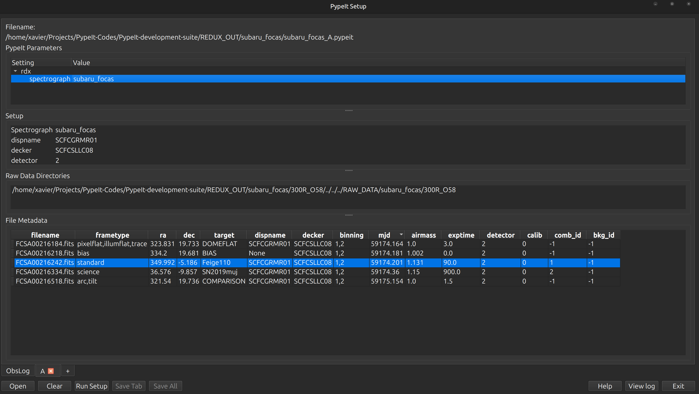

In this case, all of the files have already been selected
to have a similar setup (i.e., same grating, decker, binning, etc.).
But one of the files (FCSA00216242.fits) is mis-typed as a science 
frame instead of a standard star. We change the ``frametype`` of this
file to ``standard`` and then click on the ``Save All`` button.

This writes the :ref:`pypeit_file` called ``subaru_focas_A.pypeit``:

.. include:: ../include/subaru_focas_A.pypeit.rst

Inspecting this file, we want to make sure that all the frame types were accurately assigned in the
:ref:`data_block`.  If not, these can be fixed by editing the :ref:`pypeit_file` directly; see instructions
:ref:`here<data_block>`. We can also remove any bad (or undesired) calibration
or science frames from the list, by either deleting them altogether or commenting them out with a ``#``.

In this case, we have restricted the reduction to 
find only 2 objects in the science frames. 
This is done by setting the parameter ``maxnumber_sci`` to 2
under [reduce][[findobj]] in the :ref:`pypeit_file`.

.. note::

    PypeIt has a long list of parameters that can be set by the user to customize the reduction. This
    makes PypeIt very flexible and able to reduce a wide range of data from many instruments. Most
    parameters are set by default for the specific instrument, see  :ref:`instr_par-subaru_focas`.
    Moreover, there are some parameters that are set by default for a specific configuration within
    the same instrument. For example, in many cases, PypeIt uses by default different wavelength templates
    for different gratings.  The default parameters are not shown in the
    :ref:`pypeit_file`, therefore it may be sometime difficult to know which parameters to set
    and which ones to leave as default.
    To help with this, the user can inspect the ``.par`` file, which is generated at the very beginning
    of the main run (see below). This file contains every single available parameter with the assigned
    value, giving the user an idea of what are the values of the default parameters.

Main Run
========

Once the :ref:`pypeit_file` is ready, the main call is simply:

.. code-block:: bash

    run_pypeit subaru_focas_A.pypeit -o

The ``-o`` flag indicates that any existing output files should be overwritten.  As
there are none, it is superfluous but we recommend (almost) always using it.

The code will run uninterrupted until the basic data-reduction procedures
(wavelength calibration, field flattening, object finding, sky subtraction, and
spectral extraction) are complete; see :doc:`../running`.

As the code processes the data, it will produce a number of files and QA plots
that can be inspected. A number of :ref:`inspect_scripts` are available to help
with this process.  We present some of these below.

Calibrations
------------

Slit Edges
++++++++++

The code first uses the ``trace`` frames to find the slit edges on the detector.
When available, the slitmask design information is used to help find the slit edges
(**not for long-slit observations**).

To check that PypeIt correctly identified every slits, we can run the :ref:`pypeit_chk_edges` script,
with this explicit call:

.. code-block:: bash

    pypeit_chk_edges Calibrations/Edges_A_0_DET01.fits.gz

which opens the `ginga`_ image viewer. Here is a zoom-in screenshot from the first tab
in the `ginga`_ window:

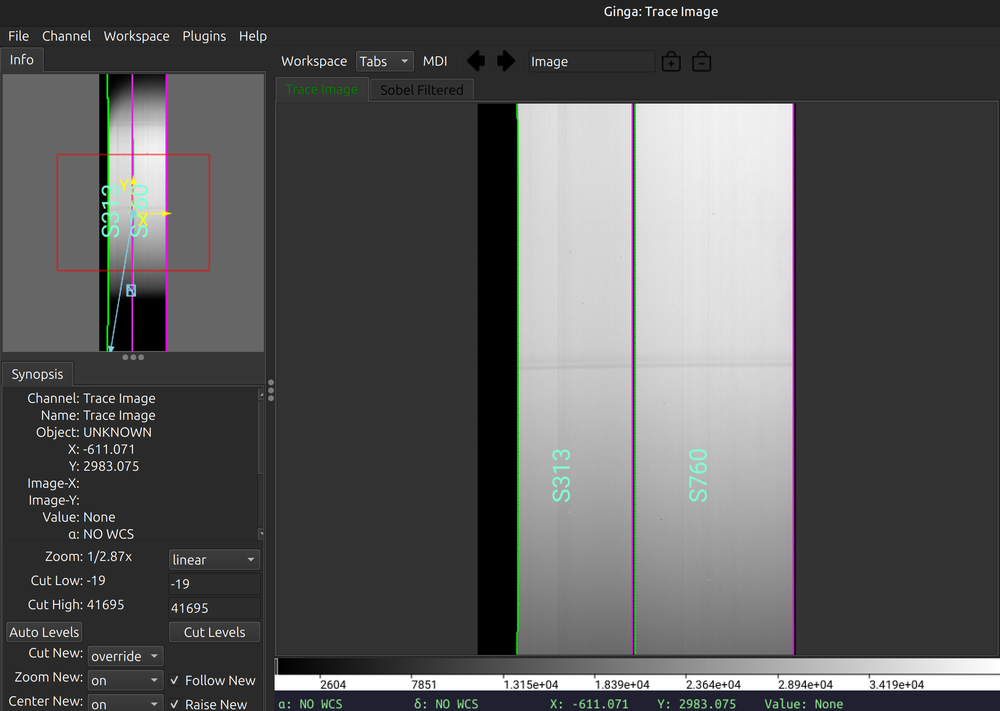

The data shown is the *Trace Image*, i.e., the flat image.
The green/magenta lines indicate the left/right slit edges.  
The aquamarine labels starting with an
``S`` are the internal slit identifiers of PypeIt. 
In this case, the code has identified 2 slits on the detector, which is correct.

See :ref:`edges` for further details.

Arc
+++

You can view the ``Arc`` image used for the wavelength calibration of the science frame with `ginga`_:

.. code-block:: bash

    ginga Calibrations/Arc_A_0_DET01.fits

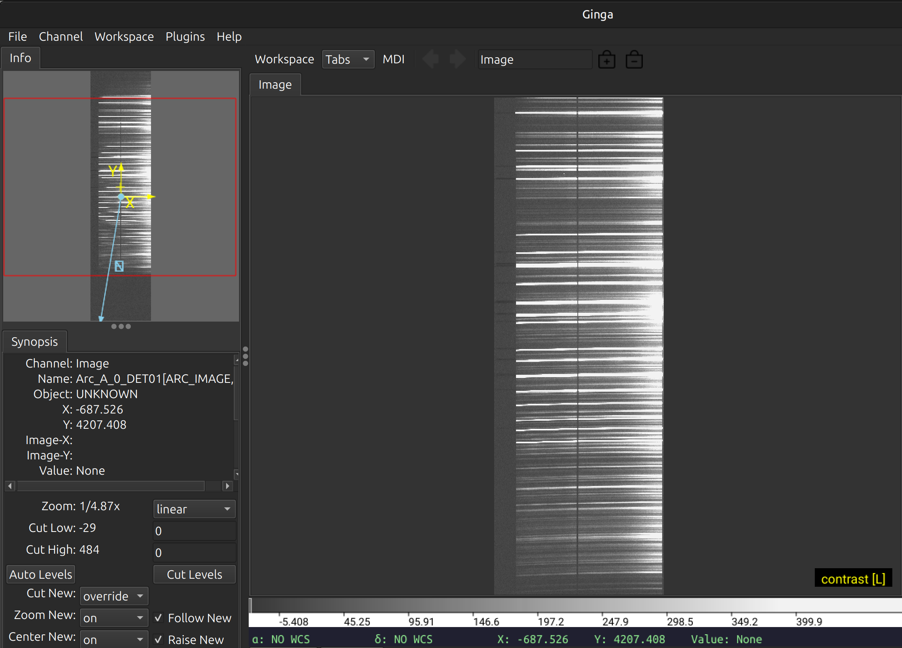

As typical of most arc images, we can see a series of arc lines, here oriented approximately horizontally.
It is important to inspect the arc image to make sure it looks good, ensuring to get a good wavelength calibration.

See :ref:`arc` for further details.

Wavelengths
+++++++++++

It is, also, very important to inspect the :ref:`qa` for the wavelength calibration.
These are PNG files in the ``QA/PNG/`` folder.

1D
::

Here is an example of the 1D fits for one of the slit on the detector,
written to the ``QA/PNGs/Arc_1dfit_A_0_DET01_S0760.png`` file:

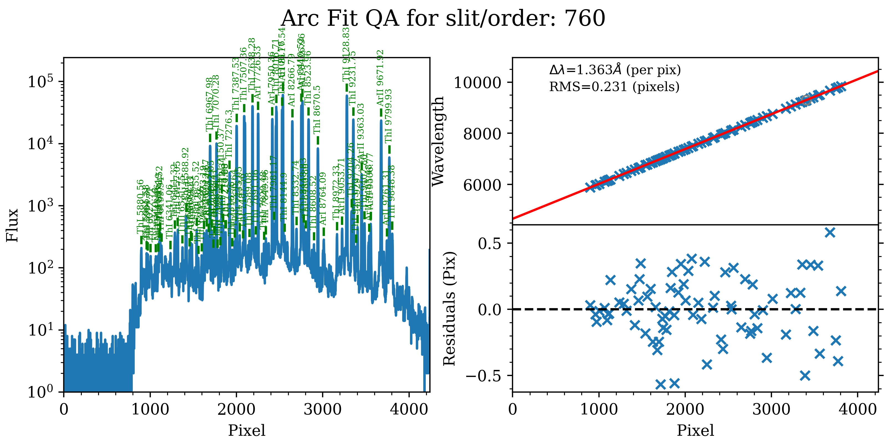

The left panel shows the arc spectrum extracted down the center of the slit, with the lines
used by the wavelength calibration marked in green.  Gray lines mark detected features that were
*not* included in the wavelength solution.  The top-right panel shows the fit (red) to the
observed trend in wavelength as a function of spectral pixel (blue crosses); gray circles
are features that were rejected by the wavelength solution.  The bottom-right panel shows the
fit residuals (i.e., data - model).

What you hope to see in this QA is:

 - On the left, many of the arc lines marked with green IDs
 - In the upper right, an RMS < 0.3 pixels [depending on binning]
 - In the lower right, a random scatter about 0 residuals

In addition, the script :ref:`pypeit-chk-wavecalib` provides a summary of the wavelength calibration
for all the spectra. We can run it with this simple call:

.. code-block:: bash

    pypeit_chk_wavecalib Calibrations/WaveCalib_A_0_DET01.fits

and it prints on screen the following table:

.. code-block:: bash

    N. SpatOrderID minWave Wave_cen maxWave dWave Nlin     IDs_Wave_range    IDs_Wave_cov(%) measured_fwhm  RMS 
    --- ----------- ------- -------- ------- ----- ---- --------------------- --------------- ------------- -----
    0         313  4673.0   7557.1 10434.8 1.358   76  5879.905 -  9848.383            68.9           7.6 0.231
    1         760  4658.4   7548.0 10439.9 1.363   77  5880.556 -  9848.383            68.6           8.2 0.231

See :ref:`pypeit-chk-wavecalib` for a detailed description of all the columns.

Tilts
:::::

Wavelength tilts are measured performing a 2D fit to the traced arc lines.
There are several QA files written for the 2D fits. One example is
``QA/PNGs/Arc_tilts_2d_A_0_DET01_S0760.png``:

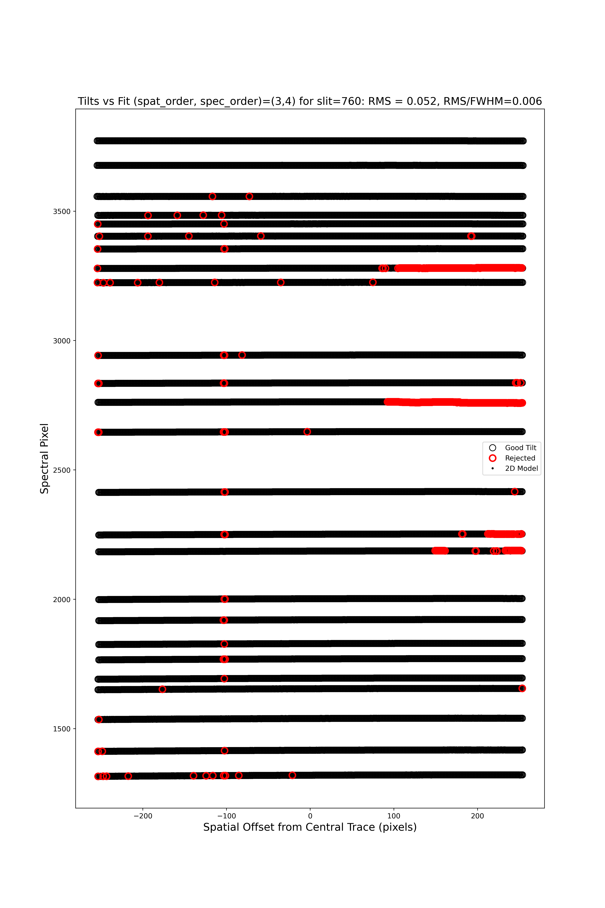

Each horizontal line of black open circles identifies a traced arc line.
Red circles shows the points that were rejected in the 2D fitting, and the
black points show the model predicted position.  The text across the top of
the figure gives the RMS of the 2D wavelength solution, which should be less than 0.1 pixels.

The 2D fit for the wavelength tilts can also be inspected using the script :ref:`pypeit_chk_tilts`,
which shows a :ref:`tiltimg` image in a `ginga`_ or `matplotlib`_ window with the
traced and 2D fitted tilts over-plotted. 

See :ref:`tilts` for further details.

Flatfield
+++++++++

PypeIt computes a number of multiplicative corrections to correct the 2D spectral response
for pixel-to-pixel detector throughput variations and lower-order spatial and spectral illumination
and throughput corrections.  We collectively refer to these as flat-field corrections; see
:ref:`here <flat_fielding>` and :ref:`here <flat>`.
To inspect the ``Flat`` images we can use the script :ref:`pypeit_chk_flats`, with this explicit call:

.. code-block:: bash

    pypeit_chk_flats Calibrations/Flat_A_0_DET01.fits

Here is a zoom-in screenshot from the first tab in the `ginga`_ window (``pixflat_norm``):

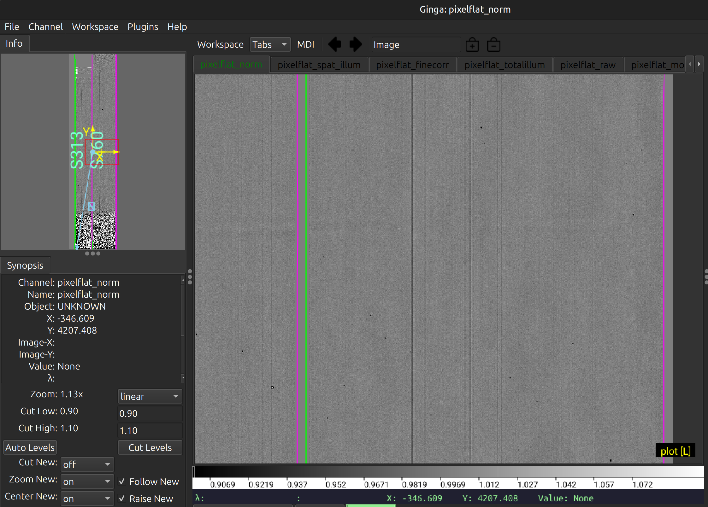

This shows the normalized flat field image. The green/magenta lines are the slit edges, which are
tweaked using the illumination flat field.

See :ref:`flat` and :ref:`flat_fielding` for further details.

Object finding
--------------

After the above calibrations are complete, PypeIt will iteratively identify
sources, perform global and local sky subtraction, and perform 1D spectral
extractions.  This process is fully described here: :ref:`object_finding`.

PypeIt produces QA files that allow you to assess the detection of the objects.
One example is ``QA\PNGs\FCSA00216334-SN2019muj_FOCAS_20201121T083826.517_DET01_S0760_obj_prof.png``:

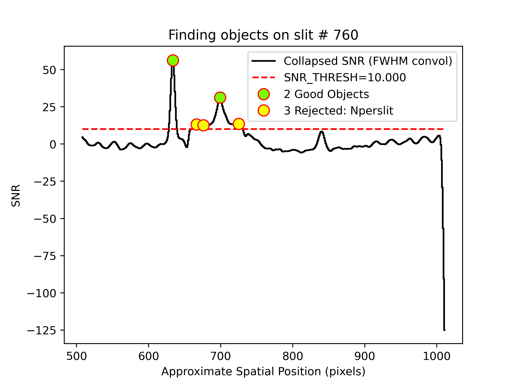

This shows the spatial profile of the object's S/N collapsed along the spectral direction.
The dashed red line is the S/N threshold set by the :ref:`findobjpar`, and the green circle
marks the spatial position of the detected object. This plot is useful to assess if the object
was correctly detected and if the S/N threshold (``snr_thresh``) set is appropriate for the
observation.  You will note that there were 3 objects rejected because we restricted 
the code to find only 2 objects in the science frame.
See :ref:`object_finding` for further details.

Flexure
-------

PypeIt also measures a spectral flexure correction, by performing a cross-correlation
between the sky spectrum extracted in each slit and an archived sky spectrum.
The relative shift between the two spectra is then used to correct the wavelength solution
for each slit (see :ref:`flexure-spectral`).
Two flexure corrections are computed, one (called ``global``) using the sky lines
extracted at the center of the slit, and one (called ``local``) using the sky lines
extracted at the location of the science object.

There are two QA files (two for the ``global`` and two for the ``local`` correction)
that can be used to assess the flexure correction. Here is an example of two QA files
for the ``global`` correction, called
``QA/PNGs/FCSA00216334-SN2019muj_FOCAS_20201121T083826.517_global_DET01_S0760_spec_flex_corr.png``
``QA/PNGs/FCSA00216334-SN2019muj_FOCAS_20201121T083826.517_global_DET01_S0760_spec_flex_sky.png``:

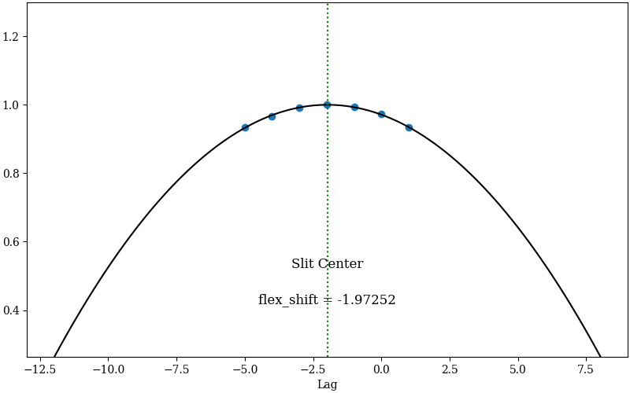
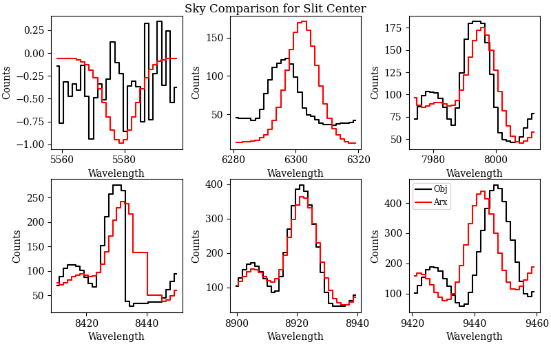

The first plot shows the polynomial fit (black line) between the top seven highest cross-correlation values
(y-axis) and the corresponding shift in pixels (x-axis). The value of the shift with the highest
cross-correlation is the flexure correction applied to the wavelength solution (also printed in the plot).
The user should inspect this plot to make sure that the fit is good and that the value of the flexure shift
is comparable to what expected for the observations.
The second plot shows sky spectrum cutouts around some of the sky lines used for the 
flexure correction.
The black line is the sky spectrum extracted at the center of the slit shifted by the
computed flexure correction, while the red line is the archived sky spectrum. 
This is another way to
assess that the computed flexure correction is good. The user should hope to see a 
good match between the two spectra.

Outputs
=======

The primary science output from :ref:`run-pypeit` are 2D spectral images and 1D
spectral extractions, located in the ``Science/`` folder.; see :ref:`outputs`.

Spec2D
------

Slit inspection
+++++++++++++++

It is frequently useful to view a summary of the slits successfully reduced by PypeIt, by
running the script :ref:`pypeit_parse_slits`.
In this example, we can inspect the reduced 2D spectrum with this explicit call:

.. code-block:: bash

     pypeit_parse_slits Science/spec2d_FCSA00216334-SN2019muj_FOCAS_20201121T083826.517.fits

which print the following table in the terminal:

.. code-block:: bash

    ============================== DET01 ==============================
    SpatID Flags
    ------ -----
    313  None
    760  None

The two columns printed to screen are ``SpatID`` (the internal PypeIt ID), 
and ``Flags`` for each slit.
If the calibration failed for some slits, the ``Flags`` column will show the reason for 
the failure.
Those slits with *None* in the ``Flags`` column have been successfully reduced.

Visual inspection
+++++++++++++++++

The 2D spectrum can be visually inspected using the script :ref:`pypeit_show_2dspec`.
In this example, we can visualize the 2D spectrum with this explicit call:

.. code-block:: bash

    pypeit_show_2dspec Science/spec2d_FCSA00216334-SN2019muj_FOCAS_20201121T083826.517.fits

The ``--removetrace`` only shows the object trace in the first channel (the channel showing the
calibrated science image), but does not include it in the remaining channels. It is helpful to
use the ``--removetrace`` option to better visualize the object traces (especially for faint
objects).

We show here a zoom-in screenshot from three (``sciimg-DET01``, ``skysub-DET01``, ``sky_resid-DET01``) of the
four tabs in the `ginga`_ window:

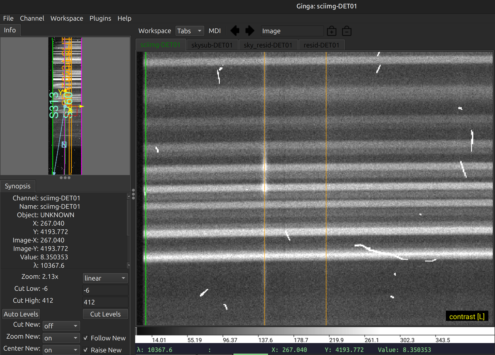
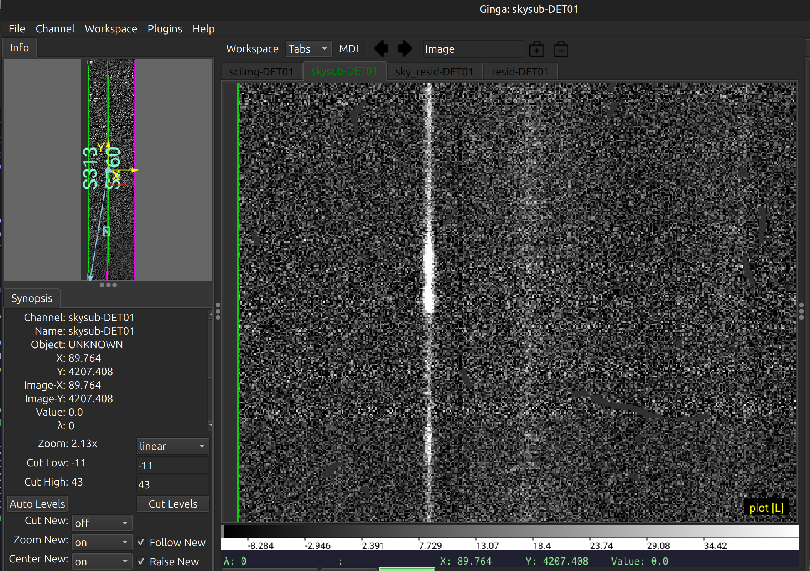
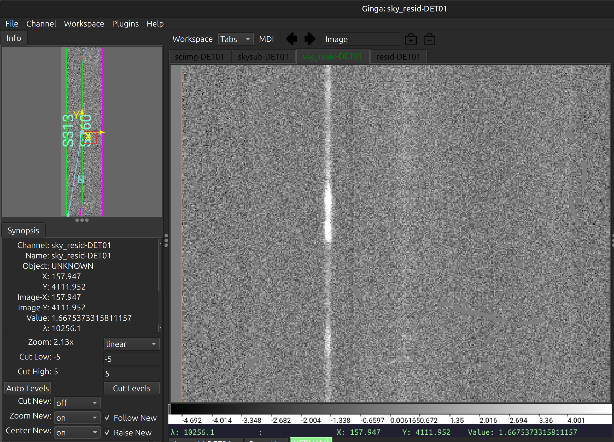

This shows on the top the calibrated science image, in the middle the sky-subtracted
calibrated image, and on the bottom the sky residual image (sky-subtracted
calibrated image divided by the uncertainties).
The green/magenta lines are the slit edges.  The orange lines (shown only in the first channel)
are the object traces. 
See :ref:`spec-2d-output` for further details.

The main assessments to perform are to make sure that the object is well traced,
that there are little to no strong sky residuals in the ``sky_resid`` channel,
and that the data in the ``resid`` channel looks like pure noise (see also :ref:`pypeit_chk_noise_2dspec`).

Spec1D
------

You can see a summary of all the extracted sources in the ``spec1d*.txt`` files saved
in the ``Science/`` folder.  For this example, here are the first few lines of the file
``Science/spec1d_FCSA00216334-SN2019muj_FOCAS_20201121T083826.517.txt``:

.. code-block:: console

    | slit |                    name | obj_id | spat_pixpos | spat_fracpos | box_width | opt_fwhm |  s2n | wv_rms |
    |  760 | SPAT0634-SLIT0760-DET01 |    634 |       634.2 |        0.249 |      3.00 |    0.805 | 2.14 |  0.231 |
    |  760 | SPAT0700-SLIT0760-DET01 |    700 |       699.6 |        0.380 |      3.00 |    3.944 | 1.37 |  0.231 |

It shows a table with the PypeIt names of the extracted spectra in each slit and all the associated
information about the extraction and the object. See :ref:`spec1d-extract_info` for a detailed description of this file.
**Note that the maskdef_id, objname, objra, objdec and maskdef_extract columns are not
printed for long-slit observations.**

To inspect the 1D spectrum, we can use the script :ref:`pypeit_show_1dspec`, with a call like this:

.. code-block:: bash

    pypeit_show_1dspec Science/spec1d_FCSA00216334-SN2019muj_FOCAS_20201121T083826.517.fits

which plots the spectrum in a tab of the `ginga`_ viewer and allows to select the different extracted spectra using a
drop down menu, in addition to selecting other properties of the spectrum. Here is one exemple:

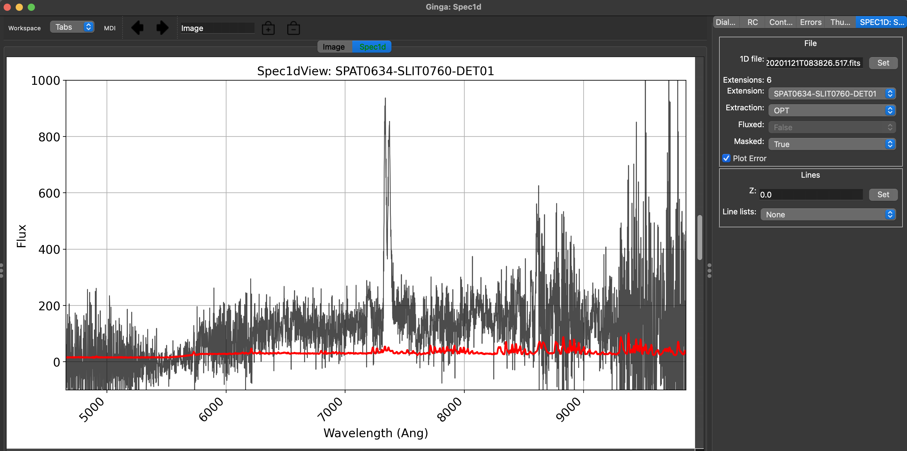

The black line is the flux and the red line is the estimated error. In the `ginga`_ window, the user can
select the different extracted spectra, the extraction type (``OPT`` or ``BOX``), fluxed or not fluxed spectrum, and
if showing masked data, by using the drop down menu on the right of the window. Common spectral features
can be over-plotted by selecting an option in the ``Line lists`` drop down menu and providing a redshift.

See :ref:`spec-1d-output` for further details.

Noise
-----

Another important QA is to inspect the noise properties of the 
reduced 1D and 2D spectra.

2D 
++

Use the script :ref:`pypeit_chk_noise_2dspec` to inspect the
noise properties of the 2D spectra:

.. code-block:: bash

    pypeit_chk_noise_2dspec spec2d_FCSA00216334-SN2019muj_FOCAS_20201121T083826.517.fits

This launches a GUI on your screen. Here is an example screenshot:

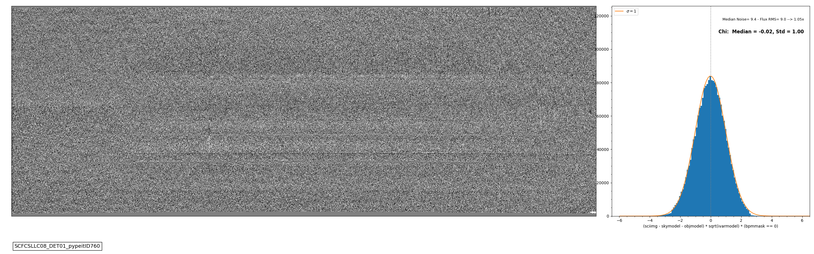

Here, we see the residuals are well centered around zero, and the histogram of
the S/N values is well matched to the expected Gaussian distribution 
with unit variance.

1D 
++

Use the script :ref:`pypeit_chk_noise_1dspec` to inspect the 
noise properties of the 1D spectra.

.. code-block:: bash

    pypeit_chk_noise_1dspec spec1d_FCSA00216334-SN2019muj_FOCAS_20201121T083826.517.fits  --ploterr

This launches a GUI on your screen. Here is an example screenshot:

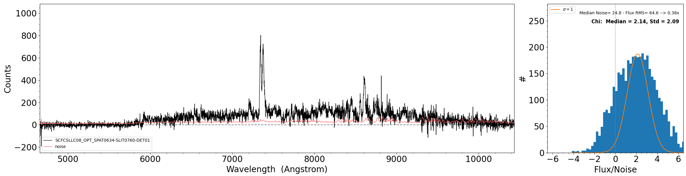

The plot on the right is showing the distribution of Flux/Noise of 
the extracted spectrum. In this example there is clearly flux coming 
from the object that biases the Flux/Noise diagnostic plot. 
However, this script provides the possibility to select a region in 
the spectrum without emission to be used for the diagnostic plot.