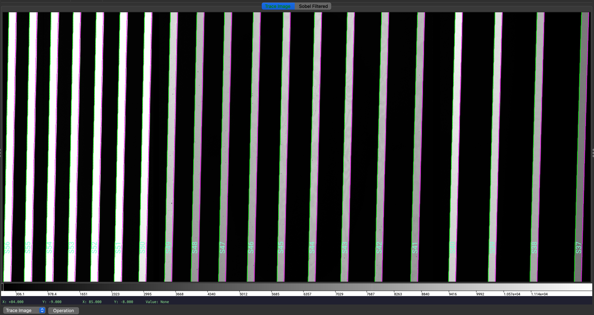
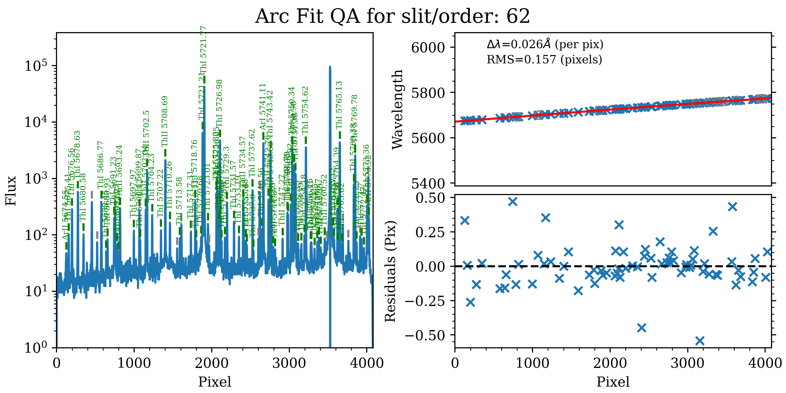
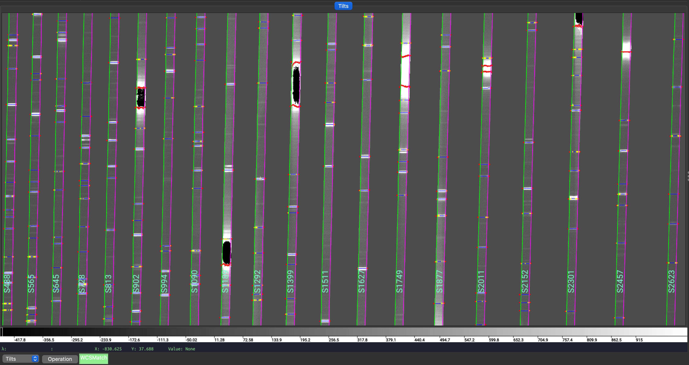
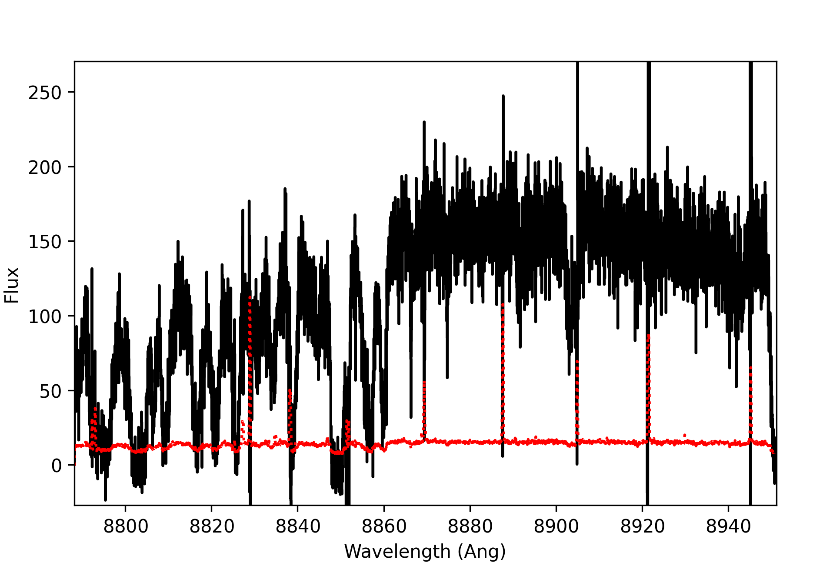
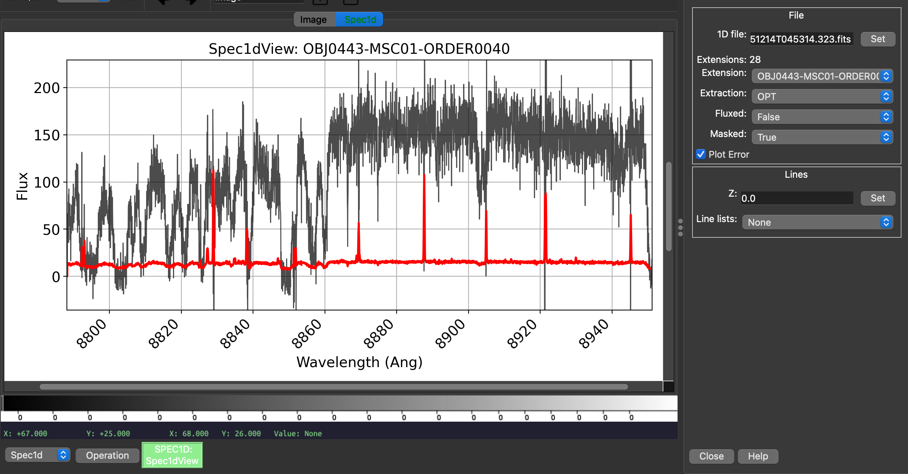
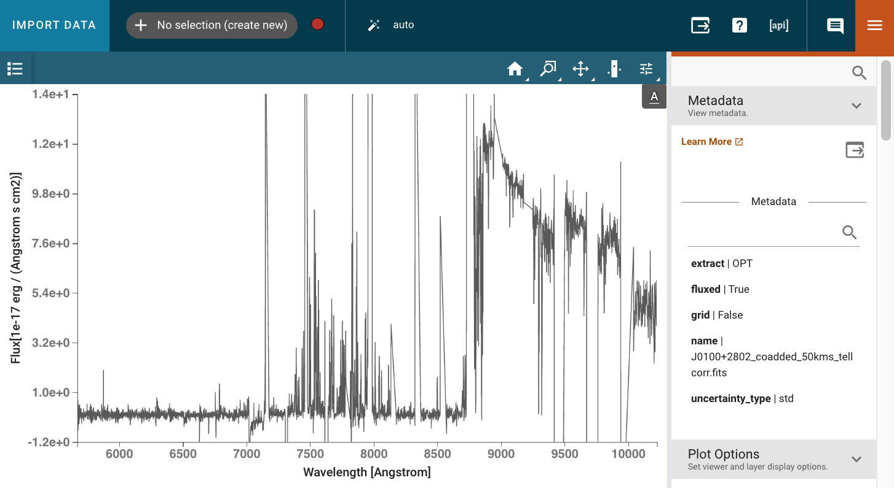

.. include:: ../include/links.rst

.. _hires_howto:

================
Keck-HIRES HOWTO
================

Overview
========

This tutorial goes through a full run of PypeIt on one of our example Keck/HIRES datasets.
Specifically, we shows the reduction of the ``J0100+2802_H204Hr_RED_C1_ECH_-0.82_XD_1.62_1x2``
dataset, which are observations of the quasar J0100+2802 at z=6.29 taken with the HIRES RED
cross-disperser, echelle angle of -0.82°, cross-disperser angle of 1.62°, and 1x2
(spectral x spatial) binning.  See :ref:`here <dev-suite>` to find this example dataset.

If you're having trouble reducing your data, we encourage you to try going through this tutorial
using this example dataset first.  Please join our `PypeIt Users Slack <pypeit-users.slack.com>`__
(using `this invitation link
<https://join.slack.com/t/pypeit-users/shared_invite/zt-1kc4rxhsj-vKU1JnUA~8PZE~tPlu~aTg>`__)
to ask for help, and/or `Submit an issue`_ to Github if you find a bug!

The following was performed on a Macbook Pro with 16 GB RAM. The main reduction took
approximately 1 hour and 30 minutes, and the fluxing took an additional 20 minutes.

Setup
=====

Organize data
-------------

Identify the folder where the raw data are stored and make sure you have all the calibration files
you need, in addition to the science ones. In this example, the raw data are stored in the folder
``PypeIt-development-suite/RAW_DATA/keck_hires/J0100+2802_H204Hr_RED_C1_ECH_-0.82_XD_1.62_1x2``.

.. note::

    This folder can include data from different datasets (e.g., observations taken with various
    echelle angles, cross-disperser angles, etc). The script :ref:`pypeit_setup` (see next step)
    will help to parse the desired dataset.

Run ``pypeit_setup``
--------------------

The first script to run with PypeIt is :ref:`pypeit_setup`, which examines the raw files and generates
a sorted list and (when instructed) one :ref:`pypeit_file` per instrument configuration. See complete
instructions provided in :ref:`setup_doc`.

For this example, we move to the folder where we want to perform the reduction and save the
associated outputs and we run:

.. code-block:: bash

    pypeit_setup -s keck_hires -r PypeIt-development-suite/RAW_DATA/keck_hires/J0100+2802_H204Hr_RED_C1_ECH_-0.82_XD_1.62_1x2

This creates, in a folder called ``setup_files/``, a ``.sorted`` file that shows the raw files organized
by datasets. We inspect the ``.sorted`` file and identify the dataset that we want to reduced
(in this case it is indicated with the letter ``A`` ) and re-run ``pypeit_setup`` with the flag `-c A` as:

.. code-block:: bash

    pypeit_setup -s keck_hires -r PypeIt-development-suite/RAW_DATA/keck_hires/J0100+2802_H204Hr_RED_C1_ECH_-0.82_XD_1.62_1x2 -c A

This creates a :ref:`pypeit_file` called ``keck_hires_A.pypeit`` inside a folder called ``keck_hires_A.pypeit/``,
and it looks like this:

.. include:: ../include/keck_hires_A.pypeit.rst

Inspecting this file, we want to make sure that all the frame types were accurately assigned in the
:ref:`data_block`.  If not, these can be fixed by editing the :ref:`pypeit_file` directly; see instructions
:ref:`here<data_block>`. We can also remove any bad (or undesired) calibration
or science frames from the list, by either deleting them altogether or commenting them out with a ``#``.
Additionally, we can make edits to the :ref:`parameter_block` to change the default parameters for the
reduction.

In this example, we want to use an archival special type of “slitless” pixel flat, which is provided by PypeIt
and saved to the PypeIt cache (see :ref:`here <hires_flat>` for more details). To do this, we add the the
``pixelflat_file`` parameter to the :ref:`parameter_block` like this:

.. code-block:: ini

   [calibrations]
      [[flatfield]]
         pixelflat_file = pixelflat_keck_hires_RED_1x2_20160330.fits.gz

And we make sure to delete the ``pixelflat`` frame type from the :ref:`data_block`.

.. tip::

    PypeIt has a long list of parameters that can be set by the user to customize the reduction. This
    makes PypeIt very flexible and able to reduce a wide range of data from many instruments. The default
    parameters are not shown in the :ref:`pypeit_file`, therefore it may be sometime difficult to know
    which parameters to set and which ones to leave as default.
    To help with this, the user can inspect the ``.par`` file, which is generated at the very beginning
    of the main run (see below). This file contains every single available parameter with the assigned
    value, giving the user an idea of what are the values of the default parameters.

The edited version looks like this (pulled directly from the :ref:`dev-suite`):

.. include:: ../include/keck_hires_A_edited.pypeit.rst

Main Run
========

Once the :ref:`pypeit_file` is ready, the main call is simply:

.. code-block:: bash

    cd keck_hires_A
    run_pypeit keck_hires_A.pypeit -o

The ``-o`` flag indicates that any existing output files should be overwritten.  As
there are none, it is superfluous but we recommend (almost) always using it.

The code will run uninterrupted until the basic data-reduction procedures
(wavelength calibration, field flattening, object finding, sky subtraction, and
spectral extraction) are complete; see :doc:`../running`.

As the code processes the data, it will produce a number of files and QA plots
that can be inspected. A number of :ref:`inspect_scripts` are available to help
with this process.  We present some of these below.

Calibrations
------------

Order Edges
+++++++++++

The code first uses the ``trace`` frames to find the order edges on the three HIRES
detector mosaiced together. To check that PypeIt correctly identified every order,
we can run the :ref:`pypeit_chk_edges` script, with this explicit call:

.. code-block:: bash

    pypeit_chk_edges Calibrations/Edges_A_0_MSC01.fits.gz

which opens the `ginga`_ image viewer. Here is a zoom-in screenshot from the
first tab in the `ginga`_ window:

   *Trace Image*, i.e., the flat image, with the traced order edges overlaid.
   The green/magenta lines indicate the left/right order edges, and the aquamarine
   labels starting with an ``S`` are the internal slit/order identifiers of PypeIt.

Additionally, since for echelle observations PypeIt is able to add missing orders, a QA
file is automatically generated to allow the user to assess the success of the predicted locations;
see :ref:`qa-order-predict`.
The QA file is a PNG file in the ``QA/PNG/`` folder and it looks like this:

.. container:: objfind

   .. image:: ../figures/Edges_A_0_MSC01_orders_qa.png
      :align: center

   *QA plot, called ``Edges_A_0_MSC01_orders_qa.png``, showing the measured order
   spatial widths (blue) and gaps (green) in pixels. The colored lines show
   the best fit polynomial model used for the predicted order locations. The
   missing orders that are added are shown as open squares.*

Wavelengths
+++++++++++

The wavelength calibration is usually performed using the ThAr arc lamp frames. The results can
be inspected using the automatically generated QA files; see :ref:`qa-wave-fit`.

Below is the 1D fit wavelength-calibration QA plot for the bluest order in this dataset (order=62).
Such a plot is produced for each order.

   The 1D fit wavelength-calibration QA plot for the bluest Keck/HIRES order
   (order=62), called ``Arc_1dfit_A_0_MSC01_S0062.png``.  The left panel shows
   the arc spectrum extracted down the center of the order, with green text and
   lines marking lines used by the wavelength calibration.  Gray lines mark
   detected features that were *not* included in the wavelength solution.  The
   top-right panel shows the fit (red) to the observed trend in wavelength as a
   function of spectral pixel (blue crosses); gray circles are features that
   were rejected by the wavelength solution.  The bottom-right panel shows the
   fit residuals (i.e., data - model).

For echelle spectrographs, the automated wavelength calibration procedure will
also perform a 2d fit to attempt to improve the 1d fits. The results of the 2d
fit can be inspected by looking at the automatically generated QA files. Below
is an example of the global 2D fit and the improved 1D fits QA plots.

.. container:: image-group

   .. image:: ../figures/hires_wave_global2dfit.png
      :width: 48%

   .. image:: ../figures/hires_wave_after2dfit.png
      :width: 48%

   *Wavelength-calibration QA plots, showing the global 2D fit (on the left) and
   the improved 1D fits (on the right) for the six reddest orders in the Keck/HIRES
   dataset, i.e. the orders in the red ccd.*

In addition, the script :ref:`pypeit-chk-wavecalib` provides a summary of the wavelength
calibration for all orders. We can run it with this simple call:

.. code-block:: bash

    pypeit_chk_wavecalib Calibrations/WaveCalib_A_0_MSC01.fits

and it prints on screen the following (here truncated) table:

.. code-block:: bash

     N. SpatOrderID minWave Wave_cen maxWave dWave Nlin     IDs_Wave_range    IDs_Wave_cov(%) measured_fwhm  RMS
    --- ----------- ------- -------- ------- ----- ---- --------------------- --------------- ------------- -----
      0          62  5671.2   5725.3  5775.1 0.026   72  5674.551 -  5773.924            95.6           4.6 0.157
      1          61  5764.1   5819.1  5869.8 0.026   74  5764.392 -  5868.438            98.4           4.7 0.174
      2          60  5860.1   5916.1  5967.7 0.027   87  5861.293 -  5965.578            96.9           4.7 0.179
      3          59  5959.3   6016.4  6068.9 0.027   73  5961.325 -  6067.459            96.8           4.6 0.097
      4          58  6062.0   6120.1  6173.6 0.028   70  6063.214 -  6171.881            97.3           4.6 0.105
      5          57  6168.3   6227.5  6282.0 0.028   78  6171.529 -  6280.903            96.2           4.7 0.147

See :ref:`pypeit-chk-wavecalib` for a detailed description of all the columns.

Tilts
+++++

Wavelength tilts are measured performing a 2D fit to the traced arc lines.
There are several QA files written to the ``QA/PNG/`` folder that can be inspected
to check the quality of the 2D fits. See :ref:`tilts_qa_all` for examples of these QAs.

The 2D fit for the wavelength tilts can also be inspected using the script :ref:`pypeit_chk_tilts`,
which shows a :ref:`tiltimg` image in a `ginga`_ or `matplotlib`_ window with the
traced and 2D fitted tilts over-plotted. Here is an example:

.. code-block:: bash

    pypeit_chk_tilts Calibrations/Tilts_A_0_MSC01.fits

   Zoom-in of a :ref:`tiltimg` image in a `ginga`_ window with overlaid the 2D fitted tilts (blue),
   the masked pixels (red), and the pixels rejected in the 2D fitting (yellow). The lines that are
   not overlaid with any colored tilts are the ones that were not detected for the purpose of the
   performing the 2D fitting.

See :ref:`tilts` for further details.

Flatfield
+++++++++

PypeIt computes a number of multiplicative corrections to correct the 2D spectral response
for pixel-to-pixel detector throughput variations and lower-order spatial and spectral illumination
and throughput corrections.  We collectively refer to these as flat-field corrections; see
:ref:`here <flat_fielding>` and :ref:`here <flat>`.
To inspect the ``Flat`` images we can use the script :ref:`pypeit_chk_flats`, with this explicit call:

.. code-block:: bash

    pypeit_chk_flats Calibrations/Flat_A_0_MSC01.fits

This script displays a series of flat fielding images in a `ginga`_ viewer, each in a separate tab.
See :ref:`flat` and :ref:`flat_fielding` for further details.

Object Finding and Extraction
-----------------------------

After the above calibrations are complete, PypeIt will iteratively identify
sources, perform global and local sky subtraction, and perform 1D spectral
extractions.  This process is fully described here: :ref:`object_finding`.

PypeIt produces QA files that allow you to assess the detection of the objects.
For example, here is the QA plots for the quasar and standard star spectra in order 35 (reddest order):

.. container:: objfind

   .. image:: ../figures/hires_objfind.png
      :width: 48%

   .. image:: ../figures/hires_objfind2.png
      :width: 48%

   *Detection of the quasar (left) and standard star (right) in order 35 spectra.
   The black line shows the spectrally collapsed S/N as a function of position within the order.
   The dashed red line is the S/N threshold set by the :ref:`findobjpar`, and
   the green circle marks the spatial position of the detected object. This plot
   is useful to assess if the object was correctly detected and if the S/N
   threshold (``snr_thresh``) parameter set is appropriate for the observation.*

Given that HIRES produces multi-order echelle data, PypeIt will attempt to extract
the object spectrum across all orders, even if it is only detected in a single order.
Therefore, PypeIt uses the provided standard spectrum as a crutch to trace the relative
spatial position of the object spectrum in all orders.

Outputs
=======

The primary science output from :ref:`run-pypeit` are 2D spectral images and 1D
spectral extractions, located in the ``Science/`` folder.; see :ref:`spec-2d-output`
and :ref:`spec-1d-output`.

Spec2D
------

The calibrated 2D spectral images can be visually inspected using
:ref:`pypeit_show_2dspec`, which displays the images in a `ginga`_ window.
The call to visualize the 2D spectral image of one of the quasar observations is:

.. code-block:: bash

    pypeit_show_2dspec Science/spec2d_HI.20151214.17593-SDSSJ0100+2802_HIRES_20151214T045314.323.fits

We show here a zoom-in screenshot from three (``sciimg-DET01``, ``sky_resid-DET01``, ``resid-DET01``) of the
four tabs in the `ginga`_ window:

.. container:: spec2d

   .. image:: ../figures/hires_sciimg.png

   .. image:: ../figures/hires_skyres.png

   .. image:: ../figures/hires_res.png

   *Calibrated science image at the top, in the middle the sky residual image (sky-subtracted
   calibrated image divided by the uncertainties), and on the right the residual image.
   The green/magenta lines are the order edges.  The orange lines are the object traces and the
   orange text is the PypeIt assigned name (starting with ``OBJ``).*

The main assessments to perform are to make sure that the object is well traced,
that there are little to no strong sky residuals in the ``sky_resid`` channel,
and that the data in the ``resid`` channel looks like pure noise (see also :ref:`pypeit_chk_noise_2dspec`).

Spec1D
------

A summary of all the extracted sources is reported in an ASCII text with the
same name as the spec1d fits file, but with the extension changed from ``.fits`` to ``.txt``.
For this example, here are the first few lines of the file
``Science/spec1d_HI.20151214.17593-SDSSJ0100+2802_HIRES_20151214T045314.323.txt``:

.. code-block:: console

   | order |          name | spat_pixpos | spat_fracpos | box_width | opt_fwhm |   s2n | wv_rms |
   |    62 | OBJ0443-MSC01 |        66.2 |        0.443 |      3.00 |    0.804 | -0.01 |  0.157 |
   |    61 | OBJ0443-MSC01 |       130.6 |        0.443 |      3.00 |    0.804 | -0.02 |  0.174 |
   |    60 | OBJ0443-MSC01 |       197.2 |        0.443 |      3.00 |    0.804 | -0.02 |  0.179 |
   |    59 | OBJ0443-MSC01 |       265.8 |        0.443 |      3.00 |    0.804 | -0.01 |  0.097 |
   |    58 | OBJ0443-MSC01 |       336.5 |        0.443 |      3.00 |    0.804 |  0.01 |  0.105 |

It shows a table with the PypeIt names of the extracted spectra in each order and all the associated
information about the extraction. See :ref:`spec1d-extract_info` for a detailed description of this file.
Each spectrum is given its own extension in the fits file, where the extension name is based
on the object name identified in the file and the order number; e.g.,
`OBJ0443-MSC01-ORDER0040`.

You can plot the spectrum using :ref:`pypeit_show_1dspec`:

.. code-block:: bash

    pypeit_show_1dspec Science/spec1d_HI.20151214.17593-SDSSJ0100+2802_HIRES_20151214T045314.323.fits --exten 23

The ``--exten 23`` argument specifies to use the 23rd extension in the fits file, which selects
the spectrum in the order 40. This uses the `XSpecGUI`_ from the `linetools`_ package,
and the result looks like this:

   `XSpecGUI`_ produced by calling :ref:`pypeit_show_1dspec` for the order=40 spectrum.
   The black line is the flux and the red line is the estimated error. In the window,
   press ``?`` to open a webpage with the `XSpecGUI keystrokes`_ that help you navigate
   through the spectrum.

Another option for visualizing the 1D extracted spectrum is to use the `ginga`_ viewer. The call
is simply:

.. code-block:: bash

    pypeit_show_1dspec Science/spec1d_HI.20151214.17593-SDSSJ0100+2802_HIRES_20151214T045314.323.fits --ginga

which plots the spectrum in a tab of the `ginga`_ viewer and allows to select the different order spectra using a
drop down menu, in addition to selecting other properties of the spectrum. Here is one exemple:

Fluxing and co-adding
=====================

The flux calibration is performed by first creating a sensitivity function from the
standard star observations. The sensitivity function is then applied to the science
observations. See :ref:`fluxing` for more details.

Generating a Sensitivity function
---------------------------------

The sensitivity function is generated by the :ref:`pypeit_sensfunc` script, using the
standard star observations reduced in the `Main Run`_. The typical call for HIRES is:

.. code-block:: bash

    pypeit_sensfunc -f Science/spec1d_HI.20151214.16715-Feige110_HIRES_20151214T043836.845.fits

The ``-f`` flag requests that the script uses the extracted spectrum of the flatfield calibration to
estimate the blaze function in order to improve the sensitivity function calculation. Other parameters
can be set through a configuration file, but in this case, most of the parameters needed for HIRES
are already set by default. See :ref:`sensfuncpar` for a list of all the parameters that can be set,
and :ref:`instr_par-keck_hires` for the default parameters for HIRES.

The script produces a sensitivity function file, called
``sens_HI.20151214.16715-Feige110_HIRES_20151214T043836.845.fits`` and three QA files that can be
inspected to assess the quality of the sensitivity function.
One QA file shows the fit, per order, of the sensitivity function zeropoint, another shows the computed throughput
for the current observation, and the last one shows the standard star spectrum flux-calibrated using
the generated sensitivity function. Here is an example of the zeropoint fit QA plot and the flux-calibrated
standard star spectrum:

.. container:: spec2d

   .. image:: ../figures/hires_zeropoint.png
      :width: 49%

   .. image:: ../figures/hires_std_fluxed.png
      :width: 48%

   *On the left, example of the spectroscopic zeropoint fit for order 58. On the right, the standard star
   spectrum flux-calibrated using the generated sensitivity function. The true archival standard star spectrum
   is also shown in green for comparison.*

Flux Calibration
----------------

For the next steps we need specific configuration files, which can be generated using the
:ref:`pypeit_flux_setup` script:

.. code-block:: bash

    pypeit_flux_setup --objmodel qso Science/ ./

This script takes as input the folder where the spec1d files are stored (``Science/``) and the folder
where the sensitivity function is stored (``./``). The ``--objmodel`` flag is used to specify the type
of object model to be used for the telluric correction. The script creates three configuration files:
``keck_hires.flux``, ``keck_hires.coadd1d``, and ``keck_hires.tell``.

The ``keck_hires.flux`` (see also :ref:`flux_file`) looks like this:

.. include:: ../include/keck_hires.flux.rst

It does not need much editing, besides making sure that the ``sensfile`` column has the correct file name.
In this example, both the quasar and standard star spectra are flux calibrated.

The flux calibration can be run with:

.. code-block:: bash

    pypeit_flux_calib keck_hires.flux

This will add a ``*_FLAM`` columns to each of the spec1d files in the ``Science/`` directory.
See :ref:`spec1D-datamodel` for more details.

Co-adding
---------

The next step is to co-add the flux-calibrated spectra. This step is particular important for
echelle observations, since the orders are are also stitched together. The co-addition is performed
using the :ref:`pypeit_coadd_1dspec` and the configuration file ``keck_hires.coadd1d``.

The configuration file (see also :ref:`coadd1d_file`) for co-adding the quasar spectra looks like this:

.. include:: ../include/keck_hires.coadd1d.rst

Before running the co-addition, we need to remove the standard star file from the :ref:`data_block`,
make sure that the ``sensfile`` column has the correct file name, and provide a name for the output ``coaddfile``.
In this example, the output file is called ``J0100+2802_coadded_50kms.fits``. If the sensitivity function
used is the same for all the objects, then it is enough to add the file name of the sensitivity function
only to the first row of the :ref:`data_block`.

In addition, we decided for this example to use a 50 km/s dispersion for the co-added spectrum,
by setting the parameter ``dv = 50.0``, which allows for a smoother visualization of the final spectrum.

The co-addition can then be run with:

.. code-block:: bash

    pypeit_coadd_1dspec keck_hires.coadd1d

The coadded spectrum can be visualized by just using `matplotlib`_, or we can take advantage of the
`specutils`_ interface available through PypeIt.  Use of this interface requires to have the `specutils`_
package installed. See :ref:`spec1D-specutils` for more details.
This interface allows us to interact with our spectrum using `jdaviz`_.  This **needs** to be done
within a `jupyter notebook`_, and the following lines can be used to load and visualize the co-added
spectrum:

.. code-block:: python

    from pypeit.specutils import Spectrum1D
    from jdaviz import Specviz

    file = 'J0100+2802_coadded_50kms.fits'
    spec = Spectrum1D.read(file)

    specviz = Specviz()
    specviz.load_data(spec)
    specviz.show()

Here is an example of how the spectrum looks in the `jdaviz`_ interface:

   The co-added spectrum of the quasar J0100+2802 at z=6.29, with a 50 km/s dispersion, visualized
   using the `jdaviz`_ interface.

Telluric Correction
-------------------

Last step that can be performed, if needed, is the telluric correction. This is done using the
:ref:`pypeit_tellfit` script and the configuration file ``keck_hires.tell``. The configuration file
looks like this:

.. include:: ../include/keck_hires.tell.rst

The telluric correction relies on a user-defined object model, defined by the ``objmodel`` parameter.
In this example, we are using a quasar model, and we needs to edit the configuration file to provide
the redshift of the quasar. The rest of the parameters can be left as default. See :ref:`telluricpar` for
a list of all the parameters that can be set, and :ref:`instr_par-keck_hires` for the default parameters
for HIRES.

The telluric correction can then be run with:

.. code-block:: bash

    pypeit_tellfit -t keck_hires.tell J0100+2802_coadded_50kms.fits

This will produce a telluric corrected spectrum, with the suffix ``_tellcorr``, which can still be visualized
using the `specutils`_ interface as shown above, and a file with the suffix ``_tellmodel`` that contains the
telluric model used to correct the spectrum.
