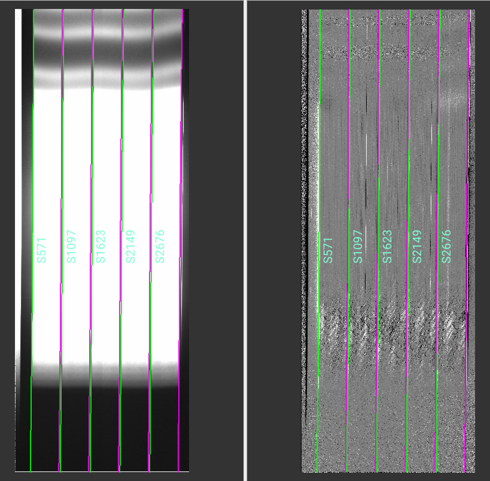
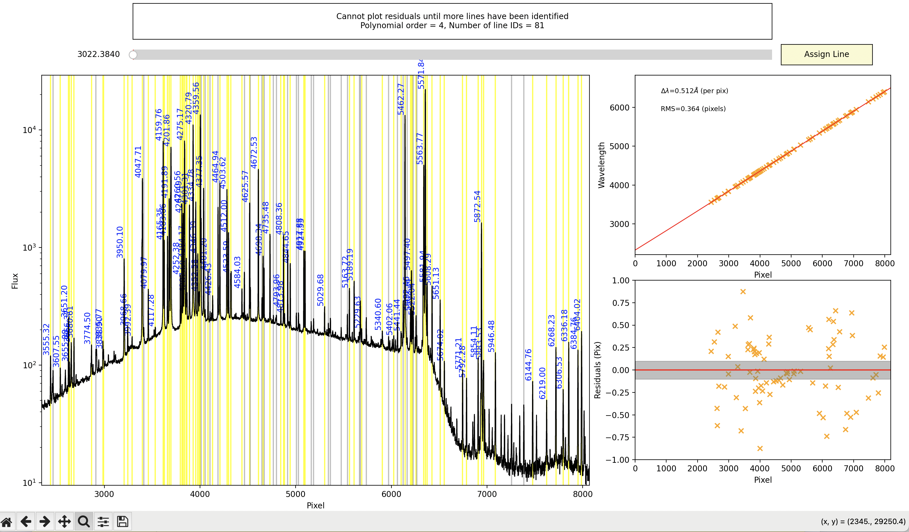
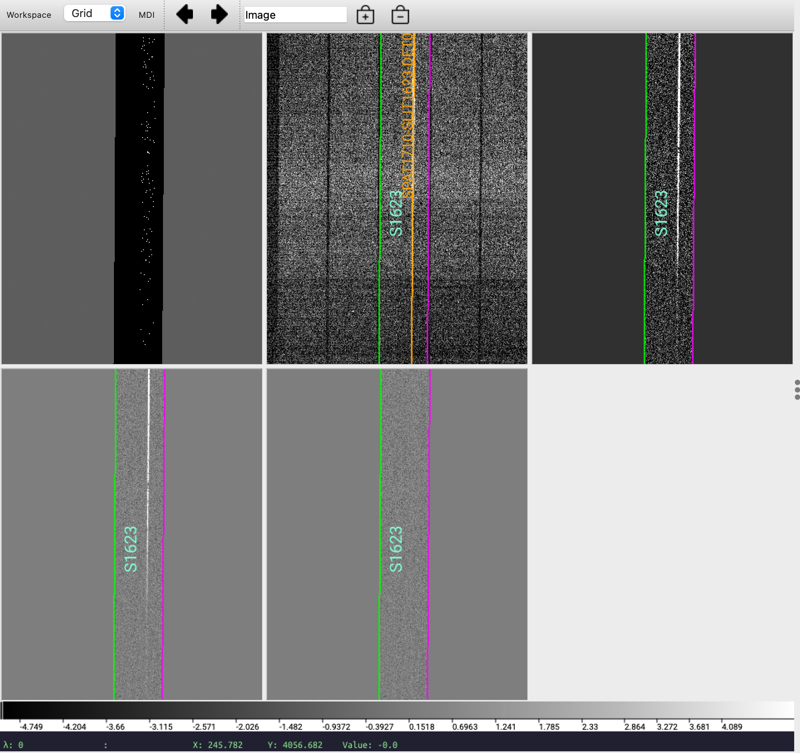
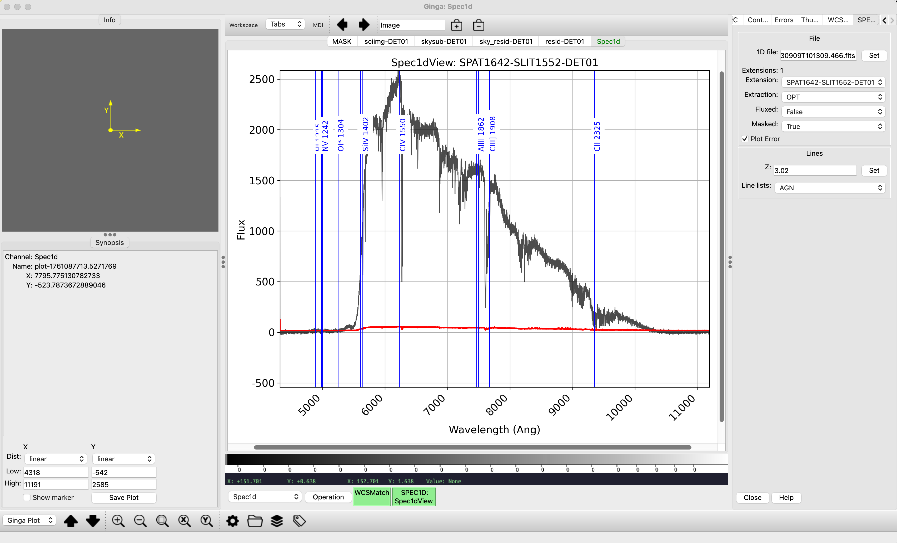
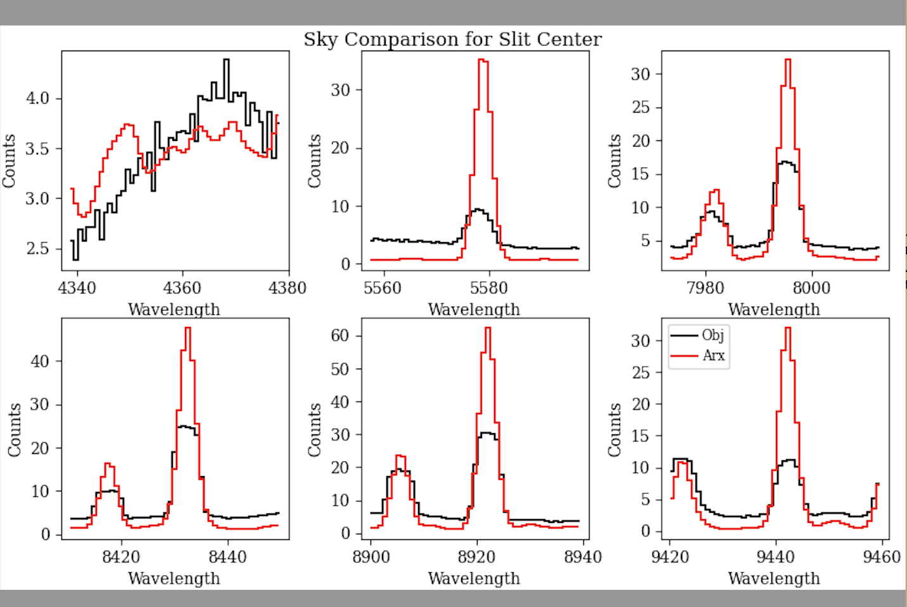
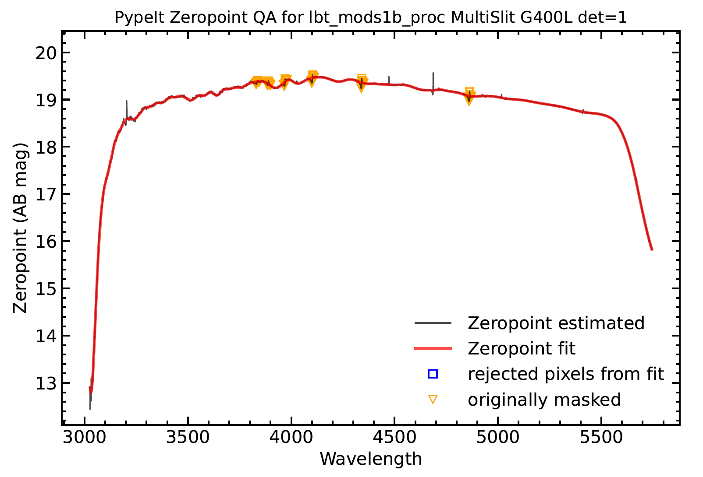
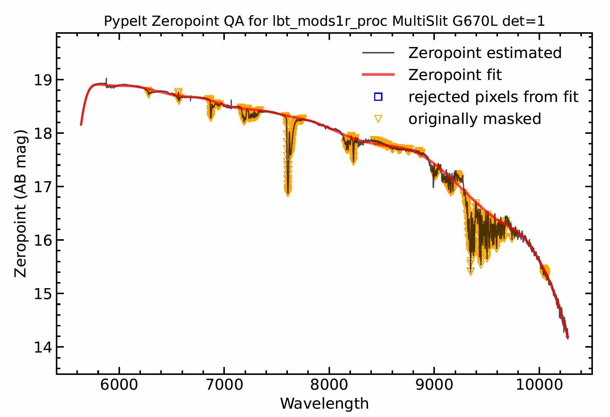
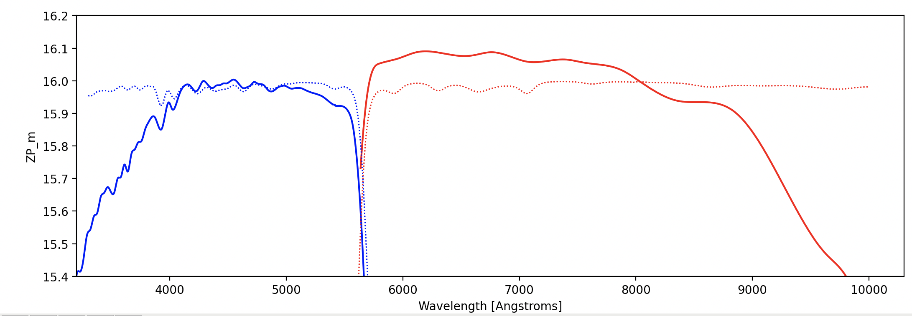

.. include:: ../include/links.rst

.. _mods_howto:

=================
LBT/MODS HOWTO
=================

Overview
========

This document provides a guide to reducing MODS longslit data with PypeIt: 
(1) from setting up the pypeit file; (2) through the main pypeit run which performs
the wavelength calibration, sky subtraction and extraction; (3) to the final steps of 
flux calibration, coaddition of the extracted 1D spectra and correction of telluric 
absorption. 

There are two sets of MODS spectrograph classes: (1) the original ones (*lbt_mods1b*, *lbt_mods1r*, *lbt_mods2b*
and *lbt_mods2r*) which work on the raw 2D spectra and (2) four new ones (*lbt_mods1b_proc*, *lbt_mods1r_proc*, 
*lbt_mods2b_proc* and *lbt_mods2r_proc*) which were added in v1.18 and work on spectra which have been pre-processed 
by the `modsCCDRed 
scripts <https://github.com/rwpogge/modsCCDRed>`_. The modsCCDRed scripts overscan-subtract, trim, flat-field and 
flip the red-channel data about the Y axis. Pre-processed data will have the suffix _otf. 
Using modsCCDRed to pre-process the spectra, and then feeding the results into a spectroscopic data reduction pipeline, 
has been the standard procedure for reducing MODS data. 

This tutorial will use the _proc classes, but within the RAW_DATA folder of the shared google drive, linked from :ref:`this page <dev-suite>`, you 
can find sets of both raw and pre-processed data, and pypeit_files for each dataset are in 
`Pypeit-development-suite github <https://github.com/pypeit/PypeIt-development-suite/tree/main/pypeit_files>`_. 

Update 2026-05-15: The controllers in both MODS1 and MODS2 were upgraded in the summer of 2025, and consequently
the structure of the raw data files has changed significantly. Where the data used to be stored as simple FITS files, they are now stored
as multi-extension files, with one extension for each of the quadrants, a 5th extension which contains the controller configuration parameters
and a 6th extension which contains an overscan-subtracted, merged image. 

Although the detectors are the original ones, the dimensions of the data have changed because the 32-column overscan region is now being read and the
number of prescan columns has changed from 48 to 50. Post-upgrade images have, for each quadrant, 50-columns of prescan and 32-columns of overscan.
The detector is still read out through 4 amplifiers, but now through a single chain rather than two, so the even-odd column striping is no longer seen 
and a single overscan value can be subtracted from each quadrant.

The original classes (*lbt_mods1b*, *lbt_mods1r*, *lbt_mods2b* and *lbt_mods2r*) still need to be modified to work with the new data. 
The new classes which operate on pre-processed data (*lbt_mods1b_proc*, *lbt_mods1r_proc*, *lbt_mods2b_proc* and *lbt_mods2r_proc*) will continue to work,
and an updated set of pre-processing scripts is in preparation.

Setup
=====

Organize the data
-----------------

The directory of pre-processed images should contain, for each channel (e.g. MODS1/2 Red/Blue), the science
and spectrophotometric standard star spectra, the set of 3 arcs and the set of slit flats taken through the science slit 
and the standard star slit. MODS longslit arcs always use the 0.6" wide segmented long slit; MODS 
spectrophotometric standards always use the 5"x60" slit; and science data may be taken through any of the 
segmented slits (0.3", 0.6", 0.8", 1", 1.2", or 2.4") or the wide 5" slit, so your directory
could potentially contain spectra taken through 3 different slits. However, all of these data can be combined 
into a single pypeit file, and since the edges of the central segment of the science slit match those of the 5" 
wide slit, only the science slit flats will be used to trace the spectra. This has the advantage that the main 
pypeit run only needs to be done only once per channel and that the standard star trace is available for use 
as a crutch for tracing a science target with a weak continuum.

The MODS1 Dual Grating data on the z~3 quasar, HS1946+7658 will be used for this tutorial.
In this example, the pre-processed blue and red channel data are stored in the folders:

`/PypeIt-development-suite/RAW_DATA/lbt_mods1b_proc/dual_grating_longslit_qso`
and
`/PypeIt-development-suite/RAW_DATA/lbt_mods1r_proc/dual_grating_longslit_qso`

The files within the lbt_mods1b_proc and lbt_mods1r_proc folders are. 

.. code-block:: console

 FILENAME                      OBJECT INSTRUME DICHNAME MASKNAME GRATNAME EXPTIME AIRMASS
 mods1b.20230909.0024_otf.fits Feige_110_dual_grating MODS1B Dual LS60x5 G400L 90.0 1.35
 mods1b.20230909.0028_otf.fits HS1946+7658 MODS1B Dual LS5x60x0.8 G400L 400.0 1.96
 mods1b.20230910.0028_otf.fits Ne_+_Hg_Lamps MODS1B Dual LS5x60x0.6 G400L 2.0 1.00
 mods1b.20230910.0029_otf.fits Kr_+_Xe_Lamps MODS1B Dual LS5x60x0.6 G400L 15.0 1.00
 mods1b.20230910.0030_otf.fits Ar_Lamp MODS1B Dual LS5x60x0.6 G400L 30.0 1.00
 mods1b.20230910.0048_otf.fits QTH1_ND1.5_Dual_LS5x60x0.8_Slit_Flat MODS1B Dual LS5x60x0.8 G400L 20.0 1.00
 mods1b.20230910.0049_otf.fits QTH1_ND1.5_Dual_LS5x60x0.8_Slit_Flat MODS1B Dual LS5x60x0.8 G400L 20.0 1.00
 mods1b.20230910.0051_otf.fits QTH1_UG5_Dual_LS5x60x0.8_Slit_Flat MODS1B Dual LS5x60x0.8 G400L 8.0 1.00
 mods1b.20230910.0052_otf.fits QTH1_UG5_Dual_LS5x60x0.8_Slit_Flat MODS1B Dual LS5x60x0.8 G400L 8.0 1.00
 mods1b.20230910.0080_otf.fits QTH1_ND1.5_Dual_LS60x5_Slit_Flat MODS1B Dual LS60x5 G400L 3.5 1.00
 mods1b.20230910.0083_otf.fits QTH1_UG5_Dual_LS60x5_Slit_Flat MODS1B Dual LS60x5 G400L 1.5 1.00
 
and

.. code-block:: console

 FILENAME                      OBJECT INSTRUME DICHNAME MASKNAME GRATNAME EXPTIME AIRMASS
 mods1r.20230909.0044_otf.fits Feige_110_dual_grating MODS1R Dual LS60x5 G670L 90.0 1.35
 mods1r.20230909.0051_otf.fits HS1946+7658 MODS1R Dual LS5x60x0.8 G670L 400.0 1.96
 mods1r.20230910.0028_otf.fits Ne_+_Hg_Lamps MODS1R Dual LS5x60x0.6 G670L 1.1 1.00
 mods1r.20230910.0029_otf.fits Kr_+_Xe_Lamps MODS1R Dual LS5x60x0.6 G670L 1.0 1.00
 mods1r.20230910.0030_otf.fits Ar_Lamp MODS1R Dual LS5x60x0.6 G670L 1.0 1.00
 mods1r.20230910.0044_otf.fits QTH1_ND1.5_Dual_LS5x60x0.8_Slit_Flat MODS1R Dual LS5x60x0.8 G670L 2.0 1.00
 mods1r.20230910.0047_otf.fits VFLAT10.0_Clear_Dual_LS5x60x0.8_Slit_Flat MODS1R Dual LS5x60x0.8 G670L 2.0 1.00
 mods1r.20230910.0080_otf.fits VFLAT5.0_Clear_Dual_LS60x5_Slit_Flat MODS1R Dual LS60x5 G670L 3.0 1.00
 mods1r.20230910.0081_otf.fits VFLAT5.0_Clear_Dual_LS60x5_Slit_Flat MODS1R Dual LS60x5 G670L 3.0 1.00
 
The input files should be collected into a directory on your machine, e.g. $DATA/dual_grating_longslit_qso/Proc/ (*Proc*, to 
indicate that these are pre-processed and not raw data). You should create a separate directory, e.g. $DATA/dual_grating_longslit_qso/pypeit_rdx/ 
in which to run pypeit.

Run pypeit_setup
----------------

In the pypeit_rdx/ sub directory, run :ref:`pypeit_setup` to create the pypeit input files for the blue
and red channels. 

.. code-block:: bash

 (pypeit18)% cd pypeit_rdx
 (pypeit18)% pypeit_setup -r $DATA/dual_grating_longslit_qso/Proc/mods1b -s lbt_mods1b_proc -c A
 (pypeit18)% pypeit_setup -r $DATA/dual_grating_longslit_qso/Proc/mods1r -s lbt_mods1r_proc -c A

This will create subdirectories lbt_mods1b_proc_A/ and lbt_mods1r_proc_A/ and write the pypeit files
for the blue and red channels into their respective subdirectories.

.. note::

    If there is more than one configuration in the Proc directory, e.g. MODS1B spectra taken in blue-only and 
    also in dual (dichroic) modes, then -c A will choose only the first configuration.  You should store blue-only, 
    red-only and dual mode data in separate raw(processed) data directories.

Modify the pypeit setup files
-----------------------------

Now, make the following edits to the pypeit setup files:

1) Remove frametypes pixelflat and illumflat from the slit flats since, in this case, they will be used only to trace the slit edges. The 20 spaces keep the columns aligned, but this is only for readability as the columns in pypeit files are separated by '|' and don't need to line up. 

.. code-block:: bash

    sed -i -e s/pixelflat,illumflat,/'\ \ \ \ \ \ \ \ \ \ \ \ \ \ \ \ \ \ \ \ '/ lbt_mods1b_proc_A.pypeit

    sed -i -e s/pixelflat,illumflat,/'\ \ \ \ \ \ \ \ \ \ \ \ \ \ \ \ \ \ \ \ '/ lbt_mods1r_proc_A.pypeit

2) Comment out the 5" slit flats. The central slit segment of the science slit will be used to trace the
5" slit edges.

3) Add the slitedges and findobj -> find_min_max parameters indicated below for the blue and red channels. In cases
such as dual grating mode, where the object trace does not illuminate the full detector, it is necessary to set limits 
on the spectral range to be collapsed for object detection. In this example, find_min_max is set to collapse just the 
central part of the spectrum.

Optionally, you can add slitspatnum with the central row, 1544, to indicate that only the central slit segment should
be reduced.

The box below, which shows the top of the pypeit file used to reduce the sample dataset, illustrates the use 
of the user-defined parameters mentioned in item 3 above.

.. code-block:: console

 # User-defined execution parameters
 [rdx]
        spectrograph = lbt_mods1b_proc # or lbt_mods1r_proc
        slitspatnum = "DET01:1544"   # reduce only the central slit segment. 
 [calibrations]
        [[slitedges]]
             edge_thresh = 30 
             minimum_slit_length = 50 # slit segments are 60" long
             fit_niter = 3
             sobel_enhance = 5 #(for the blue channel only)
 [reduce]
        [[findobj]]
           find_min_max = 3904,4288 #collapse only the middle of the spectrum when finding objects
           find_numiterfit = 50 #default 9, to improve profile fit and eliminate masking when not desired.
           snr_thresh = 10
           maxnumber_sci = 1
           maxnumber_std = 1

.. note:: 

   The proc classes work in ADUs and not electrons (the conversion gain, which is ~2 e-/ADU, is not applied), 
   so snr_thresh = 10/sqrt(2) will find sources above 10-sigma.

.. note::

   Use of find_numiterfit is discussed under Object Tracing in :ref:`object_finding`. In this case, the slit edges at the blue end 
   of the blue channel may not be that well defined, since neither continuum lamp, quartz-tungsten halogen or variable-intensity 
   incandescent, emits strongly in the blue, and therefore object tracing benefits from more iterations.

Non-standard binning
--------------------

The pipeline has been run for binned spectra which have been pre-processed by modsCCDRed, but in case any issues 
are encountered, please post a note in the `PypeIt Users Slack <https://pypeit-users.slack.com>`__ or `submit an
issue <https://github.com/pypeit/PypeIt/issues>`__ on GitHub.

Main Run
========

Once the :doc:`../pypeit_file` is ready, the main call is simply:

.. code-block:: bash

    run_pypeit lbt_mods1b_proc_A.pypeit 

The available options may be listed with ``-h``. ``-c`` indicates that only calibrations should be done. 
If this is the first run on a particular dataset, then it is beneficial to run with ``-c`` first, and then 
check that the slit edges have been found correctly and the wavelength solution is good, before proceeding 
with the full reduction.  The ``-o`` indicates that any existing output files should be overwritten. 

The :doc:`../running` doc describes the process in more detail.

For this dataset, a full run takes just under 15 minutes per channel on a macBook Pro with 16Gb RAM.

Inspecting Files
================

Calibrations
------------

The first set are :doc:`../calibrations/calibrations`.

Slit Edges
++++++++++

PypeIt will map the slit edges using the trace frames.

Use the :ref:`pypeit_chk_edges` script (:doc:`../calibrations/edges`) to confirm that the edges of the slits were correctly traced and that all of the slits were found and that there are no extra slits such as might be produced by pinholes or artifacts of the earlier stages of reduction.

For the segmented science slit, all 5 segments are identified as slits, although only those indicated by slitspatnum will be analyzed.

As an example, for MODS1B, 

.. code-block:: bash

   pypeit_chk_edges Calibrations/Edges_A_0_DET01.fits.gz

will generate an image like the one shown below, where the left and right panels display the slit flat and Sobel 
filtered image used to detect edges:

Wavelengths
+++++++++++

To check the quality of the wavelength calibration, open the Arc_1dfit file in the QA/PNGs subdirectories (in this example, QA/PNGs/Arc_1dfit_A_0_DET01_S1623.png) to insure that the lines have been identified and the RMS is low, ideally < 0.1 pixel, or run :ref:`pypeit_chk_wavecalib`.

.. code-block:: console

 pypeit_chk_wavecalib Calibrations/WaveCalib_A_0_DET01.fits                                         
 [INFO]    :: Loading WaveCalib from /Users/olga/Library/CloudStorage/Dropbox/Data/MODS_Sample_Datasets/pypeit_rdx/MODS_LS_rdx/lbt_mods1b_proc_A/Calibrations/WaveCalib_A_0_DET01.fits
 
  N. SpatOrderID minWave Wave_cen maxWave dWave Nlin     IDs_Wave_range    IDs_Wave_cov(%) measured_fwhm  RMS 
 --- ----------- ------- -------- ------- ----- ---- --------------------- --------------- ------------- -----
   0         571     0.0      0.0     0.0 0.000    0     0.000 -     0.000             0.0           0.0 0.000
   1        1097     0.0      0.0     0.0 0.000    0     0.000 -     0.000             0.0           0.0 0.000
   2        1623  2323.1   4407.5  6506.1 0.516   84  3555.321 -  6404.018            68.1           4.6 0.351
   3        2149     0.0      0.0     0.0 0.000    0     0.000 -     0.000             0.0           0.0 0.000
   4        2676     0.0      0.0     0.0 0.000    0     0.000 -     0.000             0.0           0.0 0.000

The wavelength fit used the combination of the 3 arc images, and was based on the identification of 84 lines. 
A relatively high RMS ~ 0.35 is not uncommon for MODS Blue. The RMS is improved if just one or two arcs are used, e.g. if only the Argon lamp spectrum is used, the 35 lines still cover the same wavelength range but the fit has an RMS ~ 0.08 pix. The final results do not appear different and using all 3 spectra is still recommended.

You may refine the wavelength calibration using :ref:`pypeit_identify`. The command below uses the solution found in the pypeit run as a starting point (``-s``) and uses only slit number 2.

.. code-block:: bash

 pypeit_identify Calibrations/Arc_A_0_DET01.fits Calibrations/Slits_A_0_DET01.fits.gz -s --slits 2

This plots the arc spectrum and labels all identified lines. Grey lines indicate those lines detected but not 
identified. How to mark new lines, delete lines and increase or decrease the fit order are all described in
:ref:`pypeit_identify`.

.. important:: 

   Remember, the default calibration is in vacuum wavelengths. The line lists provided on the `LBTO Sciops MODS 
   webpages <https://scienceops.lbto.org/mods/>`__, which contain air wavelengths for lines positively identified 
   in MODS comparison lamp spectra, have been regenerated from NIST in vacuum wavelengths and are part of the 
   default instrument-specific parameters for the *lbt_mods#c* and *lbt_mods#c_proc* classes in pypeit.
   
Spectra
-------

The code will generate 2D and 1D spectra outputs.  One per science frame, located in the ``Science/`` folder.

2D spectra
++++++++++

One can inspect the two dimensional spectra 
with :ref:`pypeit_show_2dspec`.
It is sometimes helpful to include the ``-showmask`` and ``-removetrace`` options to display the mask and enable a better view of the residuals around the object. The mask values are explained in :ref:`out_masks`.

.. code-block:: bash

   pypeit_show_2dspec Science/spec2d_mods1b.20230909.0028_otf-HS1946+7658_MODS1B_20230909T101314.909.fits

The mask is displayed first (upper left), and then from upper left to lower right are the processed raw image, the sky-subtracted image, the sky-subtracted residuals and the residuals with both sky and object profile subtracted. The spec2D files contain more than 4 extensions. These are listed in the header and can be displayed with `ds9 -memf spec2d*fits`.

.. code-block:: console

  EXT0001 = 'DET01-SCIIMG'
  EXT0002 = 'DET01-IVARRAW'
  EXT0003 = 'DET01-SKYMODEL'
  EXT0004 = 'DET01-OBJMODEL'
  EXT0005 = 'DET01-IVARMODEL'
  EXT0006 = 'DET01-TILTS'
  EXT0007 = 'DET01-SCALEIMG'
  EXT0008 = 'DET01-WAVEIMG'
  EXT0009 = 'DET01-BPMMASK'
  EXT0010 = 'DET01-SLITS'
  EXT0011 = 'DET01-WAVESOL'
  EXT0012 = 'DET01-SCI_SPEC_FLEXURE'
  EXT0013 = 'DET01-MED_CHIS'
  EXT0014 = 'DET01-STD_CHIS'
  EXT0015 = 'DET01-DETECTOR'

1D spectra
++++++++++

One can inspect the one dimensional spectra with :ref:`pypeit_show_1dspec`, e.g.

.. code-block:: bash

  pypeit_show_1dspec Science/spec1d_mods1b.20230909.0028_otf-HS1946+7658_MODS1B_20230909T101314.909.fits --ginga

or with a custom python script run within your pypeit environment. For example, the code below will plot the boxcar 
and optimally extracted spectra for the first object (spec[0]) in the 1D spec file, spec1dfits.

.. code-block:: python

   #!/usr/bin/env python

   from pypeit import specobjs
   import matplotlib.pyplot as plt

   spec = specobjs.SpecObjs.from_fitsfile(spec1dfits)
   plt.plot(spec[0]['BOX_WAVE'],spec[0]['BOX_COUNTS'])
   plt.plot(spec[0]['OPT_WAVE'],spec[0]['OPT_COUNTS'])

Spectral Flexure
++++++++++++++++

PypeIt performs spectral flexure correction on science targets, although it does not do this for standard stars. The shift
is determined by cross-correlating a template sky spectrum which has been convolved with a Gaussian with the FWHM of the arc files with the data. 
There is both a global correction, applied to all slits, and local correction, an offset from the global one, for each slit. 
Since most MODS spectra are not taken through the 0.6" slit that is used for the arcs, the procedure may not be exactly correct, but it works well nevertheless.
View the set of spec_flex images in QA/PNGs to verify that the flexure correction looks good. For MODS1R, the global spec_flex_sky PNG looks like this:

Flux Calibration 
================

Sensitivity function
------------------------

As described in :ref:`fluxing`, pypeit currently has two algorithms to determine the sensitivity function -- UVIS for wavelengths < 7000 :math:`\mathrm{\mathring{A}}` and IR for spectra at longer wavelengths.  The IR method does not apply extinction but does a detailed fitting of the telluric absorption. To maximize the matching of blue and red channel dual grating spectra, it is recommended to use the same algorithm, and the UVIS algorithm works well although some iteration over parameters may be necessary, particularly in the red where, with the UVIS algorithm, it is necessary to fit across regions of telluric absorption. Overriding the default resolution with the resolution of MODS (R~2000, 0.6" slit), setting the breakpoint spacing to 40 rather than the default 20 times the resolution element, and using a fairly low order may help, but if the order is too low, then the wiggles in the dichroic transmission may be washed out. 

The script :ref:`pypeit_sensfunc` generates the sensitivity function from a single spectrophotometric standard star spectrum. Since MODS scripts typically take 3 
back-to-back standard star integrations, it can be reassuring to overplot these (you may need to write a custom script with commands similar to those shown above) to insure that
there was no significant variation between them and to select the best. :ref:`pypeit_sensfunc` reads in a sensfunc input file and the filename of the 1D spectrum to use. For this dataset, the commands were the following, and the input files are shown below:

``pypeit_sensfunc -s mods1b_dual.sens Science/spec1d_mods1b.20230909.0024_otf-Feige110dualgrating_MODS1B_20230909T084730.480.fits --debug -v 2`` 

and

``pypeit_sensfunc -s mods1r_dual.sens Science/spec1d_mods1r.20230909.0044_otf-Feige110dualgrating_MODS1R_20230909T084726.333.fits --debug -v 2``

The ``debug`` and high verbosity (``v = [0,1,2]``) options are helpful, especially when starting to reduce a dataset. 

:ref:`pypeit_sensfunc` outputs the sensitivity function as a fits file and also 3 PDFs: one of the 
throughput vs wavelength; another of the zeropoint vs wavelength; and a third of the flux-calibrated standard 
star spectrum, with the tabulated spectrum overplotted in green for comparison. 

.. note:: 

   Note that the proc classes do not apply the CCD conversion gain, so the sensitivity functions generated for these 
   will differ from those generated for the original mods classes, but so long as the use is consistent there will be 
   no problem. 

.. note:: 

   Note that pypeit uses spectroscopic zeropoints, which are defined so that a source with a flat spectrum in frequency 
   and an AB magnitude equal to the zeropoint will produce 1 photon/s/:math:`\mathrm{\mathring{A}}` on the detector. To convert these 
   zeropoints (:math:`ZP`) to the zeropoints tabulated on the `LBTO Sciops MODS webpages <https://scienceops.lbto.org/mods>`__ (:math:`ZP_m`):

   :math:`ZP_m` = 0.4 :math:`ZP` + 2 log10(:math:`\lambda`) + 0.964 - log10(g)

   where :math:`\lambda` is the wavelength in :math:`\mathrm{\mathring{A}}` and g, the conversion gain in e-/ADU (g=1 for the *proc* classes).

Sample sensfunc input files for the blue and red channels are given below.

Blue
++++

For the blue channel, `mods1b_dual.sens` is:

.. code:: console

   [sensfunc]
      algorithm = UVIS
      extr = OPT
      polyorder = 25 # default is 7, higher order to fit wiggles in dichroic transmission
      extrap_blu = 0.3
      extrap_red = 0.15
      trim_std_pixs = 1400,1500 #for MODS1B Dual Grating, 3027-5745 Angstroms
      use_flat = False
      # for algorithm = UVIS
      [[UVIS]] 
         extinct_correct = True
         extinct_file = lbtoextinct.dat

The dual grating standard star spectrum drops precipitously in the blue, at the atmospheric cutoff, and in the red, due to the dichroic 
transmission. For this reason, trim_std_pixs was set to trim the first 1400 and the last 1500 pixels. These values were determined by locating
the wavelength of the sharp turndown on the 1D spectrum plot and then reading off the corresponding pixel value on the 2D spectrum plot.
The `extrap_blu` and `extrap_red` were set to extrapolate the fit to endpoints of the spectral range.

The `polyorder` has been increased over the default to fit through wiggles in the dichroic transmission function.

Hydrogen absorption lines are masked, and the default 10 :math:`\mathrm{\mathring{A}}` setting appears to be fine.
Uncorrected flexure causes 'P-Cygni'-like profiles for the hydrogen lines, but because these are masked, the fit is 
unaffected. But there is an absorption line, probably HeII/5411 angstroms, in some standards (e.g. Feige 110) which is 
not masked and contributes a small-scale blip in the sensitivity function.

Red
+++

For the red channel, `mods1r_dual.sens` is:

.. code:: console

 [sensfunc]
   algorithm = UVIS

   extr = OPT
   polyorder = 6

   hydrogen_mask_wid = 15. #default is 10.
   trim_std_pixs = 1600,1100  #for MODS1R Dual Grating 5635 - 10272 angstroms

   extrap_blu = 0.4
   extrap_red = 0.1

   use_flat = False

   # for algorithm = UVIS
   [[UVIS]]
      nresln = 40 # default is 20
      resolution = 2000 # default is 3000
      extinct_correct = True
      extinct_file = lbtoextinct.dat
      telluric = True
      telluric_correct = True
      trans_thresh = 0.97 # default is 0.9

The zeropoints vs wavelength PDF is shown below.

To illustrate that the fits to the sensitivity function account for the wiggles in the dichroic transmission curves,
the MODS1 Dual Red and Dual Blue zeropoint fits output by pypeit_sensfunc (solid blue or red curves) are plotted together 
with the MODS1 dichroic transmission curves which have been scaled to overlap (dotted), below.

Flux Calibrating the spectra
----------------------------

Setup files for the next three steps: flux calibrating the spectra, coadding these, and correcting for
telluric absorption; are generated with a single script, :ref:`pypeit_flux_setup`.

Flux Calibration
++++++++++++++++

First the spectra are flux calibrated, using the sensitivity functions just generated. The following commands were used, and the input flux files are included below.

``pypeit_flux_calib lbt_mods1b_proc.flux``

and

``pypeit_flux_calib lbt_mods1r_proc.flux``

`lbt_mods1b_proc.flux`:

.. code-block:: console

   # Auto-generated Flux input file using PypeIt version: 1.18.0
   # UTC 2025-10-18T19:37:47.788+00:00
   
   # User-defined execution parameters
   [fluxcalib]
     extinct_correct = True # Set to True if your SENSFUNC derived with the UVIS algorithm
   # Please add your SENSFUNC file name below before running pypeit_flux_calib
   
   # Data block 
   flux read
    path Science
    path .
                                                                              filename |                                                                          sensfile
   spec1d_mods1b.20230909.0024_otf-Feige110dualgrating_MODS1B_20230909T084730.480.fits | sens_mods1b.20230909.0024_otf-Feige110dualgrating_MODS1B_20230909T084730.480.fits
           spec1d_mods1b.20230909.0028_otf-HS1946+7658_MODS1B_20230909T101314.909.fits | 
   flux end

`lbt_mods1r_proc.flux`:

.. code-block:: console

   # Auto-generated Flux input file using PypeIt version: 1.18.0
   # UTC 2025-10-18T19:56:18.092+00:00
   
   # User-defined execution parameters
   [fluxcalib]
     extinct_correct = True  # Set to True if your SENSFUNC derived with the UVIS algorithm
   # Please add your SENSFUNC file name below before running pypeit_flux_calib
   
   # Data block 
   flux read
    path Science
    path .
                                                                              filename |                                                                          sensfile
           spec1d_mods1r.20230909.0051_otf-HS1946+7658_MODS1R_20230909T101309.466.fits | sens_mods1r.20230909.0044_otf-Feige110dualgrating_MODS1R_20230909T084726.333.fits
   spec1d_mods1r.20230909.0044_otf-Feige110dualgrating_MODS1R_20230909T084726.333.fits | 

Coadding the 1D spectra
=======================

Next, the individual flux-calibrated spectra may be coadded using the script :ref:`pypeit_coadd_1dspec`. Parameter values to override the defaults are added to the input file. there are several options for handling the differences in the wavelength arrays, which result for  several reasons: each spectrum may have been individually wavelength calibrated, if the OH lines are used as in the near-infrared; individually corrected for spectral flexure; or extracted from a different position along the slit, if dithering has been done; and when wave_method is set to linear or velocity, the output spectrum is linearized to the constant dispersion that is specified by dwave or dvel.

.. note:: 
   The datamodel for the output of :ref:`pypeit_coadd_1dspec` is different from that for the 1D specra output by run_pypeit, and it is the one required for telluric correction by pypeit_tellfit; therefore, before correcting for telluric absorption, it is necessary to run pypeit_coadd_1dspec even if you have only a single target spectrum.

``pypeit_coadd_1dspec lbt_mods1b_proc.coadd1d --debug -v 2 --show``

and 

``pypeit_coadd_1dspec lbt_mods1r_proc.coadd1d --debug -v 2 --show``

The input files, lbt_mods1b_proc.coadd1d and lbt_mods1r_proc.coadd1d (see below), have wave_method, dwave, wave_grid_min and wave_grid_max all specified, in order to output blue and red spectra with the same dispersion and to cut off the endpoints which are noisy. The value, dwave = 0.85 :math:`\mathrm{\mathring{A}}`, was chosen simply because it is larger of the blue and red channel linear dispersions. 

`lbt_mods1b_proc.coadd1d`:

.. code-block:: console

   # Auto-generated Coadd1D input file using PypeIt version: 1.18.0
   # UTC 2025-10-18T19:37:47.795+00:00

   # User-defined execution parameters
   [coadd1d]
     coaddfile = m1b_HS1946+7658_coadd1d.fits # Please set your output file name
     wave_method = linear  # creates a uniformly space grid in lambda
     dwave = 0.85
     wave_grid_min = 3400
     wave_grid_max = 5700
   # This file includes all extracted objects. You need to figure out which object you want to
   # coadd before running pypeit_coadd_1dspec!!!
   
   # Data block
   coadd1d read
    path Science
    path .
                                                                              filename |                  obj_id
           spec1d_mods1b.20230909.0028_otf-HS1946+7658_MODS1B_20230909T101314.909.fits | SPAT1710-SLIT1623-DET01
   coadd1d end

`lbt_mods1r_proc.coadd1d`:

.. code-block:: console

   # Auto-generated Coadd1D input file using PypeIt version: 1.18.0
   # UTC 2025-10-18T19:56:18.097+00:00

   # User-defined execution parameters
   [coadd1d]
     coaddfile = m1r_HS1946+7658_coadd1d.fits  # Please set your output file name
     wave_method = linear  # creates a uniformly space grid in lambda
     dwave = 0.85
     wave_grid_min = 5500   
     wave_grid_max = 10270   
   # This file includes all extracted objects. You need to figure out which object you want to
   # coadd before running pypeit_coadd_1dspec!!!

   # Data block
   coadd1d read
    path Science
    path .
                                                                              filename |                  obj_id
           spec1d_mods1r.20230909.0051_otf-HS1946+7658_MODS1R_20230909T101309.466.fits | SPAT1642-SLIT1552-DET01
   coadd1d end

Correcting the Telluric Absorption
==================================

   Under construction...
