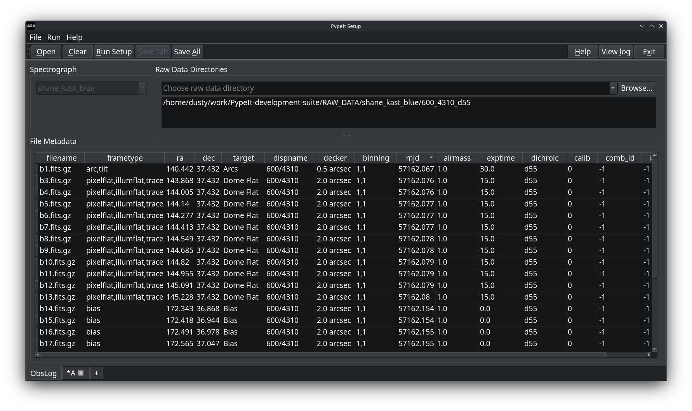
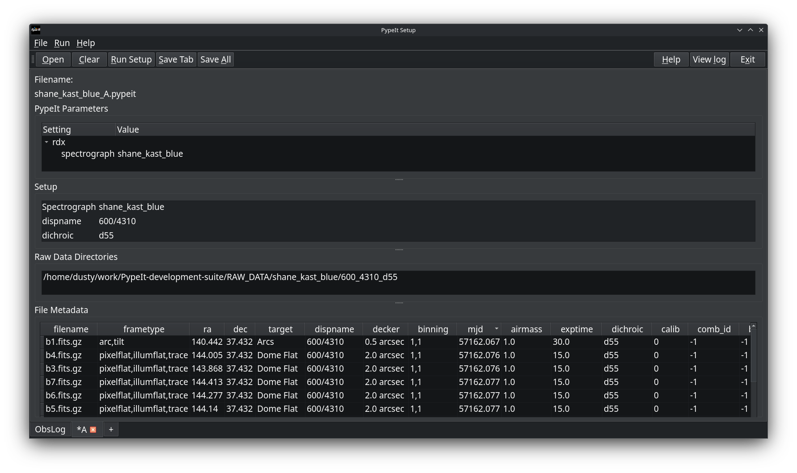

.. _setup_gui:

=========================
PypeIt Setup GUI Tutorial
=========================

Overview
========

The PypeIt Setup GUI provides an interactive, graphical interface for creating and editing PypeIt input files (`.pypeit` files). This GUI-based approach is particularly helpful for first-time users and provides a visual way to organize and inspect your raw data before running reductions.

The Setup GUI performs the same core functions as the command-line :ref:`pypeit_setup` script, but with an interactive interface that allows you to:

- Select a spectrograph
- Specify raw data directories
- Automatically scan and organize raw data files.
- Create an observation log
- Create and manage `.pypeit` configuration files
- Edit data tables and frame types
- Save your `.pypeit` file for reduction

Launching the Setup GUI
=======================

There are two ways to launch the Setup GUI:

**Method 1: Using the -G flag with pypeit_setup**

.. code-block:: bash

    pypeit_setup -G

This launches the GUI with a blank slate, allowing you to configure everything interactively.

**Method 2: Pre-populate with command-line arguments**

You can also launch the GUI with some initial settings:

.. code-block:: bash

    pypeit_setup -G -s keck_deimos -r /path/to/raw/data

This will:
    - Start the GUI with the spectrograph already selected (`keck_deimos`)
    - Pre-populate the raw data directory path
    - Automatically run the setup scan when the GUI opens

The GUI Interface
=================

The Setup GUI window consists of several main components:

Main Window Components
----------------------

1. **Button Bar** (top of window)
   
   - **Open**: Open an existing `.pypeit` file
   - **Clear**: Clear everything and start fresh
   - **Run Setup**: Scan raw data directories and generate observation log and .pypeit files for each setup.
   - **Save Tab**: Save the currently active tab
   - **Save All**: Save all tabs with unsaved changes
   - **Help**: Opens PypeIt Setup GUI tutorial
   - **View log**: Opens a window showing the application log
   - **Exit**: Quit the application

2. **Main View (obslog tab)**
      
   - **Spectrograph Selector**: (top left) Drop-down menu to choose your instrument
   - **Raw Data Directories**:  (top right) Area to add one or more directories containing raw FITS files
   - **Observation Log Table**: (central) Displays metadata from all raw files after scanning

3. **PypeIt File Tabs**
   
   After running setup, additional tabs appear for each unique instrument configuration detected (labeled A, B, C, etc.). Each tab represents a `.pypeit` file.

Basic Workflow
==============

Step 1: Select Your Spectrograph
---------------------------------

1. Click on the **Spectrograph** drop-down menu
2. Select your instrument from the list of available spectrographs (e.g., `keck_deimos`, `keck_lris_blue`, `vlt_fors2`)
3. You can also type to search through the spectrograph list

The spectrograph selection determines how PypeIt will interpret your raw data files and what metadata fields to extract.

Step 2: Add Raw Data Directories
---------------------------------

1. In the **Raw Data Directories** section, type the folder containing your raw FITS files or press the `Browse` button to bring up a dialog box to choose the directory.
2. You can add multiple directories if your data is spread across different locations.
3. Previously used directories appear in a dropdown for quick access.

.. note::
    The directories can contain data from multiple observing configurations. PypeIt will automatically parse and separate them in the next step.

Step 3: Run Setup
-----------------

1. Click the **Run Setup** button
2. PypeIt will scan all specified directories for raw data files
3. The observation log table will populate with metadata from each file
4. New tabs will appear for each unique instrument configuration detected

The setup process:

- Identifies all raw files matching the spectrograph's allowed extensions
- Extracts metadata from FITS headers
- Groups files by instrument configuration
- Assigns frame types (science, arc, flat, bias, etc.)
- Creates a separate `.pypeit` file tab for each configuration

.. tip::
    The scan may take a few moments depending on the number of files. Watch the progress bar or log window for progress.

Step 4: Inspect the Observation Log
-----------------------------------

After setup completes, examine the observation log table:

- **Columns**: Display metadata like filename, frame type, target, exposure time, filter, etc.
- **Sorting**: Click column headers to sort
- **Frame Types**: Verify PypeIt correctly identified science, calibration, and standard frames
- **Configurations**: Different setups (grating angles, filters, etc.) are separated into different tabs

.. warning::
    Always check that frame types are correctly assigned! Misidentified frames can cause reduction failures.

Step 5: Edit PypeIt File Tabs
-----------------------------

Click on the configuration tabs (A, B, C, etc.) to view and edit the `.pypeit` files:

**Configuration Tab Features:**

- **Parameter Block**: Shows the PypeIt reduction parameters
- **Data Table**: Modify frame types, add background pairs.
- **Setup Block**: View the instrument configuration parameters

**Common Edits:**

- Change frame types if PypeIt misidentified them
- Update the  background pair columns (`comb_id`, `bkg_id`)

To edit frame types:
    1. Click on a cell in the frametype column
    2. Check the correct frame type in the pop up list of types
    3. Multiple types can be selected and will appear as comma-separated in the metadata (e.g., `arc,tilt`)

Step 6: Save Your Setup
-----------------------

When you're satisfied with your configuration:

1. **Save Tab**: Saves only the currently displayed tab
2. **Save All**: Saves all tabs that have unsaved changes

The GUI will prompt you to specify the location for each `.pypeit` file. By default, files are named using the convention:

.. code-block:: bash

    <spectrograph>_<setup>.pypeit

For example: `keck_deimos_A.pypeit`, `keck_deimos_B.pypeit`

Additional Features
===================

Opening Existing PypeIt Files
-----------------------------

To load and edit an existing `.pypeit` file:

1. Click **Open** button
2. Navigate to your `.pypeit` file
3. The file contents will load into a new tab
4. Edit as needed and save changes

.. note::
    Opening a `.pypeit` file will also load the ObsLog tab for the raw data directories mentioned in the file.

Viewing Raw Data
----------------

To view the raw data files in Ginga, right click on the file in the File Metadata table and select 
"Viiew File". Then select which detector you wish to view. 

You can also view the FITS header for the raw data files by right clicking on the file and selecting 
"View Header".

Working with Multiple Configurations
------------------------------------

If PypeIt detects multiple instrument configurations:

- Each configuration gets its own tab (A, B, C, etc.)
- Configurations differ by grating, filter, binning, or other setup parameters
- You can edit and save each configuration independently
- All configurations share the same raw data pool

Closing Tabs
------------

To close a configuration tab:

- Click the **X** on the tab
- The GUI will prompt you to save if there are unsaved changes
- The ObsLog tab cannot be closed

Viewing Logs
------------

Click the **View log** button to see:

- Setup operations and their status
- File scanning progress
- Any warnings or errors encountered
- Metadata extraction details

This is helpful for debugging if something doesn't work as expected.

Example Walkthrough
===================

Here's a complete example using Keck DEIMOS data:

.. code-block:: bash

    # Launch the GUI
    pypeit_setup -G

**In the GUI:**

1. Select spectrograph: `keck_deimos`
2. Add raw data directory: `/data/DEIMOS/2024mar15/raw`
3. Click **Run Setup**
4. Wait for scan to complete (watch the log)
5. Review the ObsLog tab - verify all expected files are present
6. Click on **Configuration A** tab
7. Inspect frame types in the data table
8. Make any necessary edits to frame types
9. Click **Save Tab**
10. Choose the location for the file. The file will be named `keck_deimos_A.pypeit`
11. Click **Exit**

Your setup is now ready! Run the reduction with:

.. code-block:: bash

    run_pypeit keck_deimos_A.pypeit

Tips and Best Practices
=======================

Organizing Your Data
--------------------

- Keep raw data in a dedicated directory
- Use a separate working directory for reductions

Checking Frame Types
--------------------

Always verify frame type assignments. Common frame types are:

- **science**: Target observations
- **arc**: Wavelength calibration lamps
- **flat**: Flat field exposures (dome or internal)
- **bias**: Bias frames
- **dark**: Dark current frames
- **trace**: Used for slit/order tracing (often same as flat)
- **pixelflat**: Used for pixel-to-pixel sensitivity
- **standard**: Standard star observations for flux calibration
- **illumflat**: Flat-field exposure used for illumination flat
- **tilt**:  Exposure used to trace the tilt in the wavelength solution

Multiple frame types can be selected and are displayed separated by commas e.g., `arc,tilt`.
For a full list of frame types see :ref:`frame_types`.

Handling Edge Cases
-------------------

**Multiple setups**: If you have multiple configurations but don't want to reduce all of them:
    - Only save the tabs you need
    - Close unwanted configuration tabs
    - Or run setup with the `-c` flag to pre-select specific configurations

**Large datasets**: For very large datasets (hundreds of files):
    - The initial scan may take some time
    - Consider splitting into separate reduction directories by configuration
    - Use the log viewer to monitor progress

Troubleshooting
===============

GUI Won't Launch
----------------

If the GUI fails to start:

1. Check that you have Qt dependencies installed (PyQt6)
2. Verify your PypeIt installation is up to date
3. Check for error messages in the terminal

No Files Found
--------------

If "Run Setup" finds no files:

1. Verify the raw data directory path is correct
2. Check that files have allowed extensions (`.fits`, `.fits.gz`, etc.)
3. Ensure the spectrograph is correctly selected
4. Look at the log for detailed scanning information

Setup Fails
-----------

If setup scanning fails or crashes:

1. Check the log viewer for error messages
2. Verify raw files are readable and not corrupted
3. Ensure FITS headers contain expected keywords
4. Try running command-line `pypeit_setup` to see more detailed errors

Related Documentation
=====================

- :ref:`setup_doc`: Detailed documentation on the setup process
- :ref:`pypeit_file`: Understanding PypeIt file format
- :ref:`pypeit_setup`: Command-line setup script documentation
- :ref:`pypeitpar`: Complete parameter documentation

See Also
========

- :ref:`run-pypeit`: Running the actual data reduction
- :ref:`calibrations`: Understanding calibration frames
- Command-line alternative: :ref:`pypeit_setup`
